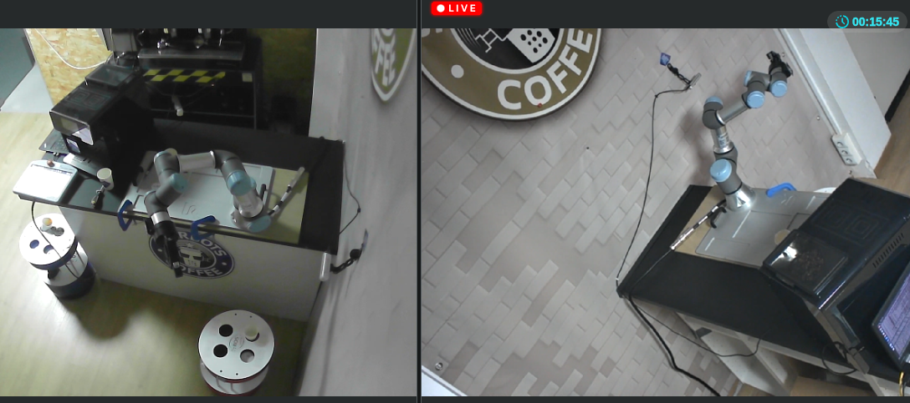
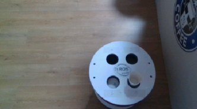
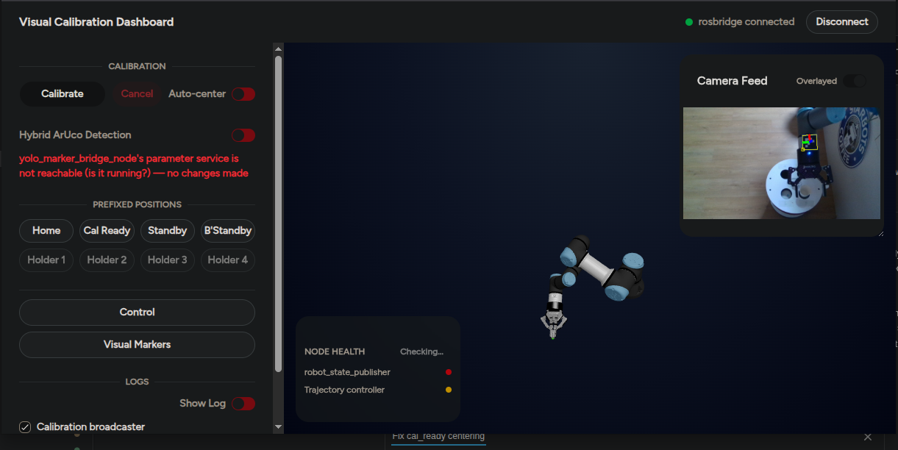
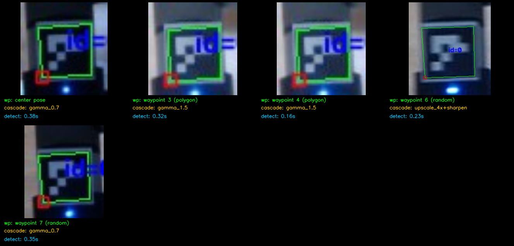

# Visual Calibration


<!-- TODO: add a license badge once a LICENSE file is added at the repo root — most package.xml files declare Apache-2.0, but there's no top-level LICENSE file to back a badge claim yet -->

A ROS 2 (Humble) project that automatically computes the transform between a
wrist-mounted or fixed-mount camera and a UR3e robotic arm's `base_link`
frame, using ArUco marker detection (classical OpenCV or a YOLO-backed
alternative) on the arm's end-effector — without relying on any pre-known
transform between the two, since the real robot (unlike simulation) has no
such transform available ahead of time. Control of the pipeline is exposed
via a web application.

## Table of contents

- [Hardware Setup](#hardware-setup)
- [Demo: How It Works](#demo-how-it-works)
- [Related Repositories](#related-repositories)
- [Quick Start](#quick-start)
- [Packages](#packages)
- [Known limitation: MoveIt Task Constructor (MTC) unavailable](#known-limitation-moveit-task-constructor-mtc-unavailable)
- [Getting started](#getting-started)

## Hardware Setup



A UR3e arm with a Robotiq 85 gripper is mounted on a countertop, positioned
so it can place a coffee cup in an unoccupied hole on a Baristabot's top
surface. An ArUco marker is also mounted on the gripper for the visual
calibration process.

For perception, an Intel D415 camera is used, bolted to the wall and looking
down at the Baristabot.

## Demo: How It Works

The walkthrough below follows the same order as an actual calibration run,
from physical setup through to the final result.

**1. Camera view** — the wall-mounted D415's view of the Baristabot and
workspace.



**2. Connect via the web app** — once connected to the UR3e robot through
the webpage, the calibration controls become available.



**3. Start calibration** — clicking the `Calibrate` button moves the arm's
gripper into position and starts the calibration process.


**4. Classical vs. Hybrid detection** — by default, calibration detects the
ArUco marker using classical OpenCV ArUco detection only. Turning on the
`Hybrid Aruco Detection` switch enables YOLO-assisted detection (YOLO +
OpenCV) for locating the marker on the gripper instead.

**5. TF construction result** — once calibration completes, transforms for
the entire Baristabot's top surface and its vacant holes are constructed:


**6. Per-waypoint detection debug grid** — for inspecting how the
calibration was carried out, a debug image is generated showing the
detection result at each waypoint visited during the run.



Full documentation, including architecture diagrams, the calibration
process explained step by step, and per-node interface details, lives under
[resources/docs/](./resources/docs/README.md).

## Related Repositories

This ROS 2 package is the calibration backend: it detects the ArUco marker,
chains the detection with known TF, and broadcasts the camera-to-robot
calibration. Two sibling repositories build on top of it:

1. [Visual calibration webapp](https://github.com/tesarect/-aruco_visual_calibration_dashboard.git)
   — the browser-based control UI (the `webpage` above), which talks to this
   package's `orchestrator` node over `rosbridge` (via its `~/start_auto_calibrate`
   / `~/auto_calibrate_status` facade, since this project's `rosbridge_suite`
   has no native ROS 2 action support).
2. [YOLO-Pipeline Server](https://github.com/tesarect/-aruco_visual_calibration_dashboard.git)
   <!-- TODO: confirm correct YOLO-Pipeline Server repo URL, currently duplicated from webapp link -->
   — the optional YOLO detection backend used by the `Hybrid Aruco Detection`
   switch above. It runs as an isolated HTTP inference server
   (`inference_server.py`) that `aruco_perception_yolo_bridge` calls into,
   kept out-of-process so ROS's system OpenCV never shares a process with
   `ultralytics`' bundled OpenCV — see
   [aruco_perception_yolo_bridge.md](./resources/docs/aruco_perception_yolo_bridge.md).

## Quick Start

Build the workspace (from `ros2_ws/`):

```bash
colcon build --symlink-install
```

Then follow the ordered manual startup sequence (simulation, `move_group`,
planning scene, trajectory planner, detectors, calibration) in
[resources/docs/manual_bringup.md](./resources/docs/manual_bringup.md) — see
[Getting started](#getting-started) below.

## Packages

| Package | Role |
|---|---|
| `visual_calibration_msgs` | Custom action/srv/msg definitions shared across the packages below. |
| `aruco_perception` | Classical ArUco marker detection, cupholder/hole detection (sim), and `calibration_broadcaster_node` — the node that chains detected marker poses with known TF to compute and broadcast `base_link → camera`. |
| `aruco_perception_yolo_bridge` | YOLO-backed alternative marker/cupholder/hole detector, a drop-in swap for `aruco_perception`'s classical detector. |
| `orchestrator` | Chains "move to cal_ready" → "auto-center on the marker" → "calibrate" into one action; also owns the classical/hybrid detector switch and the rosbridge-reachable web-facing facade. |
| `depth_perception` | Back-projects cupholder/hole 2D detections into stable 3D positions, broadcast as TF frames chained through the calibrated camera transform. |
| `visual_calibration_moveit` | MoveIt2 interaction nodes: planning scene setup, trajectory planning, and MoveIt Task Constructor (see known limitation below). |
| `calibration_validation` | Sim-only node that checks the broadcast calibration TF against simulation's own ground-truth camera TF. |
| `sim_ur3e_moveit_config` / `real_ur3e_moveit_config` | Project-owned, environment-split MoveIt2 configs that `move_group` actually launches from. |
| `visual_calibration_bringup` | Launch-native sequencing for the full stack, as an alternative to the manual startup steps. |
| `real_ur3e_description` | Real-robot URDF/xacro support package. |

See [resources/docs/architecture.md](./resources/docs/architecture.md) for
how these packages interact.

## Known limitation: MoveIt Task Constructor (MTC) unavailable

MoveIt Task Constructor (for staged approach/interact/retreat trajectories)
could not be built in this environment due to an unresolved upstream
packaging issue in `moveit_task_constructor_core`'s dependency declarations:
[moveit/moveit_task_constructor#629](https://github.com/moveit/moveit_task_constructor/issues/629).
Trajectory generation instead uses a plain `MoveGroupInterface`
single-shot plan/execute approach. See
[resources/docs/visual_calibration_moveit.md](./resources/docs/visual_calibration_moveit.md#mtc_trajectory)
for the full detail on `mtc_trajectory`'s current state.

## Getting started

For the ordered manual startup sequence (simulation, `move_group`, planning
scene, trajectory planner, detectors, calibration), see
[resources/docs/manual_bringup.md](./resources/docs/manual_bringup.md).
