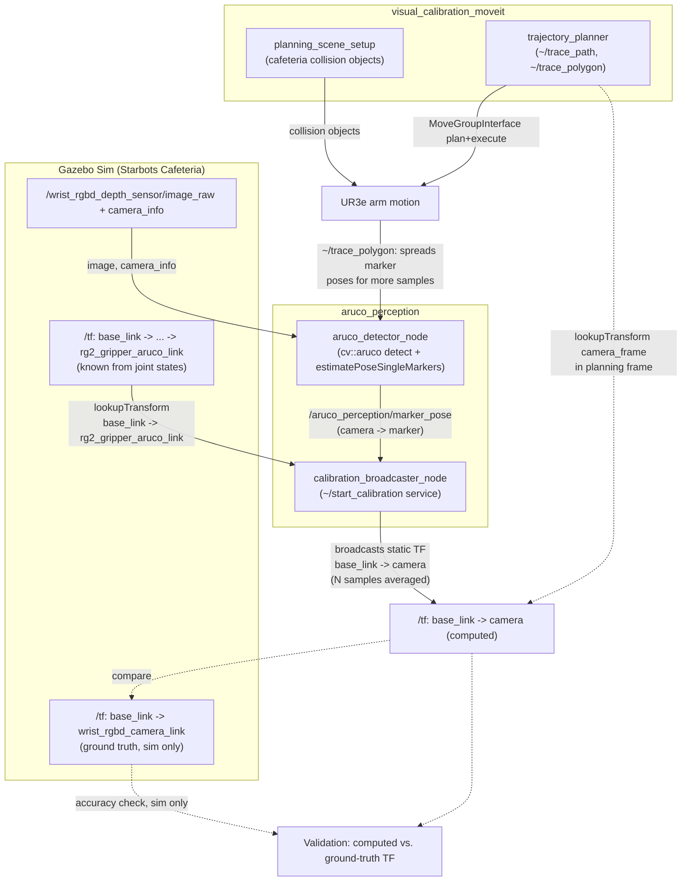

# Visual Calibration — Project Overview

## 1. Problem Statement

A robotic arm's motion planner (MoveIt2) only reasons about poses in the arm's
own frame tree, rooted at `base_link`. A camera used to *observe* that arm —
whether mounted on the wrist or fixed externally — is only useful for guiding
the arm if the transform between the camera's frame and `base_link` is known.

On the real UR3e, that transform is **not** available for free: the camera is
a separate physical device with no built-in link to the robot's kinematic
chain, so `base_link → camera` cannot be looked up from `/tf`. It has to be
measured. Manually measuring this (e.g. with calipers/CAD, or a one-off
hand-eye calibration performed by an operator) is time-consuming, has to be
repeated whenever the camera is bumped or remounted, and doesn't scale to
redeploying the same code on a different cell.

This project automates that measurement: it detects an ArUco marker rigidly
attached to the arm's end effector (`rg2_gripper_aruco_link`) from the
camera's image stream, and combines the camera's *measured* view of the
marker with the arm's *known* kinematic chain (from joint states, via
`/tf`) to solve for `base_link → camera`.

**Simulation vs. real robot:** In the Starbots Cafeteria Gazebo simulation,
`base_link → wrist_rgbd_camera_link` is already published in `/tf` (Gazebo
knows exactly where it placed the camera model). This is not available on
the real robot — but it is exactly what makes simulation useful here: the
existing ground-truth TF lets the calibration pipeline's output be checked
against a known-correct answer before ever being trusted on real hardware.
Development and validation are therefore happening in simulation first, with
the real-robot camera path (over Zenoh, see the root `CLAUDE.md`) staged as a
later target — see `resources/info/real_information_observations.md`, which
is still marked `[TBD]` for most fields, confirming real-robot data
collection has not started yet.

## 2. Project Structure

Everything below is under `ros2_ws/src/visual_calibration/`.

```
visual_calibration/
├── aruco_perception/            # Detection + TF-chaining pipeline (implemented)
│   ├── src/aruco_detector/       # ArUco marker detection + pose estimation node
│   ├── src/image_subscriber/     # Minimal camera image/camera_info smoke-test node
│   ├── src/calibration_broadcaster/  # Chains marker pose with known TF, broadcasts result
│   └── config/*_sim.yaml         # Per-node parameters for the simulation
├── visual_calibration_moveit/   # MoveIt2 interaction nodes (implemented, partially)
│   ├── src/planning_scene_setup/ # Publishes cafeteria collision objects to the planning scene
│   ├── src/trajectory_planner/   # Services to plan/execute moves relative to a TF frame
│   └── src/mtc_trajectory/       # Stub only — blocked on an upstream MoveIt Task
│                                   Constructor packaging issue; excluded from this doc
├── visual_calibration_msgs/     # Custom srv definitions shared by the above (TracePath.srv)
├── aruco_moveit_config/         # Project's MoveIt2 config for UR3e + RG2 gripper
└── resources/
    ├── docs/                    # This file
    ├── info/                    # Captured TF trees, topic lists, observations (sim vs. real)
    └── scripts/                 # tmux/shell/python helpers for running the sim stack
```

No web application code exists in the repository yet. The "expose control via
a web app" goal stated in the top-level `CLAUDE.md` is not represented by any
package, node, or launch file at this time — it is a planned deliverable, not
a built one.

### Dependency on the wider workspace

- **`ur_description`** (`Universal_Robots_ROS2_Description`) — supplies the
  UR3e xacro (`ur.urdf.xacro`) that `aruco_moveit_config` is generated
  against, matching the RG2-gripper robot actually spawned in Gazebo.
- **`rg2_gripper_description`** — defines `rg2_gripper_aruco_link`, the frame
  the ArUco marker is rigidly mounted at (45 mm marker, 4x4 dictionary —
  50/100/250/1000 depending on config).
- **`the_construct_office_gazebo`** — the Starbots Cafeteria world and the
  launch chain that spawns the simulated UR3e with its wrist-mounted RGBD
  camera; also the source of the cafeteria collision meshes/SDF referenced by
  `planning_scene_setup` (coffee machine, cupholder, countertop, wall).
- **`ur3e_moveit_config`** — the sim/robot-driver-facing MoveIt config;
  `aruco_moveit_config` is this project's own equivalent, kept in sync with
  the same URDF source.
- **`zenoh-pointcloud`** — the real-robot camera bridge. Camera topics on the
  real UR3e cell are only reachable via this Zenoh bridge (not native DDS),
  which is why `aruco_perception`'s real-robot config
  (`*_real.yaml`) is still a documented gap rather than a working file — see
  Section 3.

## 3. Components

### `aruco_perception` (package: implemented, sim-only config)

| Node | Status | Role |
|---|---|---|
| `image_subscriber_node` | Implemented | Minimal subscriber to the camera's image + `camera_info` topics; logs frame size/encoding. Used as a standalone smoke test that the image pipeline is alive before running detection. |
| `aruco_detector_node` | Implemented | Subscribes to the camera image and `camera_info`, runs OpenCV `cv::aruco` marker detection + `estimatePoseSingleMarkers`, and publishes the camera-frame pose of the configured marker ID on `/aruco_perception/marker_pose`. Optionally publishes an annotated overlay image. Requires `camera_info` before it will run (needs intrinsics). |
| `calibration_broadcaster_node` | Implemented | Subscribes to `/aruco_perception/marker_pose`. On each sample (rate-limited by `min_sample_interval_sec`), inverts the camera→marker pose to marker→camera, looks up the *known* `known_chain_frame → marker_frame` TF (in sim: `base_link → rg2_gripper_aruco_link`, available because the arm's joint states are known), and chains the two to get one sample of `known_chain_frame → camera`. Averages position across `num_samples` samples and broadcasts the result as a static TF via `~/start_calibration` (a `std_srvs/Trigger` service). **Orientation is taken from the most recent sample only, not averaged** — noted directly in the node's own source comments as a known limitation. |

No launch file exists yet for `aruco_perception` (the `launch/` directory is
empty) — nodes are currently run individually (e.g. via `ros2 run` with a
params file, or the tmux helper scripts under `resources/scripts/tmux/`).

Only a simulation parameter set (`*_sim.yaml`) exists per node. A real-robot
config is referenced in code comments (`aruco_detector_real.yaml`) as future
work — real-world lighting will need different adaptive-threshold tuning —
but that file does not exist in the repo yet.

### `visual_calibration_moveit` (package: partially implemented)

| Node | Status | Role |
|---|---|---|
| `planning_scene_setup` | Implemented | Publishes the cafeteria's static collision geometry (coffee machine mesh, cupholder mesh, countertop as two stacked boxes, wall as a box) into the MoveIt planning scene, so trajectory planning avoids known obstacles. Sim and real variants configured via `scene_objects_sim.yaml` / `scene_objects_real.yaml`. |
| `trajectory_planner` | Implemented | Wraps `MoveGroupInterface` behind two services: `~/trace_path` (`visual_calibration_msgs/TracePath` — execute an explicit list of waypoints in order) and `~/trace_polygon` (`std_srvs/Trigger` — auto-generate and execute a polygon of waypoints around a standoff pose in front of a configured `camera_frame`, at `standoff_m` distance, facing back toward the camera per `facing_rpy_rad`). This is the node used to move the end effector through a spread of poses for calibration sampling, and — once a calibration TF has been broadcast — to validate it by driving to a pose derived from the camera. |
| `mtc_trajectory` | Not usable | Present as a stub only; MoveIt Task Constructor integration is blocked on an unresolved upstream packaging issue (see the package's own `package.xml`, which comments out its `moveit_task_constructor_core` dependency). Not part of the working pipeline. |

### Web application control layer — **planned, not built**

CLAUDE.md states this project should "expose control via a web application."
No web app code, server, or frontend exists anywhere in the repository.
This is future scope, not a current component.

## 4. Working / Flow

The diagram below reflects only what is implemented today: `aruco_perception`
detecting the marker and chaining TFs, and `trajectory_planner` executing
calibration-sampling and validation moves. It does not include the MTC stub
or the (not-yet-built) web app.



Flow narrative:

1. `aruco_detector_node` detects the ArUco marker in each camera frame and
   publishes its pose relative to the camera on `/aruco_perception/marker_pose`.
2. `calibration_broadcaster_node` collects samples of this pose (triggered via
   `~/start_calibration`), and for each one looks up the *known* TF chain from
   `known_chain_frame` (e.g. `base_link`) to the marker frame
   (`rg2_gripper_aruco_link`) — available because the arm's joint states are
   published. Chaining `known_chain_frame → marker` with `marker → camera`
   (the inverted detection) yields one sample of `known_chain_frame → camera`.
3. After `num_samples` samples, positions are averaged and a static TF
   `known_chain_frame → camera` is broadcast. (Orientation is currently taken
   from the last sample only — not yet averaged.)
4. `trajectory_planner`'s `~/trace_polygon` service can move the end effector
   through a spread of poses in front of the camera between samples, so
   consecutive calibration samples aren't correlated (same arm pose).
5. In simulation, the computed `base_link → camera` TF can be compared against
   Gazebo's ground-truth `base_link → wrist_rgbd_camera_link` TF to evaluate
   accuracy — this comparison is a manual/scripted check against `/tf`, not an
   automated node in the current codebase.
6. `planning_scene_setup` runs independently to keep MoveIt aware of cafeteria
   obstacles (coffee machine, cupholder, countertop, wall) during any of the
   above arm motion.

## Known gaps (explicitly not yet built)

- No launch file wiring `aruco_perception`'s three nodes together.
- No real-robot parameter files (`*_real.yaml`) for `aruco_perception`.
- No automated accuracy-validation node comparing computed vs. ground-truth TF
  in sim — this is described as a project goal in `CLAUDE.md` but doesn't
  exist as code.
- No web application (control layer) anywhere in the repository.
- `mtc_trajectory` is a non-functional stub, blocked upstream.