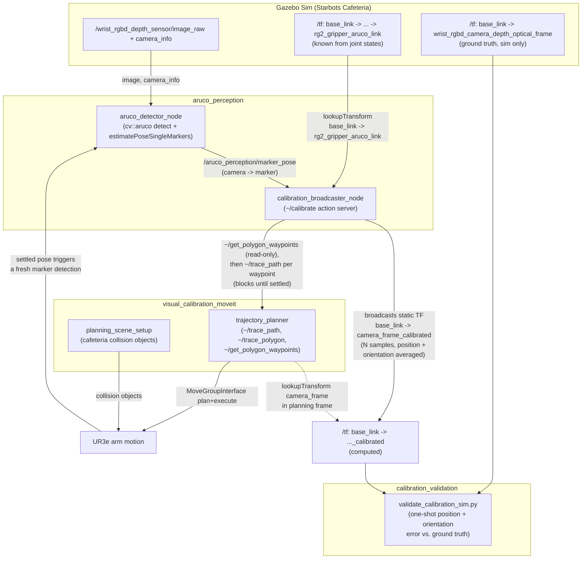

[← Back to index](./README.md)

# Architecture

## Project structure

Everything below is under `ros2_ws/src/visual_calibration/`.

```
visual_calibration/
├── aruco_perception/            # Detection + TF-chaining pipeline
│   ├── src/aruco_detector/       # ArUco marker detection + pose estimation node
│   ├── src/image_subscriber/     # Minimal camera image/camera_info smoke-test node
│   ├── src/calibration_broadcaster/  # Chains marker pose with known TF, broadcasts result
│   ├── launch/                   # Per-node launch files (env:=sim|real)
│   └── config/*_sim.yaml         # Per-node parameters for the simulation
├── visual_calibration_moveit/   # MoveIt2 interaction nodes
│   ├── src/planning_scene_setup/ # Publishes cafeteria collision objects to the planning scene
│   ├── src/trajectory_planner/   # Services to plan/execute moves relative to a TF frame
│   └── src/mtc_trajectory/       # MoveIt Task Constructor node; see visual_calibration_moveit.md
├── visual_calibration_msgs/     # Custom action/srv definitions shared by the above
│                                   (Calibrate.action, TracePath.srv, GetPolygonWaypoints.srv)
├── aruco_moveit_config/         # Project's MoveIt2 config for UR3e + RG2 gripper
├── calibration_validation/      # Sim-only node: broadcast TF vs. ground-truth TF accuracy check
└── resources/
    ├── docs/                    # This documentation set
    ├── info/                    # Captured TF trees, topic lists, observations (sim vs. real)
    └── scripts/                 # tmux/shell/python helpers for running the sim stack
```

Exposing control of the calibration pipeline via a web application is part of
this project's overall goal. That web dashboard (`webpage_ws/`, a separate
npm-managed React app) is developed outside this workspace today and is not
yet a package under `ros2_ws/src/visual_calibration/` — it is expected to be
relocated here later. Until that happens, the control surface for the
pipeline described below is reached the same way any other ROS 2 client
would reach it (CLI, `rosbridge`, etc.), not through any web-app-specific
package, node, or launch file living in this directory.

## Dependency on the wider workspace

- **`ur_description`** (`Universal_Robots_ROS2_Description`) — supplies the
  UR3e xacro (`ur.urdf.xacro`) that `aruco_moveit_config` is generated
  against, matching the RG2-gripper robot actually spawned in Gazebo.
- **`rg2_gripper_description`** — defines `rg2_gripper_aruco_link`, the frame
  the ArUco marker is rigidly mounted at (45 mm marker, 4x4 dictionary —
  50/100/250/1000 depending on config).
- **`the_construct_office_gazebo`** — the Starbots Cafeteria world and the
  launch chain that spawns the simulated UR3e with its wrist-mounted RGBD
  camera; also the source of the cafeteria collision meshes/SDF referenced by
  `planning_scene_setup` (coffee machine, cupholder, countertop, wall).
- **`ur3e_moveit_config`** — the sim/robot-driver-facing MoveIt config;
  `aruco_moveit_config` is this project's own equivalent, kept in sync with
  the same URDF source.
- **`zenoh-pointcloud`** — the real-robot camera bridge. Camera topics on the
  real UR3e cell are only reachable via this Zenoh bridge, not native DDS —
  see [aruco_perception.md](./aruco_perception.md) for how the per-node
  `env:=sim|real` parameter files are organized around that split.

## Working / flow

The diagram below covers `aruco_perception` detecting the marker and
chaining TFs, `trajectory_planner` executing calibration-sampling and
validation moves, and `calibration_validation`'s automated accuracy check.



Flow narrative:

1. `aruco_detector_node` detects the ArUco marker in each camera frame and
   publishes its pose relative to the camera on `/aruco_perception/marker_pose`.
2. `calibration_broadcaster_node` orchestrates a `~/calibrate` action goal:
   it fetches a list of waypoints from `trajectory_planner`'s
   `~/get_polygon_waypoints` (read-only, no motion), then for each waypoint
   calls `~/trace_path` with just that one pose and blocks until the
   response arrives — which only happens once the arm is confirmed settled
   there. It then waits for a *fresh* `marker_pose` message (published after
   the settle point) and looks up the *known* TF chain from
   `known_chain_frame` (e.g. `base_link`) to the marker frame
   (`rg2_gripper_aruco_link`) — available because the arm's joint states are
   published. Chaining `known_chain_frame → marker` with `marker → camera`
   (the inverted detection) yields one sample of `known_chain_frame → camera`.
3. After `num_samples` samples, position is averaged arithmetically and
   orientation is averaged by the configured quaternion-averaging method,
   and a static TF `known_chain_frame → camera` is broadcast. See
   [calibration_process.md](./calibration_process.md) for a plain-language
   walkthrough of this whole mechanism and what the spread metrics mean, or
   [aruco_perception.md](./aruco_perception.md) for the node-level detail.
4. This cycle of moving to a waypoint and sampling repeats, cycling back
   through the polygon if `num_samples` exceeds its corner count — spreading
   samples across several physically distinct poses cancels both per-frame
   sensor noise and angle-dependent systematic error, not just noise from
   repeated shots at one fixed pose.
5. In simulation, `calibration_validation`'s `validate_calibration_sim.py`
   node automatically compares the computed `base_link → camera_..._calibrated`
   TF against Gazebo's ground-truth `base_link → wrist_rgbd_camera_depth_optical_frame`
   TF, logging a position error (cm) and orientation error (deg) with a
   GOOD/CHECK/BAD verdict — see
   [calibration_validation.md](./calibration_validation.md).
6. `planning_scene_setup` runs independently to keep MoveIt aware of cafeteria
   obstacles (coffee machine, cupholder, countertop, wall) during any of the
   above arm motion.
