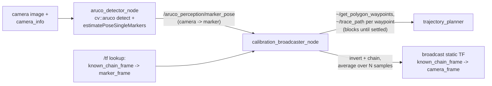

[← Back to index](./README.md)

# aruco_perception

`aruco_perception` is the detection and TF-chaining side of the calibration
pipeline. It turns a stream of camera images into a broadcast static TF from
a known robot frame (typically `base_link`) to the camera's own frame, by
combining what the camera *measures* about the ArUco marker with what the
robot's TF tree already *knows* about that same marker's position.

The package has three nodes: `image_subscriber_node`, `aruco_detector_node`,
and `calibration_broadcaster_node`. Only the latter two are part of the
working calibration chain; `image_subscriber_node` exists alongside them as
a standalone diagnostic.

## Flow

For the full step-by-step mechanism (what a "sample" is, why several
waypoints matter, what the spread metrics mean), see
[calibration_process.md](./calibration_process.md) — this section covers
the node's technical structure only.

## `image_subscriber_node`

A minimal subscriber to the configured image and `camera_info` topics. It
does no detection — it logs frame dimensions and encoding, and logs the
first `camera_info` message it receives. Its purpose is to confirm the
camera pipeline is actually publishing before running the heavier detection
node against it, since a silent topic mismatch is otherwise indistinguishable
from a detection failure.

## `aruco_detector_node`

Subscribes to a raw image topic and a `camera_info` topic, and publishes the
pose of one configured marker ID relative to the camera on
`/aruco_perception/marker_pose` (`geometry_msgs/PoseStamped`, in the
camera's own optical frame).

Detection requires intrinsics: the node buffers incoming images but does not
run `cv::aruco::detectMarkers` until it has received at least one
`camera_info` message, since `estimatePoseSingleMarkers` needs the camera
matrix and distortion coefficients to turn 2D marker corners into a 3D pose.
Once intrinsics are available, each incoming frame is converted to
grayscale, run through marker detection with a configurable ArUco
dictionary (`DICT_4X4_50/100/250/1000`), and — if the configured marker ID is
among the detected markers — has its pose estimated via `cv::Rodrigues` and
converted from an OpenCV rotation matrix into a `tf2::Quaternion` for the
published pose message.

Detector tuning (adaptive-threshold window size/step/constant, minimum
marker perimeter rate, corner refinement method) is exposed as ROS
parameters rather than hardcoded, since these values are expected to differ
between simulation's controlled lighting and a real camera's inconsistent
lighting. Only a simulation parameter file (`aruco_detector_sim.yaml`)
exists in the repository; it uses OpenCV's own adaptive-threshold defaults,
appropriate for Gazebo's consistent lighting.

The node can optionally publish an annotated overlay image (marker border
and pose axes drawn in a separate BGR conversion of the frame) on
`/aruco_perception/overlay_image`, gated by the `publish_overlay_image`
parameter — useful for visually confirming detection and pose axis
orientation in RViz or `rqt_image_view` without affecting the
performance-sensitive detection path when disabled.

## `calibration_broadcaster_node`

Subscribes to `/aruco_perception/marker_pose` and exposes a `~/calibrate`
action server (`visual_calibration_msgs/action/Calibrate`) that orchestrates
the whole sampling and averaging process — it does not passively wait for
the arm to happen to be in the right place. See
[calibration_process.md](./calibration_process.md) for the full mechanism;
summarized here:

1. Calls `trajectory_planner`'s `~/get_polygon_waypoints` once (read-only,
   no motion) to get the list of waypoints to sample from.
2. For each waypoint needed to reach `num_samples` (cycling back through the
   list if `num_samples` exceeds its length): calls `~/trace_path` with just
   that one waypoint and **blocks** until the response arrives. That
   response is only sent once the arm is confirmed settled there — this is
   the entire sync mechanism, there is no separate "arm has stopped moving"
   topic or signal.
3. Once settled, waits for a `marker_pose` message published *after* that
   point (not whatever was last cached) before taking a sample — see
   `waitForFreshMarkerPose`, bounded by `sample_wait_timeout_sec`.
4. Inverts that fresh detector `camera → marker` pose to get
   `marker → camera`, looks up the known `known_chain_frame → marker_frame`
   transform from `/tf` (in simulation, `base_link → rg2_gripper_aruco_link`,
   available from the arm's own joint states), and chains the two into one
   sample of `known_chain_frame → camera`.

Each `~/trace_path` call (and `calibration_broadcaster_node`'s own
`planning_mode` parameter feeding it) selects `TracePath`'s
`planning_mode` field — `cartesian` (straight-line, can fail partway near
limits/obstacles) or `joint_space` (free-space, more robust, no
straight-line guarantee) — see
[visual_calibration_moveit.md](./visual_calibration_moveit.md) for how
`trajectory_planner` executes each mode.

This replaced an earlier passive-timer design (accept whatever arrived every
`min_sample_interval_sec`, with no awareness of whether the arm was actually
still moving) that produced motion-blur-corrupted samples — see
`error-mitigation.md` #20. The whole per-goal sequence runs on a dedicated
thread spawned from the action server's accepted-goal callback, since
`rclcpp_action` requires that callback to return quickly and the loop's
blocking service calls would otherwise stall the same executor thread that
needs to process their responses. `trajectory_planner` itself is given no
calibration awareness — it only ever sees ordinary `~/trace_path`/
`~/get_polygon_waypoints` calls, and stays a plain mover.

Feedback is published after each recorded sample
(`samples_collected`/`samples_total`), and the goal can be cancelled
mid-collection. Once `num_samples` samples have been collected, position is
averaged arithmetically across all samples, and orientation is averaged
using the configured quaternion-averaging method. Two methods are defined in
`orientation_averaging.hpp`, selected by priority rather than by name so
additional methods can be added later without changing the node's
parameter interface:

- **Sum-and-normalize** (`kSumNormalize`) — sums the sample quaternions
  component-wise and renormalizes to unit length. This is a reasonable
  approximation when samples are reasonably close together, which holds
  here since all samples come from the same physical marker/camera pair
  with only per-frame detection noise between them; it is not a proper
  SO(3) average for widely-spread orientation samples.
- **Markley's eigenvalue method** (`kMarkley`) — a proper SO(3) average,
  robust to widely-spread samples. The averaging priority parameter for
  this method exists so it can be selected once implemented, but calling
  `averageQuaternions` with this method currently throws
  `std::invalid_argument`.

The averaged position and orientation are broadcast as a static TF from
`known_chain_frame` to the detector's own camera `frame_id` with
`broadcast_frame_suffix` appended (e.g.
`wrist_rgbd_camera_depth_optical_frame_calibrated`) — never the bare
detector `frame_id` itself, since in simulation that name is already taken
by the URDF-declared ground-truth frame, and broadcasting under the same
name would put two disagreeing publishers on one TF frame. The action
result reports `max_spread_deg`/`mean_spread_deg` — the angular deviation of
each sample's orientation from the final average — as a quality signal for
how trustworthy that average is, independent of which averaging method
produced it.

## Running the nodes

Each node has its own launch file under `aruco_perception/launch/` taking an
`env:=sim|real` argument, which selects the matching `<node>_<env>.yaml`
parameter file from `aruco_perception/config/` and sets `use_sim_time`
accordingly. Currently only the `_sim.yaml` parameter files exist; running
with `env:=real` will fail to find a parameter file until a real-robot
config is added, since real-world lighting is expected to need different
adaptive-threshold tuning than the simulation defaults.