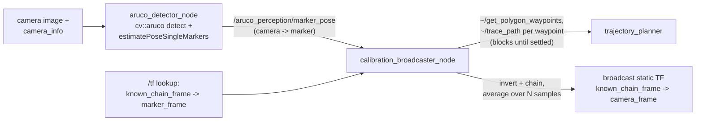

[← Back to index](./README.md)

# aruco_perception

`aruco_perception` is the detection and TF-chaining side of the calibration
pipeline. It turns a stream of camera images into a broadcast static TF from
a known robot frame (typically `base_link`) to the camera's own frame, by
combining what the camera *measures* about the ArUco marker with what the
robot's TF tree already *knows* about that same marker's position.

The package has four nodes: `image_subscriber_node`, `aruco_detector_node`,
`cup_holder_detector_node`, and `calibration_broadcaster_node`.
`aruco_detector_node` and `calibration_broadcaster_node` are the working
calibration chain; `image_subscriber_node` exists alongside them as a
standalone diagnostic; `cup_holder_detector_node` is sim's classical CV
alternative to `aruco_perception_yolo_bridge`'s YOLO-backed cupholder/hole
detector (see its own section below).

## Flow

```mermaid
flowchart LR
    IMG["camera image +\ncamera_info"] --> DET["aruco_detector_node\ncv::aruco detect +\nestimatePoseSingleMarkers"]
    DET -->|"/aruco_perception/marker_pose\n(camera -> marker)"| CB["calibration_broadcaster_node"]
    CHAIN["/tf lookup:\nknown_chain_frame -> marker_frame"] --> CB
    CB -->|"~/get_polygon_waypoints,\n~/trace_path per waypoint\n(blocks until settled)"| TP["trajectory_planner"]
    CB -->|"invert + chain,\naverage over N samples"| TF["broadcast static TF\nknown_chain_frame -> camera_frame"]
```

For the full step-by-step mechanism (what a "sample" is, why several
waypoints matter, what the spread metrics mean), see
[calibration_process.md](./calibration_process.md) — this section covers
the node's technical structure only.

## `image_subscriber_node`

A minimal subscriber to the configured image and `camera_info` topics. It
does no detection — it logs frame dimensions and encoding, and logs the
first `camera_info` message it receives. Its purpose is to confirm the
camera pipeline is actually publishing before running the heavier detection
node against it, since a silent topic mismatch is otherwise indistinguishable
from a detection failure.

## `aruco_detector_node`

Subscribes to a raw image topic and a `camera_info` topic, and publishes the
pose of one configured marker ID relative to the camera on
`/aruco_perception/marker_pose` (`geometry_msgs/PoseStamped`, in the
camera's own optical frame).

Detection requires intrinsics: the node buffers incoming images but does not
run `cv::aruco::detectMarkers` until it has received at least one
`camera_info` message, since `estimatePoseSingleMarkers` needs the camera
matrix and distortion coefficients to turn 2D marker corners into a 3D pose.
Once intrinsics are available, each incoming frame is converted to
grayscale, run through marker detection with a configurable ArUco
dictionary (`DICT_4X4_50/100/250/1000`), and — if the configured marker ID is
among the detected markers — has its pose estimated via `cv::Rodrigues` and
converted from an OpenCV rotation matrix into a `tf2::Quaternion` for the
published pose message.

Detector tuning (adaptive-threshold window size/step/constant, minimum
marker perimeter rate, corner refinement method and window/iteration/
accuracy, polygonal approximation accuracy) is exposed as ROS parameters
rather than hardcoded, since these values differ between simulation's
controlled lighting and a real camera's inconsistent lighting.
`aruco_detector_sim.yaml` uses OpenCV's own adaptive-threshold defaults,
appropriate for Gazebo's consistent lighting; `aruco_detector_real.yaml`
retunes several of these from a grid sweep against real captures (see its
own header comment for the methodology and which single change — lowering
`adaptive_thresh_constant`, 7.0 → 3.0 — actually mattered).

The node can optionally publish an annotated overlay image (marker border
and pose axes drawn in a separate BGR conversion of the frame) on
`/aruco_perception/overlay_image`, gated by the `publish_overlay_image`
parameter — useful for visually confirming detection and pose axis
orientation in RViz or `rqt_image_view` without affecting the
performance-sensitive detection path when disabled.

## `cup_holder_detector_node`

Sim-only classical OpenCV alternative to `aruco_perception_yolo_bridge`'s
YOLO-backed cupholder/hole detection: publishes
`visual_calibration_msgs/Detection2DArray` (`class_name` `"cup_holder"`/`"hole"`)
on the exact same `/aruco_perception/detections_2d` topic YOLO's bridge
already established, so `depth_perception_node` (the actual consumer) has
zero awareness of which detector produced a given message. It exists
because sim's CPU-only rosject cannot run the YOLO inference server fast
enough for usable cupholder/hole detection alongside Gazebo/RViz/the web
dashboard; real keeps YOLO (no classical equivalent runs there — there is
no `cup_holder_detector_real.yaml` and no `real_tmux_*.sh` script
references this node).

**Detection approach:** the cupholder disc and its holes are found
differently, because they behave differently under sim's lighting. The
holes are reliably darker than everything else in frame, so a flat
grayscale threshold (`cv::threshold`, inverted) isolates them cleanly. The
disc itself has almost no brightness separation from the background wall —
no single threshold cutoff can isolate it — so it's found instead via its
*rim*: `cv::Canny` edge detection (on a blurred grayscale image) plus a
small dilate to close gaps in the 1px edge line, then `cv::findContours`
filtered by circularity (`4π·area/perimeter²`). Both passes reduce their
surviving contours to a center + radius via `cv::fitEllipse` (the disc) or
`cv::minEnclosingCircle` (holes, already clean near-circles with no
equivalent fitting bias). Each hole is labeled into one of 4 fixed
quadrants (matching `yolo_marker_bridge_node.py`'s own numbering) relative
to the mean centroid of all detected holes that frame; `assignHoleQuadrants`
gives each hole a persistent identity across frames (matched to the
previous frame's holes by nearest-centroid distance) so a hole sitting
near the quadrant boundary doesn't flicker between two labels on pure
detection jitter — only a hole with no acceptable previous-frame match
falls back to the raw from-scratch quadrant split.

On sim, this node is also the sole publisher of the combined
`/aruco_perception/overlay_image`: `aruco_detector_node`'s own overlay is
rerouted to a private `overlay_image_input_topic` instead, and this node
draws cupholder/hole markers on top of that cached marker-only frame
before republishing the combined image — see
`cup_holder_detector_sim.yaml`'s header comment if that routing is ever
changed.

## `calibration_broadcaster_node`

Subscribes to `/aruco_perception/marker_pose` and exposes a `~/calibrate`
action server (`visual_calibration_msgs/action/Calibrate`) that orchestrates
the whole sampling and averaging process — it does not passively wait for
the arm to happen to be in the right place. See
[calibration_process.md](./calibration_process.md) for the full mechanism;
summarized here:

1. Calls `trajectory_planner`'s `~/get_polygon_waypoints` once (read-only,
   no motion) to get the list of waypoints to sample from.
2. For each waypoint needed to reach `num_samples` (cycling back through the
   list if `num_samples` exceeds its length): calls `~/trace_path` with just
   that one waypoint and **blocks** until the response arrives. That
   response is only sent once the arm is confirmed settled there — this is
   the entire sync mechanism, there is no separate "arm has stopped moving"
   topic or signal.
3. Once settled, waits for a `marker_pose` message published *after* that
   point (not whatever was last cached) before taking a sample — see
   `waitForFreshMarkerPose`, bounded by `sample_wait_timeout_sec`.
4. Inverts that fresh detector `camera → marker` pose to get
   `marker → camera`, looks up the known `known_chain_frame → marker_frame`
   transform from `/tf` (in simulation, `base_link → rg2_gripper_aruco_link`,
   available from the arm's own joint states), and chains the two into one
   sample of `known_chain_frame → camera`.

Each `~/trace_path` call (and `calibration_broadcaster_node`'s own
`planning_mode` parameter feeding it) selects `TracePath`'s
`planning_mode` field — `cartesian` (straight-line, can fail partway near
limits/obstacles) or `joint_space` (free-space, more robust, no
straight-line guarantee) — see
[visual_calibration_moveit.md](./visual_calibration_moveit.md) for how
`trajectory_planner` executes each mode.

This replaced an earlier passive-timer design (accept whatever arrived every
`min_sample_interval_sec`, with no awareness of whether the arm was actually
still moving) that produced motion-blur-corrupted samples — see
`error-mitigation.md` #20. The whole per-goal sequence runs on a dedicated
thread spawned from the action server's accepted-goal callback, since
`rclcpp_action` requires that callback to return quickly and the loop's
blocking service calls would otherwise stall the same executor thread that
needs to process their responses. `trajectory_planner` itself is given no
calibration awareness — it only ever sees ordinary `~/trace_path`/
`~/get_polygon_waypoints` calls, and stays a plain mover.

Feedback is published after each recorded sample
(`samples_collected`/`samples_total`), and the goal can be cancelled
mid-collection. Once `num_samples` samples have been collected, position is
averaged arithmetically across all samples, and orientation is averaged
using the configured quaternion-averaging method. Two methods are defined in
`orientation_averaging.hpp`, selected by priority rather than by name so
additional methods can be added later without changing the node's
parameter interface:

- **Sum-and-normalize** (`kSumNormalize`, default) — sums the sample
  quaternions component-wise (each first flipped to the same hemisphere as
  the first sample, since `q` and `-q` represent the same rotation but sum
  destructively otherwise) and renormalizes to unit length. This is a
  reasonable approximation when samples are reasonably close together,
  which holds here since all samples come from the same physical
  marker/camera pair with only per-frame detection noise between them; it
  is not a proper SO(3) average for widely-spread orientation samples.
- **Markley's eigenvalue method** (`kMarkley`) — the proper SO(3) average
  (Markley, Cheng, Crassidis, Oshman, "Averaging Quaternions," JGCD 2007):
  the quaternion that minimizes the total squared angular distance to
  every sample is the eigenvector of the *largest* eigenvalue of a 4×4
  symmetric matrix built from the samples' outer products —
  `orientation_averaging.cpp`'s `markleyAverage()` builds that matrix and
  solves it via Eigen's `SelfAdjointEigenSolver`. Implemented but left at
  priority `0` (disabled) by default in both sim and real configs, kept as
  an opt-in alternative rather than a default-behavior change.

`CalibrationBroadcasterNode` has grown several additional, independently
toggleable passes beyond the original two-phase sample/average design
above, all applied in `finishCalibration()` before the final broadcast:

- **Outlier rejection** (`rejectOutliers`, `outlier_rejection_enabled`) —
  computes each collected sample's deviation from the *median* position
  (per-axis) and *medoid* orientation (the actual sample with the smallest
  total angular deviation to every other sample) rather than the mean/
  average, specifically because a single wild sample can drag a mean far
  enough that every good sample's deviation from it also exceeds
  threshold; the median/medoid are far less sensitive to one outlier.
  Samples exceeding either the position or orientation threshold are
  discarded before averaging, unless doing so would leave fewer than 2
  samples (in which case rejection is skipped for that run entirely, on
  the theory that broadcasting from 0–1 samples is worse than keeping a
  possible outlier).
- **Clustering-based averaging** (`computeClusteredPose`,
  `use_clustering_average`, live-toggled) — an alternative to a plain mean
  across every kept sample: groups samples into clusters via union-find,
  where two samples join the same cluster only if *both* their position
  (straight-line distance) and orientation (angular deviation) are within
  a small tolerance of each other, then averages only the largest
  cluster's members. Motivated by live observations of many samples
  clustering tightly near one location with a handful of true outliers
  sitting further away — a plain mean lets those outliers drag the
  result, while picking the largest agreeing cluster does not.
- **Yaw/roll clamp** (`clampYawRoll`, `yaw_roll_clamp_enabled`, real-only
  hypothesis test) — real's wall-mounted camera is physically fixed in
  yaw and effectively fixed in roll (only pitch is a genuine degree of
  freedom), so any yaw/roll *variation* seen across a run's samples is
  assumed to be corner-detection noise, not real signal. When enabled,
  this computes a circular mean (`atan2(mean(sin), mean(cos))` — the
  standard fix for averaging angles that wrap at ±π) of yaw and of roll
  across all collected samples, then replaces every sample's yaw/roll with
  those two run-wide means while leaving each sample's own pitch
  untouched, before outlier rejection/averaging runs.
- **Per-waypoint hybrid detection** (`hybrid_per_waypoint_enabled`, live
  parameter, real-only in practice) — an opt-in alternative sampling
  source: instead of subscribing to the continuous `marker_pose` topic,
  each waypoint's sample comes from exactly one
  `~/detect_marker_once` call to `yolo_marker_bridge_node` (a YOLO crop +
  image-enhancement cascade + classical ArUco + `solvePnP`, run once on
  demand — see [aruco_perception_yolo_bridge.md](./aruco_perception_yolo_bridge.md)).
  This node brackets each call with SIGCONT/SIGSTOP of `inference_server.py`
  (via `orchestrator`'s `~/signal_inference_server`) so the model process
  is only live for the duration of that one call rather than the whole
  run. `min_samples_to_finish`/`cal_ready_hybrid_marker_detection_retry`
  turn a single failed waypoint into a soft, discard-and-continue miss
  (with a retry) instead of hard-aborting the entire run.
- **Dual sampling per waypoint** (`samples_per_waypoint`, default 2) —
  takes more than one sample at the same settled pose before advancing, so
  a single bad/missed detection isn't that waypoint's only data point;
  pooled with every other sample, no separate same-waypoint agreement
  check (outlier rejection is what sorts disagreement out).
- **Orientation sweep phase** (`runOrientationSweepPhase`,
  `orientation_sweep_enabled`, default on for real) — runs once after
  polygon/random sampling, probing 4 independent rotational offsets
  (pitch down, pitch up, roll left, roll right) from `cal_ready`'s own
  orientation, adding orientation diversity the position-only polygon/
  random phases never introduce.

The averaged position and orientation are broadcast as a static TF from
`known_chain_frame` to the detector's own camera `frame_id` with
`broadcast_frame_suffix` appended (e.g.
`wrist_rgbd_camera_depth_optical_frame_calibrated`) — never the bare
detector `frame_id` itself, since in simulation that name is already taken
by the URDF-declared ground-truth frame, and broadcasting under the same
name would put two disagreeing publishers on one TF frame. The action
result reports `max_spread_deg`/`mean_spread_deg` — the angular deviation of
each sample's orientation from the final average — as a quality signal for
how trustworthy that average is, independent of which averaging method
produced it.

## Running the nodes

Each node has its own launch file under `aruco_perception/launch/` taking an
`env:=sim|real` argument, which selects the matching `<node>_<env>.yaml`
parameter file from `aruco_perception/config/` and sets `use_sim_time`
accordingly. `aruco_detector_real.yaml` and `calibration_broadcaster_real.yaml`
exist, tuned against real captures (see `aruco_detector_real.yaml`'s own
header comment for the grid-sweep methodology); `image_subscriber` and
`cup_holder_detector` have no `_real.yaml` counterpart — the latter is
sim-only by design (see its own section above), and
`image_subscriber_node`'s real config simply hasn't been needed yet.