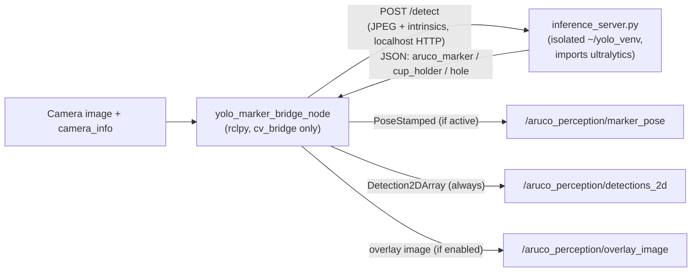

[← Back to index](./README.md)

# aruco_perception_yolo_bridge

`aruco_perception_yolo_bridge` contains one node, `yolo_marker_bridge_node`
(Python/rclpy), that is a drop-in alternative to `aruco_perception`'s
classical `aruco_detector_node`: it produces the same
`geometry_msgs/PoseStamped` marker pose on the same topic, but backed by a
YOLO model instead of classical OpenCV ArUco detection. It also detects
`cup_holder`/`hole` — objects the classical detector has no notion of at
all — for `depth_perception`'s eventual 3D pose pipeline to consume.

## Why this is a separate package, and why HTTP instead of a normal ROS call

This node deliberately **never imports `ultralytics`**. ROS's `cv_bridge`/
`image_transport` are compiled against the system's OpenCV (4.5.4 on ROS 2
Humble); `ultralytics` bundles its own, newer, ABI-incompatible OpenCV. Per
this project's locked ABI-isolation architecture, the two are never allowed
to share a process. Instead, the actual YOLO inference model runs inside an
isolated Python virtualenv (`~/yolo_venv`) as a separate process,
`inference_server.py`, exposing a plain HTTP endpoint. This node is an
ordinary `rclpy` node — no `ultralytics` dependency at all — that POSTs
JPEG-encoded frames to that local HTTP server and republishes the result
onto the ROS graph.



## Per-frame behavior

For every incoming image, once camera intrinsics have been received at
least once:

1. Convert the ROS image to an OpenCV BGR array via `cv_bridge` — a failed
   conversion logs and skips the frame, never crashes the node.
2. JPEG-encode and base64-encode the frame.
3. Build the request body using the **most recently received**
   `camera_info` message's intrinsics — never hardcoded or cached beyond
   "the latest message," matching `inference_server.py`'s own contract.
4. `POST` to the inference server with a short timeout, so a hung server
   can't stall the node — a failed request logs and skips the frame.
5. If the response contains an `aruco_marker` entry **and** this node's
   `active` parameter is currently true, convert the returned rotation
   vector to a quaternion and publish `PoseStamped` on `pose_topic`
   (`/aruco_perception/marker_pose` by convention) — same topic, message
   type, and `frame_id` convention (the source image's own header) as the
   classical detector, so `calibration_broadcaster_node` needs zero changes
   regardless of which detector is active.
6. Publishes a `visual_calibration_msgs/Detection2DArray` on
   `detections_2d_topic` **every frame, unconditionally** — containing
   whichever of `aruco_marker`/`cup_holder`/`hole` were found. Unlike the
   marker pose publish, this is never gated by `active`:
   `depth_perception`'s hole/cupholder pipeline needs a continuous stream
   regardless of which detector is currently driving calibration, and
   `calibration_orchestrator_node`'s image-based centering needs the
   `aruco_marker` entry to work identically in hybrid mode as in classical
   mode.

## The classical/hybrid switch

This node and `aruco_perception`'s classical `ArucoDetectorNode` both
publish `PoseStamped` on the *same* `pose_topic` — exactly one is meant to
be "active" (actually publishing a marker pose) at a time, controlled by
each node's own `active` boolean parameter and re-read live on every frame
(never cached), so a runtime `set_parameters` call — issued by
`calibration_orchestrator_node`'s `~/set_detector_mode` — takes effect on
the very next frame with no restart. See [orchestrator.md](./orchestrator.md)
for how that switch is actually flipped.

Unlike the classical node (which skips detection entirely when inactive),
this node still runs YOLO detection and still publishes `cup_holder`/`hole`
detections every frame regardless of `active` — only the `aruco_marker`
pose publish is gated.

## Why `visual_calibration_msgs/Detection2DArray`, not `vision_msgs`

`vision_msgs` is not a dependency anywhere in this workspace, and its
`Detection2D` is bounding-box-and-hypothesis-centric with pose/covariance
fields this project doesn't need. `Detection2D`/`Detection2DArray` here are
project-local types, named similarly to `vision_msgs`' types for
readability but not interchangeable with them — see
[visual_calibration_msgs.md](./class_docs/visual_calibration_msgs.md).

## Request/response contract with `inference_server.py`

```
POST http://<inference_server_url>/detect
Request:
  {
    "image_jpeg_base64": "<base64 JPEG>",
    "camera_matrix": [[fx,0,cx],[0,fy,cy],[0,0,1]],
    "dist_coeffs": [d0, d1, ...],
    "conf": 0.25,
    "skip_marker": false
  }
Response (each key entirely omitted, never null/empty, if not found):
  {
    "aruco_marker": {"rvec": [...], "tvec": [...], "corners": [[x,y]x4]},
    "cup_holder": [{"cx":.., "cy":.., "confidence":.., "bbox":[x1,y1,x2,y2]}, ...],
    "hole": [{"cx":.., "cy":.., "confidence":.., "bbox":[x1,y1,x2,y2]}, ...]
  }
```

`camera_matrix`/`dist_coeffs` sent are the ones actually used for this
request — already scaled down to match a downscaled frame when
`detect_max_width_px` triggers (see "CPU-budget mitigations" above), not
always the raw `camera_info` intrinsics.

`skip_marker` — optional, defaults `false` server-side if omitted. When
`true`, `inference_server.py` skips the ArUco marker cascade entirely for
this request (no `aruco_marker` key in the response); `cup_holder`/`hole`
detection is unaffected either way, since it was never part of that
cascade. This node computes it per-frame via the marker-cascade
throttling described above.

`corners` are already converted back to full-frame pixel coordinates
server-side, undoing both any YOLO crop offset and any preprocessing
resize; this node then additionally rescales them (along with
`cup_holder`/`hole`'s `cx`/`cy`/`bbox`) back to the *source* frame's
native resolution if `detect_max_width_px` downscaled the request —
usable directly either way, no further transform needed on this node's
side. `cx`/`cy`/`bbox` for `cup_holder`/`hole` are 2D pixel coordinates
only — there is no known real-world circle size to solve a 3D pose
against from YOLO alone (unlike the ArUco marker's known 45 mm size), so
any 3D pose for those two classes is left entirely to `depth_perception`'s
own downstream pipeline, which looks up depth at each detection's
centroid.

## `~/detect_marker_once` — on-demand single-shot detection

Served alongside the continuous per-frame pipeline above:
`calibration_broadcaster_node`'s `hybrid_per_waypoint_enabled` mode (see
[aruco_perception.md](./aruco_perception.md)'s "Per-waypoint hybrid
detection" bullet) calls this once per waypoint instead of relying on the
continuous `marker_pose` stream, so the YOLO crop + image-enhancement
cascade only runs once per waypoint rather than continuously at camera
framerate. `handle_detect_marker_once` waits for the *next* camera frame
to arrive after the call started (never a stale, already-buffered frame —
important since the caller wants a frame taken after the arm has actually
settled at that waypoint), then runs exactly one detection with the
cascade forced on (bypassing the continuous mode's own
`marker_check_every_n_frames` throttle, which exists to bound continuous
load and is irrelevant to a single on-demand call). It does **not**
publish to `marker_pose`/`detections_2d` — the whole point of per-waypoint
mode is bypassing those continuous-topic consumers — but does publish a
picture-in-picture update to `overlay_image` on success, so a human
watching the live feed can still see what the cascade detected during a
run (`publish_overlay_image_msg`'s own continuous-mode drawing is
suppressed for the whole run otherwise).

The response (`DetectMarkerOnce.srv`) carries the marker pose, which
cascade variant succeeded (`cascade_variant_used`), the actual annotated
crop image that succeeded (`cascade_image_b64` — `calibration_broadcaster_node`
accumulates these into one labeled debug grid per run), a `failure_reason`
(`"no_yolo_bbox"` — YOLO found no candidate box at all — vs.
`"no_classical_match"` — YOLO found a box but classical ArUco failed on
every enhancement variant tried within it) when unsuccessful, and
`detect_time_s` for that specific call.

## CPU-budget mitigations

Both sim and real run this pipeline on CPU-only hardware, where a YOLO
forward pass is the genuine compute bottleneck — three independent,
opt-in mechanisms exist purely to keep that bottleneck from cascading
into stale data or a starved auto-centering loop:

- **Drop-stale-frames guard** — `image_sub`'s `MutuallyExclusiveCallbackGroup`
  queues every incoming image while a previous `image_callback` is still
  blocked on the `/detect` HTTP call (bounded by `request_timeout_sec`,
  up to 8s on real). By the time a queued frame's turn comes, a much
  newer camera frame has usually already arrived, so processing it would
  only burn an inference cycle on outdated data. `image_callback` checks
  a `_request_in_flight` flag first and returns immediately if a request
  is already in progress, rather than letting the queue back up — no
  amount of ROS-side concurrency makes the underlying YOLO compute
  itself faster, so queuing stale frames only adds latency.
- **Marker-cascade throttling** (`marker_check_every_n_frames`,
  `marker_check_full_rate_when_active`) — the ArUco marker cascade inside
  `inference_server.py`'s `/detect` costs a meaningful fraction of total
  request time even when no marker is present, starving `cup_holder`/
  `hole` detection of a smoother stream. This node computes a per-frame
  `skip_marker` flag (sent in the request body — see the contract below)
  that skips the cascade on most frames, checking only every
  `marker_check_every_n_frames`th frame — **unless** this node's own
  `active` parameter is currently true, in which case
  `marker_check_full_rate_when_active` (default `true`) forces full-rate
  checking regardless of the throttle, since calibration/auto-centering
  need reliable per-attempt marker detection and must never be starved by
  this.
- **Detection-resolution downscaling** (`detect_max_width_px`, default
  `0` = disabled) — unlike the other tuning knobs, a smaller input image
  genuinely reduces the YOLO forward-pass cost itself (fewer pixels to
  convolve over). When enabled, the frame sent to `/detect` is downscaled
  to this width (camera intrinsics scaled proportionally alongside it),
  and every 2D pixel field in the response (`aruco_marker.corners`,
  `cup_holder`/`hole`'s `cx`/`cy`/`bbox`) is rescaled back to the
  original frame's native resolution before any downstream consumer
  (`publish_marker_pose`, `publish_detections_2d`, the overlay) ever sees
  it — none of them need to know downscaling happened.
  `aruco_marker`'s `rvec`/`tvec` (a 3D metric pose, not pixels) is left
  untouched, since `solvePnP` already used the already-scaled camera
  matrix and is correct in real-world units as computed.

## A concurrency gotcha worth knowing

`image_callback` blocks on a synchronous HTTP request for up to
`request_timeout_sec`. Under a single-threaded executor, that blocked every
other callback on the node too — including the standard `set_parameters`
service callback `calibration_orchestrator_node` uses to flip `active`,
which was observed to time out even though the node was healthy the whole
time. The fix: a `MultiThreadedExecutor`, with the image/camera_info
subscriptions sharing one dedicated `MutuallyExclusiveCallbackGroup`
(separate from the default group the parameter service runs in) — a
`MultiThreadedExecutor` only parallelizes callbacks across *different*
groups, not within one shared group.

## Class-level detail

See [class_docs/aruco_perception_yolo_bridge.md](./class_docs/aruco_perception_yolo_bridge.md)
for `YoloMarkerBridgeNode`'s method-by-method breakdown.
