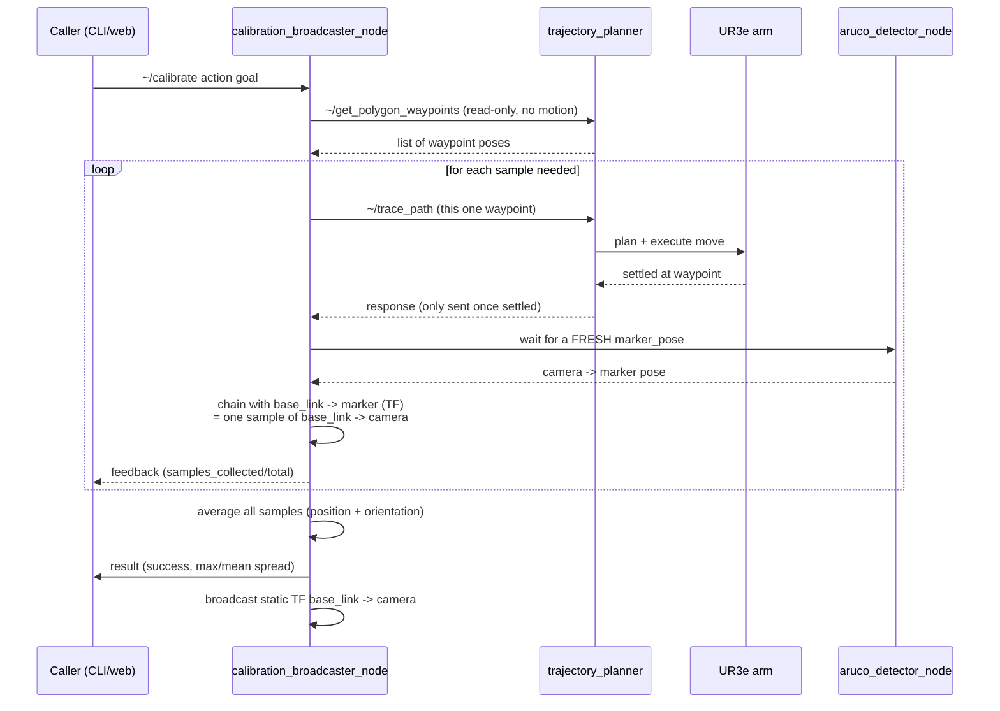

[← Back to index](./README.md)

# The calibration process, explained simply

This page walks through what actually happens during one `~/calibrate` run,
in plain language — no code, just the mechanism. For the node-by-node
technical breakdown, see [aruco_perception.md](./aruco_perception.md); for
the full package layout, see [architecture.md](./architecture.md).

## The big idea

The robot arm always knows exactly where its own hand is (joint encoders +
forward kinematics). The camera has no idea where it is relative to the arm
— that relationship simply doesn't exist yet. To find it, the arm holds up
a marker (the ArUco sticker on its wrist) so the camera can see it, and asks:
*"if you can see where this marker is, and I already know where this marker
is relative to me, can you work out where you must be sitting relative to
me?"* That's the whole trick — two views of the same marker, chained
together, solve for the one unknown link (`camera ↔ base_link`).

## Who does what

## Step by step

1. **`aruco_detector_node`** watches the camera feed and, whenever it spots
   the marker, publishes "here's where the marker is, relative to me" —
   a `PoseStamped` from the camera to the marker.

2. **`calibration_broadcaster_node`** is the conductor of the whole process.
   When it gets a `~/calibrate` goal, it first asks `trajectory_planner` for
   a list of waypoints — poses arranged in a small polygon in front of the
   camera — via `~/get_polygon_waypoints`. This call is read-only: it just
   returns the list, the arm doesn't move yet.

3. For each waypoint, `calibration_broadcaster_node` calls
   `~/trace_path` with just that one pose, and **waits** for the reply.
   That's the whole synchronization trick: `trajectory_planner` only sends
   the reply back once the arm has actually finished moving and settled at
   that pose. There's no separate "I'm done moving" signal anywhere else —
   the service response itself *is* the "arm is still now" signal.

4. Once settled, `calibration_broadcaster_node` doesn't just grab whatever
   marker pose happens to be lying around — it waits for a **brand new**
   marker detection published *after* the settle moment. This matters: an
   old, cached detection could still be from while the arm was moving.

5. That fresh detection becomes exactly one **sample**. A sample is *not*
   "the waypoint the arm moved to." It's a freshly computed
   `base_link → camera` transform, worked out by combining two things at
   that instant:
   - what the camera just saw (`camera → marker`, flipped around to
     `marker → camera`), with
   - what the arm's own joints already know for certain
     (`base_link → marker`, straight from TF, no camera involved).

   Chain those two together and the one unknown piece — where the camera
   sits relative to `base_link` — falls out.

6. This whole cycle (move → settle → wait for fresh detection → record
   sample) repeats until `num_samples` samples have been collected
   (10 by default). If there are more samples requested than there are
   polygon corners, it just loops back around the polygon again.

7. **Why move to different spots at all, instead of just taking 10 photos
   from one pose?** Averaging repeated shots from the *same* spot only
   cancels out random per-frame camera noise. Averaging shots from
   *different* spots also cancels out angle-dependent systematic error —
   the marker looking slightly "off" only at certain viewing angles, which
   repeating the same angle over and over would never catch. It's less like
   asking the same person the same question ten times, and more like asking
   ten different people from ten different angles — a broader, more honest
   vote.

8. Once all samples are in, they're averaged:
   - **Position** — plain arithmetic mean (add up all the X's, Y's, Z's,
     divide by N).
   - **Orientation** — quaternions can't just be averaged by adding numbers
     the naive way, because a rotation quaternion `q` and its negative `-q`
     represent the *exact same* rotation but would partially cancel each
     other out if summed blindly (this is called the double-cover problem).
     So every sample is first flipped, if needed, to match the same
     "hemisphere" as the very first sample, *then* summed and renormalized.

9. The averaged result is broadcast once as a static TF: `base_link →
   camera`. The action also returns `max_spread_deg` and `mean_spread_deg`
   — see below for what those mean.

## What `mean_spread_deg` and `max_spread_deg` actually tell you

Both numbers describe how much the individual samples' orientations
*disagreed with each other*, not whether the final answer is *correct*.

- **`mean_spread_deg`** — take every sample, measure the angle between its
  orientation and the final averaged orientation, then average those angles.
  "On average, how far off was each measurement from the final answer?"
- **`max_spread_deg`** — the single worst (largest) one of those angles.
  "What's the most any one measurement disagreed?"

These are a **consistency** signal, not an **accuracy** signal. Low spread
means the ten samples mostly agreed with each other — a good sign, but they
could still all be consistently wrong (e.g. if the marker's physical size is
misconfigured, every sample would agree with each other and still be off).
High spread means something was inconsistent between samples — possibly a
sample taken while the arm was still moving (the bug fixed this session, see
`progress.md`/`error-mitigation.md` #20), poor lighting, the marker partly
blocked from view, or just plain detection noise.

**What's been observed so far (simulation only):**

- Before the settle-sync fix (samples sometimes taken mid-motion,
  motion-blurred): spread was 12–84°. Clearly bad — a timing bug, not real
  measurement noise.
- After the fix, a real run produced `mean_spread_deg = 3.481`,
  `max_spread_deg = 11.553`. This is now considered a normal, healthy
  result — consistent with the ordinary per-frame noise you'd expect from
  ArUco detection across a handful of different viewing angles, not a bug.

**Rough interpretation bands** (heuristics from what's been observed in sim
so far — not rigorously derived thresholds, and the real robot may behave
differently once tested):

| `mean_spread_deg` | What it probably means |
|---|---|
| ~0–5° | Healthy, expected noise level in sim. |
| ~5–15° | Worth a second look — check marker distance/angle, lighting, or try fewer/closer waypoints — but not necessarily wrong. |
| above ~15–20°, **or** `max_spread_deg` much bigger than `mean_spread_deg` (e.g. more than 3x) | Likely a real problem. Re-check the settle-wait logic for the "arm still moving" bug pattern, check for marker occlusion, or a mid-run detection failure. |

**Important:** none of the above replaces actually checking accuracy. The
spread numbers only tell you the ten measurements agreed with each other —
they say nothing about whether they agree with the *true* camera position.
The real accuracy check is comparing the broadcast TF against simulation's
own ground-truth TF (`base_link → wrist_rgbd_camera_link`), which is still
an open item — see `progress.md`'s Open Verification Items.
