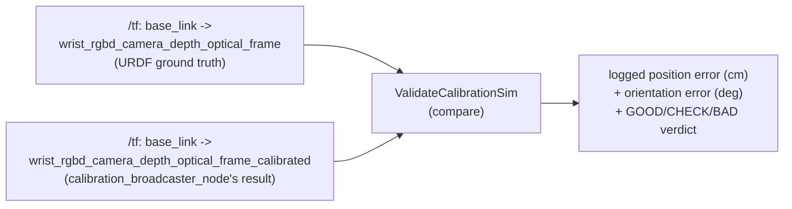

[← Back to index](./README.md)

# calibration_validation

`calibration_validation` is a small, sim-only package that automates the
accuracy check `calibration_process.md` describes: comparing
`calibration_broadcaster_node`'s broadcast TF against simulation's own
ground-truth TF for the same physical camera. It has one node,
`validate_calibration_sim.py`, and no launch file yet — it's run directly
(`ros2 run calibration_validation validate_calibration_sim.py`) once
`calibration_broadcaster_node` has already broadcast a result.

## Why this only works in simulation

The ground-truth frame comes from the URDF: `robot_state_publisher` already
knows exactly where the camera is bolted, since it's a fixed joint in the
robot description. The real robot has no such independent second source of
truth for its camera pose — that missing piece is the entire reason
calibration exists there. This node is therefore a simulation-only
correctness check on the pipeline, not something that runs against the real
cell.

## What it does

`ValidateCalibrationSim` polls `/tf` once a second until both
`base_link → wrist_rgbd_camera_depth_optical_frame` (ground truth) and
`base_link → wrist_rgbd_camera_depth_optical_frame_calibrated` (the
computed result, named per `calibration_broadcaster_node`'s
`broadcast_frame_suffix` — see [aruco_perception.md](./aruco_perception.md))
are available. Once both are found, it computes:

- **Position error** — straight-line distance (cm) between the two
  transforms' translations.
- **Orientation error** — angular difference (degrees) between the two
  transforms' rotations, using the same double-cover-aware quaternion angle
  formula as `orientation_averaging.cpp`'s spread metrics.

Each error is classified against a `GOOD`/`CHECK`/`BAD` threshold pair
(position: 1 cm / 3 cm; orientation: 5° / 15°) — a starting point sized for
the UR3e's sub-meter reach and centimeter-scale calibration offsets, not a
rigorously derived tolerance. A `BAD` verdict on either axis logs a warning
suggesting a re-check of the settle-sync logic, marker distance/lighting,
or simply re-running calibration. The node exits after its first successful
comparison — it's a one-shot check, not a continuous monitor.

This distinguishes **accuracy** (does the computed transform match reality)
from the **consistency** spread metrics (`mean_spread_deg`/`max_spread_deg`)
`calibration_broadcaster_node`'s own action result already reports — see
[calibration_process.md](./calibration_process.md) for why low spread alone
doesn't guarantee a correct answer, and this node is what actually checks
that.
