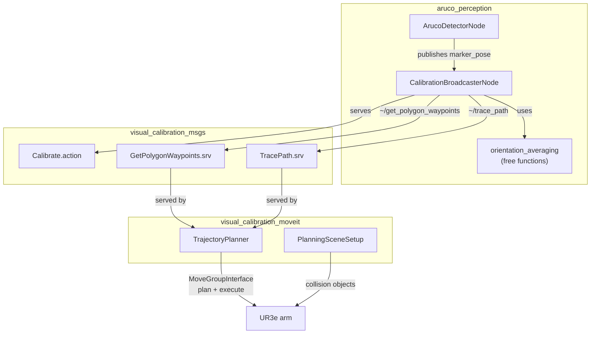

[← Back to index](../README.md)

# Class-level docs — index

Per-class documentation (Mermaid class diagrams + short plain-language
method summaries) for the packages under `visual_calibration/`. See
[CONVENTIONS.md](./CONVENTIONS.md) before adding to or extending this
folder.

## Packages

- [aruco_perception](./aruco_perception.md) — `ArucoDetectorNode`,
  `ImageSubscriberNode`, `CalibrationBroadcasterNode`, plus the
  `orientation_averaging` free functions. Per-parameter YAML references:
  [aruco_detector_sim.md](./aruco_detector_sim.md),
  [calibration_broadcaster_sim.md](./calibration_broadcaster_sim.md),
  [image_subscriber_sim.md](./image_subscriber_sim.md).
- [visual_calibration_moveit](./visual_calibration_moveit.md) —
  `PlanningSceneSetup`, `TrajectoryPlanner`, plus the `scene_object_types`
  supporting types. `MtcTrajectory` is skipped (disabled stub — MoveIt Task
  Constructor build unavailable upstream). Per-parameter YAML references:
  [trajectory_planner.md](./trajectory_planner.md),
  [scene_objects.md](./scene_objects.md).
- [visual_calibration_msgs](./visual_calibration_msgs.md) — interfaces-only
  package (`Calibrate.action`, `TracePath.srv`, `GetPolygonWaypoints.srv`),
  documented as field tables rather than class diagrams since there are no
  classes.
- `aruco_moveit_config` — **skipped**: purely generated MoveIt2 config
  (SRDF, kinematics.yaml, joint_limits.yaml, launch files) with no
  hand-written C++ classes to document. See
  [../aruco_moveit_config.md](../aruco_moveit_config.md) for its
  project-level (non-class) doc instead. Its `config/*.yaml` files
  (`initial_positions.yaml`, `joint_limits.yaml`, `kinematics.yaml`,
  `moveit_controllers.yaml`, `pilz_cartesian_limits.yaml`) are skipped for
  the same reason — they're MoveIt Setup Assistant output, not hand-tuned
  project parameters, so there's nothing project-specific to explain beyond
  what MoveIt's own documentation already covers for each field.

## Who talks to whom

High-level map of which classes/packages call into which others. This is
a class/package-level zoom-in on the flow already described in
[../architecture.md](../architecture.md) — see that page for the full
topic/TF-level detail.

`TrajectoryPlanner` never sees `Calibrate.action` or knows calibration
exists — it only serves plain `TracePath`/`GetPolygonWaypoints` requests.
All calibration-specific orchestration (waypoint iteration, sample timing,
averaging) lives entirely in `CalibrationBroadcasterNode`.
