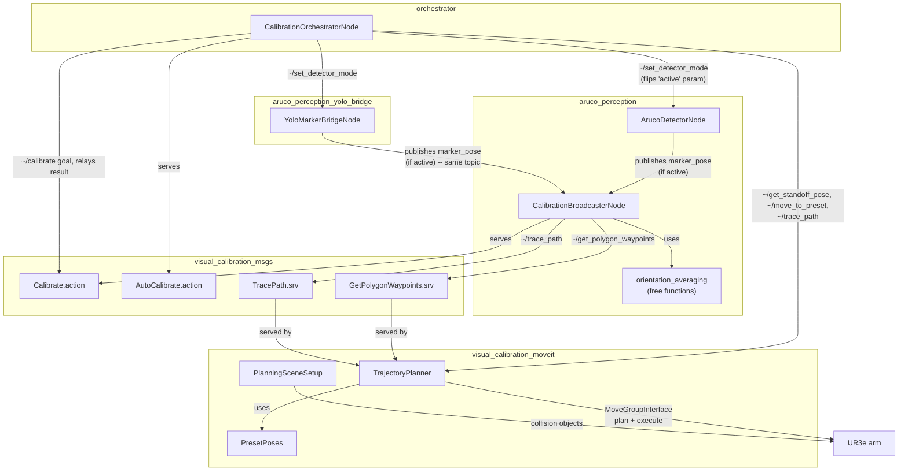

[← Back to index](../README.md)

# Introduction

High-level map of which classes/packages call into which others. This is
a class/package-level zoom-in on the flow already described in
[../architecture.md](../architecture.md) — see that page for the full
topic/TF-level detail.

```mermaid
flowchart TD
    subgraph AP["aruco_perception"]
        DET["ArucoDetectorNode"]
        CB["CalibrationBroadcasterNode"]
        OA["orientation_averaging\n(free functions)"]
    end

    subgraph YB["aruco_perception_yolo_bridge"]
        YOLO["YoloMarkerBridgeNode"]
    end

    subgraph ORCH["orchestrator"]
        ORC["CalibrationOrchestratorNode"]
    end

    subgraph MV["visual_calibration_moveit"]
        TP["TrajectoryPlanner"]
        PSS["PlanningSceneSetup"]
        PP["PresetPoses"]
    end

    subgraph MSGS["visual_calibration_msgs"]
        CAL["Calibrate.action"]
        AUTOCAL["AutoCalibrate.action"]
        TRACE["TracePath.srv"]
        POLY["GetPolygonWaypoints.srv"]
    end

    DET -->|"publishes marker_pose\n(if active)"| CB
    YOLO -->|"publishes marker_pose\n(if active) -- same topic"| CB
    ORC -->|"~/set_detector_mode\n(flips 'active' param)"| DET
    ORC -->|"~/set_detector_mode"| YOLO
    CB -->|"uses"| OA
    CB -->|"serves"| CAL
    CB -->|"~/get_polygon_waypoints"| POLY
    CB -->|"~/trace_path"| TRACE
    ORC -->|"serves"| AUTOCAL
    ORC -->|"~/calibrate goal, relays result"| CAL
    ORC -->|"~/get_standoff_pose, ~/move_to_preset,\n~/trace_path"| TP
    POLY -->|"served by"| TP
    TRACE -->|"served by"| TP
    TP -->|"uses"| PP
    TP -->|"MoveGroupInterface\nplan + execute"| ARM["UR3e arm"]
    PSS -->|"collision objects"| ARM
```

> [Note] 
`TrajectoryPlanner` never sees `Calibrate.action`/`AutoCalibrate.action` or
knows calibration exists — it only serves plain `TracePath`/
`GetPolygonWaypoints`/`GetStandoffPose`/`MoveToPreset` requests. All
calibration-specific orchestration lives in `CalibrationBroadcasterNode`
(per-sample waypoint iteration, timing, averaging) and
`CalibrationOrchestratorNode` (the cal_ready → center → calibrate
sequence) — `TrajectoryPlanner` itself stays a dumb mover.

[REMARKS to agent: give a gentle introduction and not what we are using to create something or what kind of summaries]
Per-class documentation (Mermaid class diagrams + short plain-language
method summaries) for the packages under `visual_calibration/`. See
[CONVENTIONS.md](./CONVENTIONS.md) before adding to or extending this
folder.
[REMARKS to agent: dont meniton anything about progress related or internal purpose files]

## Packages

- [aruco_perception](./aruco_perception.md) — `ArucoDetectorNode`,
  `ImageSubscriberNode`, `CalibrationBroadcasterNode`, plus the
  `orientation_averaging` free functions. Per-parameter YAML references:
  [aruco_detector_sim.md](./aruco_detector_sim.md),
  [calibration_broadcaster_sim.md](./calibration_broadcaster_sim.md),
  [image_subscriber_sim.md](./image_subscriber_sim.md).
- [aruco_perception_yolo_bridge](./aruco_perception_yolo_bridge.md) —
  `YoloMarkerBridgeNode`, plus the `rotation_matrix_to_quaternion` free
  function. See [../aruco_perception_yolo_bridge.md](../aruco_perception_yolo_bridge.md)
  for the plain-language package overview.
- [orchestrator](./orchestrator.md) — `CalibrationOrchestratorNode`. See
  [../orchestrator.md](../orchestrator.md) for the plain-language
  auto-calibrate sequence and image-based centering algorithm.
- [visual_calibration_moveit](./visual_calibration_moveit.md) —
  `PlanningSceneSetup`, `TrajectoryPlanner`, `PresetPoses`, plus the
  `scene_object_types` supporting types. `MtcTrajectory` is skipped
  (disabled stub — MoveIt Task Constructor build unavailable upstream).
  Per-parameter YAML references: [trajectory_planner.md](./trajectory_planner.md),
  [scene_objects.md](./scene_objects.md), [preset_poses.md](./preset_poses.md).
- [visual_calibration_msgs](./visual_calibration_msgs.md) — interfaces-only
  package (actions, services, and messages shared across the packages
  above), documented as field tables rather than class diagrams since there
  are no classes.
- `depth_perception` — **skipped from class_docs**: its only node
  (`DepthPerceptionNode`) is a plumbing-only camera-input smoke test with
  no real algorithmic classes yet (see
  [../depth_perception.md](../depth_perception.md) for its plain-language
  page instead, which covers its one class inline).
- `aruco_moveit_config`, `sim_ur3e_moveit_config`, `real_ur3e_moveit_config`
  — **skipped**: purely generated MoveIt2 config (SRDF, kinematics.yaml,
  joint_limits.yaml, launch files) with no hand-written C++ classes to
  document. See [../aruco_moveit_config.md](../aruco_moveit_config.md) and
  [../ur3e_moveit_config_variants.md](../ur3e_moveit_config_variants.md)
  for their project-level (non-class) docs instead. Their `config/*.yaml`
  files are skipped for the same reason — MoveIt Setup Assistant output,
  not hand-tuned project parameters, so there's nothing project-specific to
  explain beyond what MoveIt's own documentation already covers for each
  field.

