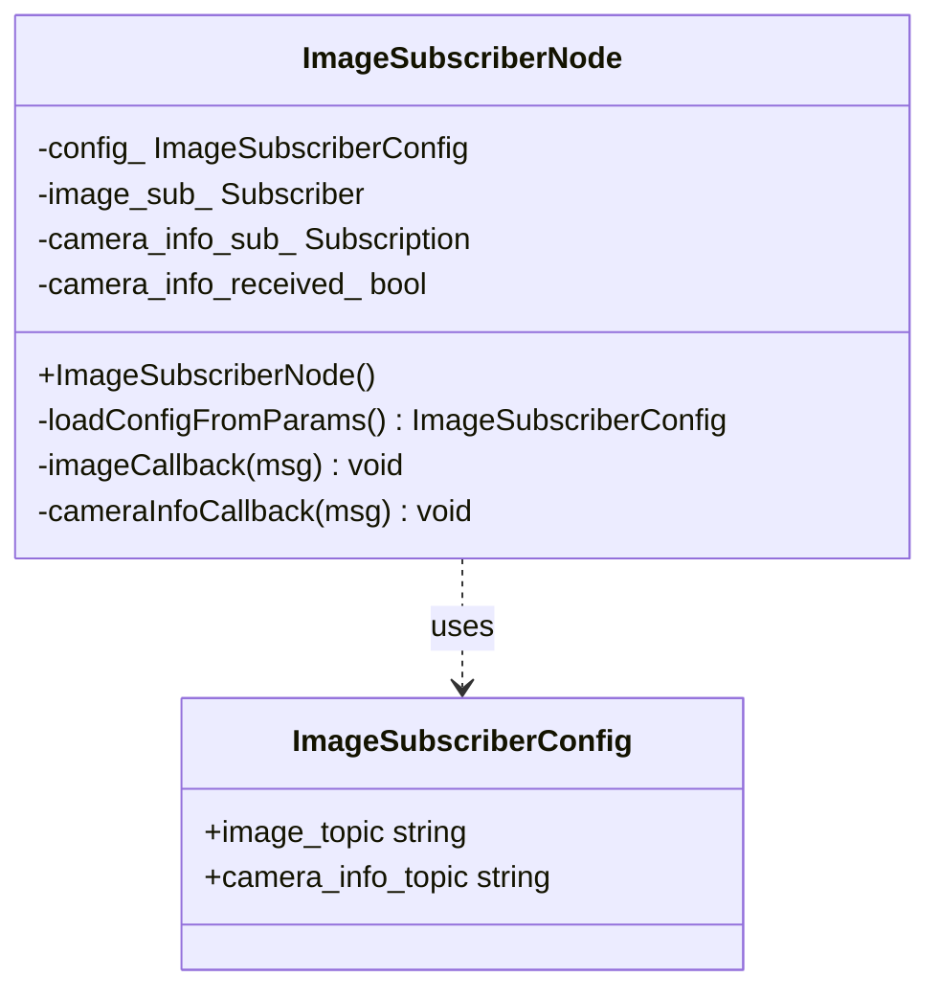
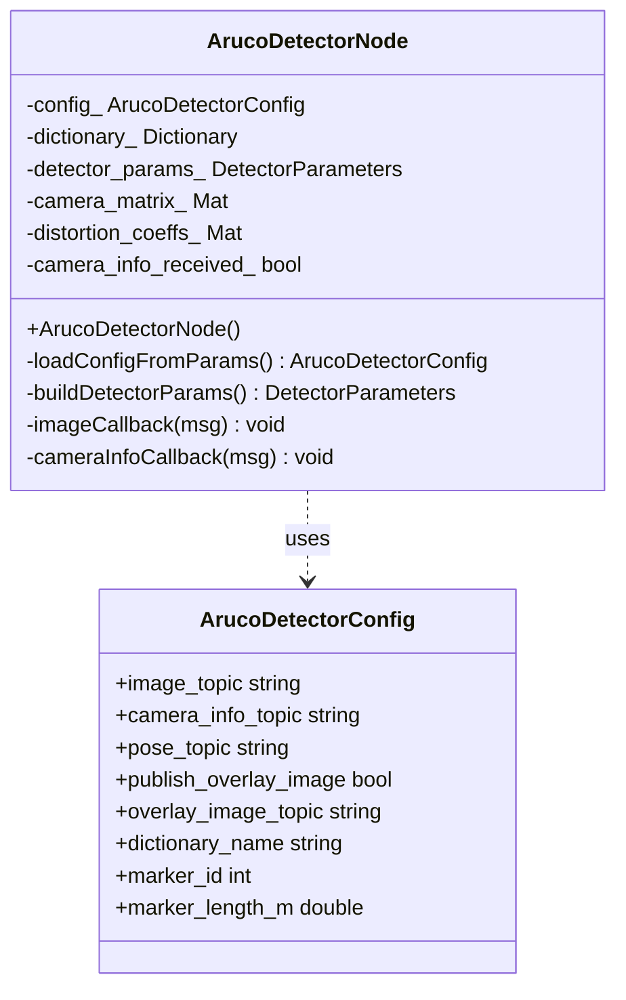
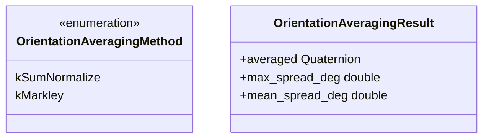
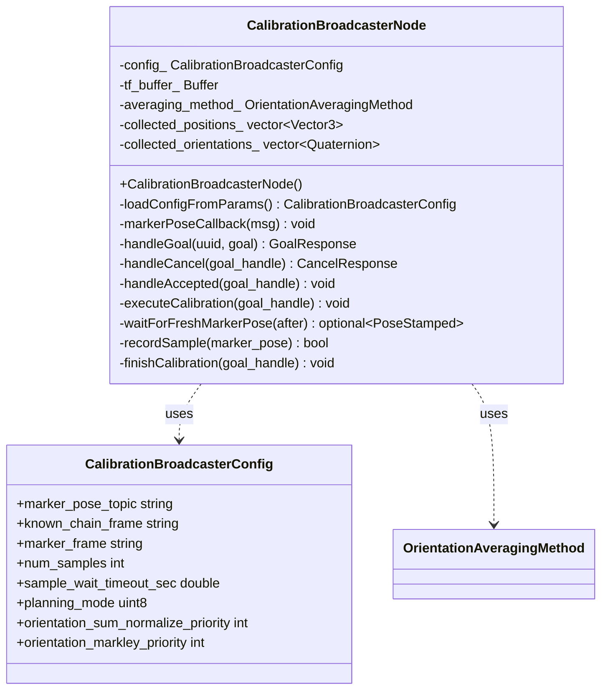
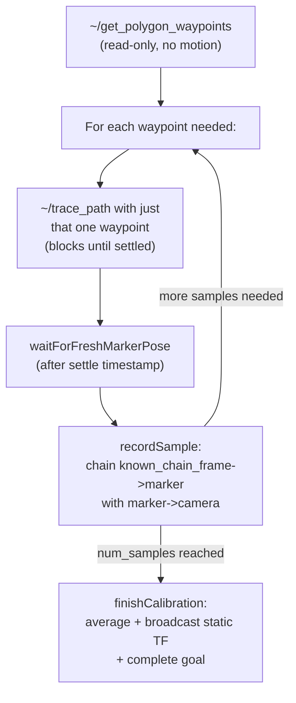

[← Back to index](../README.md)

# aruco_perception — class docs

Classes documented here: `ArucoDetectorNode`, `ImageSubscriberNode`,
`CalibrationBroadcasterNode`. Plus the free functions in
`orientation_averaging.hpp`, covered under their own section since they're
not a class.

Per-parameter YAML references:
[image_subscriber_sim.md](./image_subscriber_sim.md),
[aruco_detector_sim.md](./aruco_detector_sim.md),
[calibration_broadcaster_sim.md](./calibration_broadcaster_sim.md).

---

## ImageSubscriberNode

Plumbing-only smoke-test node: subscribes to the camera's image and
camera_info topics and logs that data is arriving, via `cv_bridge`. No
ArUco detection here — it exists to confirm the topics/conversion work
before `ArucoDetectorNode` adds vision logic on top. Parameters:
[image_subscriber_sim.md](./image_subscriber_sim.md).

### ImageSubscriberNode

Constructs the node and loads its topic names from parameters.

### loadConfigFromParams

Reads `image_topic` and `camera_info_topic` from this node's declared
parameters. Requires the node to be started with a parameter file
providing both.

### imageCallback

Logs image dimensions/encoding once per throttle period, and converts via
`cv_bridge` to confirm the ROS `Image` → `cv::Mat` path works.

Parameters: `msg`

### cameraInfoCallback

Logs that camera intrinsics were received — only once, since `camera_info`
is republished at a steady rate and doesn't change between frames.

Parameters: `msg`

---

## ArucoDetectorNode

Vision-only node: detects the single expected ArUco marker in the camera
feed and publishes its pose (camera optical frame → marker) as
`PoseStamped`. Doesn't touch TF or robot frames at all — that's
`CalibrationBroadcasterNode`'s job. Uses OpenCV's older free-function ArUco
API (matching what ships with ROS 2 Humble) rather than the newer
`ArucoDetector` class, to avoid conflicting with `cv_bridge`'s OpenCV ABI.
Parameters: [aruco_detector_sim.md](./aruco_detector_sim.md).

### dictionaryFromName

Free function. Maps a dictionary name (e.g. `"DICT_4X4_50"`) to OpenCV's
predefined dictionary ID — the set of valid bit-patterns a candidate square
is matched against, not the marker's physical size. Throws
`std::invalid_argument` for an unrecognized name.

Parameters: `name`

### ArucoDetectorNode

Constructs the node, loads its config, and builds the OpenCV dictionary and
detector parameters from it.

### loadConfigFromParams

Reads all of `ArucoDetectorConfig`'s fields from this node's declared
parameters — detection tuning is kept in YAML rather than hardcoded because
real-world lighting is inconsistent, unlike sim, so these are exactly the
knobs expected to need retuning when moving off simulation.

### buildDetectorParams

Builds a `cv::aruco::DetectorParameters` from `config_`'s tunables
(adaptive threshold window sizes, corner refinement method, etc.).

### imageCallback

Runs marker detection on the incoming frame; if the configured `marker_id`
is found, estimates its pose via `estimatePoseSingleMarkers` and publishes
it on `pose_topic`. Also draws and publishes the axis-overlay image if
`publish_overlay_image` is enabled.

Parameters: `msg`

### cameraInfoCallback

Captures camera intrinsics (`camera_matrix_`, `distortion_coeffs_`) on
first receipt — required for pose estimation — and assumes they stay
constant after that.

Parameters: `msg`

---

## Orientation averaging (`orientation_averaging.hpp`)

Not a class — free functions `CalibrationBroadcasterNode` uses to combine
several noisy orientation samples of the same physical pose into one
averaged quaternion.

- **`OrientationAveragingMethod`** — which averaging strategy to use.
  `kSumNormalize` sums all sample quaternions and renormalizes — correct
  enough when samples are close together (true here: same physical
  marker/camera, only per-frame noise differs). `kMarkley` is a proper
  SO(3) average, robust to widely-spread samples, but **not yet
  implemented** — it's reserved so priority configs can name it today
  without using it.
- **`OrientationAveragingResult`** — the averaged quaternion plus how far
  each sample deviated from it, in degrees (`max_spread_deg`,
  `mean_spread_deg`) — a quality signal for whether the average is
  trustworthy, logged but not yet used to auto-escalate between methods.

### selectAveragingMethod

Picks the highest-priority (lowest positive priority number) method among
those given. A priority of 0 means "disabled." Throws
`std::invalid_argument` if every priority is 0.

Parameters: `sum_normalize_priority`, `markley_priority`

### averageQuaternions

Averages a list of quaternion samples using the given method. Throws
`std::invalid_argument` if `method` is `kMarkley` (not implemented yet) or
if `samples` is empty.

Parameters: `samples`, `method`

---

## CalibrationBroadcasterNode

Orchestrates the whole calibration run as a `~/calibrate` action server.
Parameters: [calibration_broadcaster_sim.md](./calibration_broadcaster_sim.md).
For each waypoint, it calls `trajectory_planner`'s `~/trace_path` with just
that one pose (blocking until the arm is confirmed settled there), waits
for a *fresh* marker detection published after that settle point, and
takes exactly one sample from it. `trajectory_planner` itself is never
told calibration exists — it only ever sees ordinary `~/trace_path` /
`~/get_polygon_waypoints` calls, so all calibration-specific logic (waypoint
iteration, sample timing, averaging, broadcasting) lives entirely in this
class.

**Why "wait for fresh," not "use whatever's latest":** an earlier design
accepted whatever marker pose had arrived most recently on a timer,
regardless of whether the arm was still moving — which produced
motion-blur-corrupted samples. Blocking for a message stamped *after* the
settle point guarantees every sample reflects the arm actually being still.

Runs the whole per-goal sequence on its own dedicated thread (spawned from
`handleAccepted`), not inline in an action-server or subscription callback —
either would block the executor that this loop itself depends on (to
process the `~/trace_path` response and incoming `marker_pose` messages).

### CalibrationBroadcasterNode

Constructs the node, loads config, sets up the TF listener/broadcaster, and
picks the orientation averaging method from config priorities.

### loadConfigFromParams

Reads a `CalibrationBroadcasterConfig` from this node's declared
parameters.

### markerPoseCallback

Caches the latest marker pose message (with its receipt time) and notifies
anyone waiting in `waitForFreshMarkerPose`.

Parameters: `msg`

### handleGoal

Accepts a new `~/calibrate` goal unless a calibration run is already in
progress.

Parameters: `uuid`, `goal`

### handleCancel

Always accepts cancellation requests — `executeCalibration` polls for
cancellation between waypoints.

Parameters: `goal_handle`

### handleAccepted

Spawns a detached thread running `executeCalibration` — action servers
require this callback to return quickly rather than block.

Parameters: `goal_handle`

### executeCalibration

The actual orchestration sequence described in the diagram above: fetch
waypoints once, then for each sample needed, trace to that waypoint, wait
for a fresh detection, record a sample, and publish feedback. Aborts on any
failure (waypoint fetch, trace_path, sample-wait timeout) or cancellation;
calls `finishCalibration` on success.

Parameters: `goal_handle`

### waitForFreshMarkerPose

Blocks (up to `sample_wait_timeout_sec`) until a `marker_pose` message
stamped after `after` arrives, then returns it. Returns nothing on timeout.

Parameters: `after`

### recordSample

Chains one fresh marker detection (camera → marker) with the live known TF
chain (`known_chain_frame` → `marker_frame`) into one sample of
`known_chain_frame` → camera, appending it to the collected samples.
Returns false if the TF lookup fails.

Parameters: `marker_pose`

### finishCalibration

Averages all collected samples — position arithmetically, orientation via
`averaging_method_` — broadcasts the result as a static TF from
`known_chain_frame` to the camera frame, completes the action goal with the
result (including spread metrics), and clears the collected samples for the
next run.

Parameters: `goal_handle`
