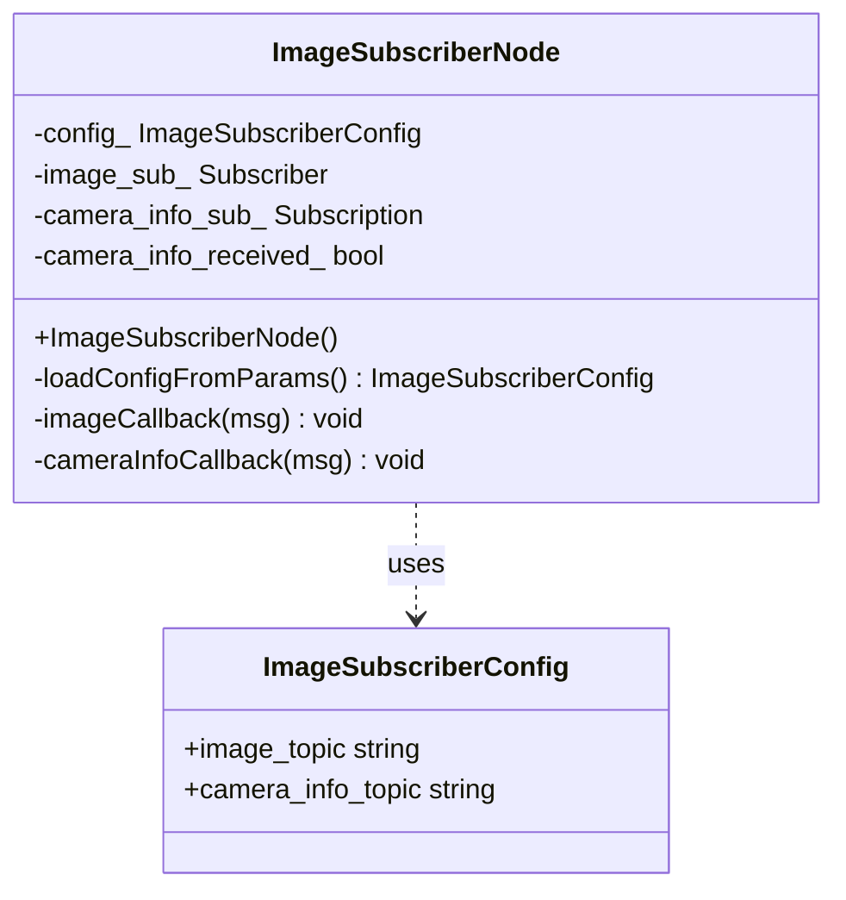
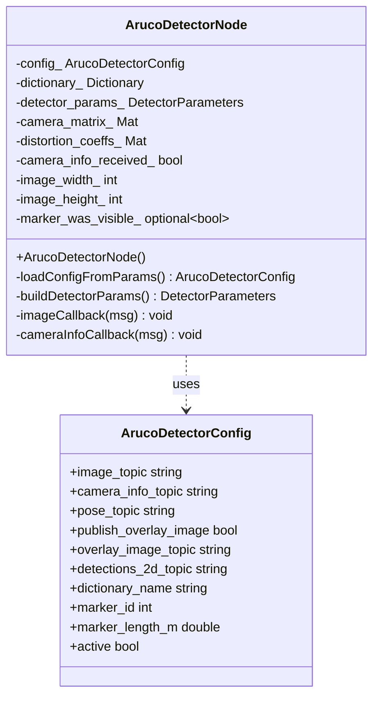
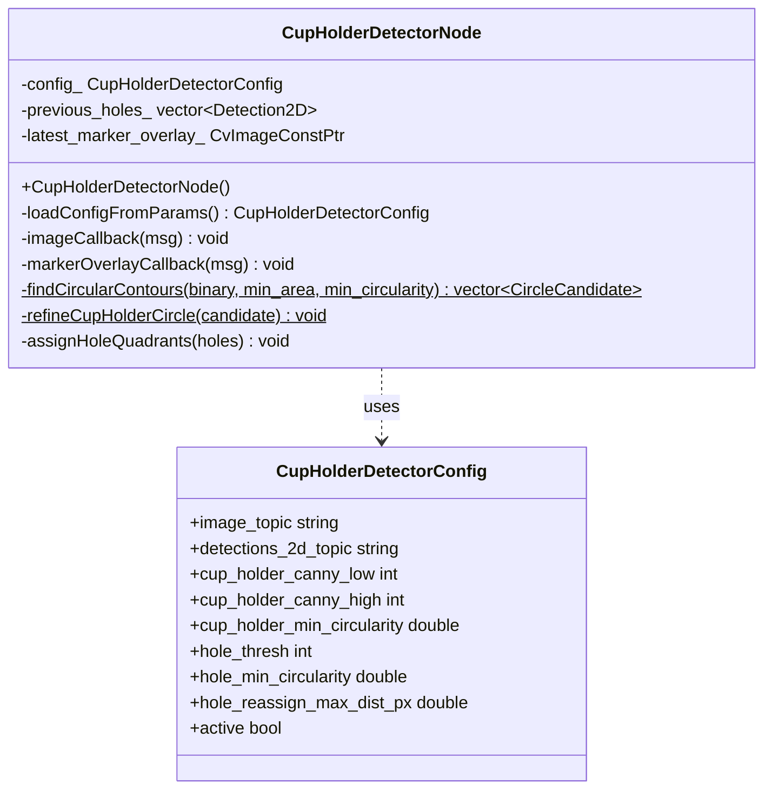
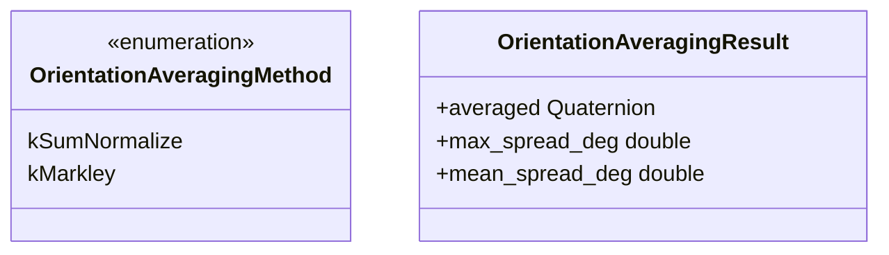
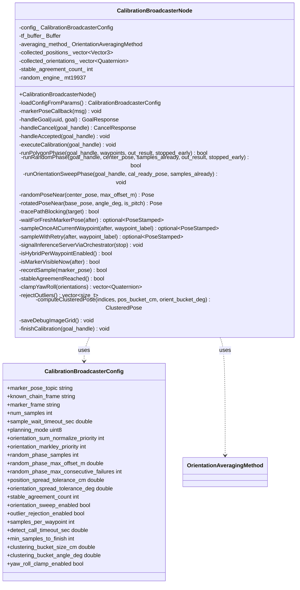
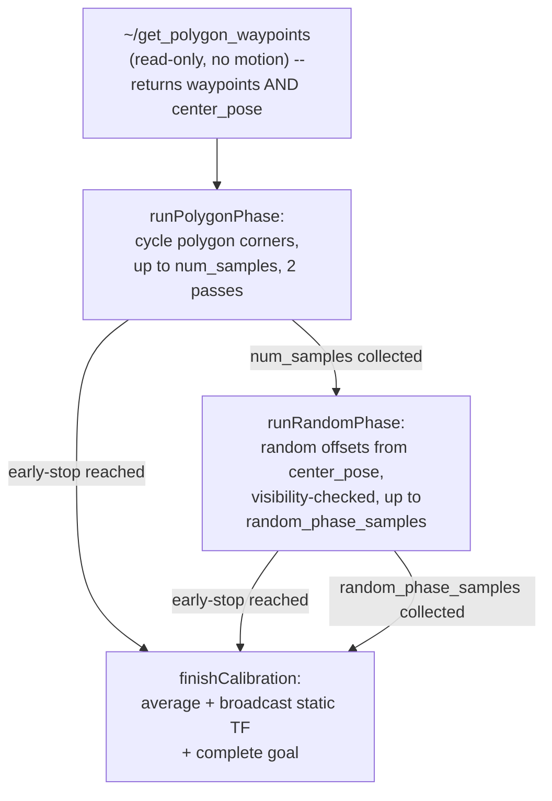

[← Back to index](../README.md)

# aruco_perception — class docs

Classes documented here: `ArucoDetectorNode`, `ImageSubscriberNode`,
`CupHolderDetectorNode`, `CalibrationBroadcasterNode`. Plus the free
functions in `orientation_averaging.hpp`, covered under their own section
since they're not a class.

Per-parameter YAML references:
[image_subscriber_sim.md](./image_subscriber_sim.md),
[aruco_detector_sim.md](./aruco_detector_sim.md),
[calibration_broadcaster_sim.md](./calibration_broadcaster_sim.md). No
parameter-reference page yet for `cup_holder_detector_sim.yaml` — see its
own comments in `aruco_perception/config/cup_holder_detector_sim.yaml`.

---

## ImageSubscriberNode

```mermaid
classDiagram
    class ImageSubscriberNode {
        +ImageSubscriberNode()
        -loadConfigFromParams() ImageSubscriberConfig
        -imageCallback(msg) void
        -cameraInfoCallback(msg) void
        -config_ ImageSubscriberConfig
        -image_sub_ Subscriber
        -camera_info_sub_ Subscription
        -camera_info_received_ bool
    }
    class ImageSubscriberConfig {
        +image_topic string
        +camera_info_topic string
    }
    ImageSubscriberNode ..> ImageSubscriberConfig : uses
```

Plumbing-only smoke-test node: subscribes to the camera's image and
camera_info topics and logs that data is arriving, via `cv_bridge`. No
ArUco detection here — it exists to confirm the topics/conversion work
before `ArucoDetectorNode` adds vision logic on top. Parameters:
[image_subscriber_sim.md](./image_subscriber_sim.md).

### ImageSubscriberNode

Constructs the node and loads its topic names from parameters.

### loadConfigFromParams

Reads `image_topic` and `camera_info_topic` from this node's declared
parameters. Requires the node to be started with a parameter file
providing both.

### imageCallback

Logs image dimensions/encoding once per throttle period, and converts via
`cv_bridge` to confirm the ROS `Image` → `cv::Mat` path works.

Parameters: `msg`

### cameraInfoCallback

Logs that camera intrinsics were received — only once, since `camera_info`
is republished at a steady rate and doesn't change between frames.

Parameters: `msg`

---

## ArucoDetectorNode

```mermaid
classDiagram
    class ArucoDetectorNode {
        +ArucoDetectorNode()
        -loadConfigFromParams() ArucoDetectorConfig
        -buildDetectorParams() DetectorParameters
        -imageCallback(msg) void
        -cameraInfoCallback(msg) void
        -config_ ArucoDetectorConfig
        -dictionary_ Dictionary
        -detector_params_ DetectorParameters
        -camera_matrix_ Mat
        -distortion_coeffs_ Mat
        -camera_info_received_ bool
        -image_width_ int
        -image_height_ int
        -marker_was_visible_ optional~bool~
    }
    class ArucoDetectorConfig {
        +image_topic string
        +camera_info_topic string
        +pose_topic string
        +publish_overlay_image bool
        +overlay_image_topic string
        +detections_2d_topic string
        +dictionary_name string
        +marker_id int
        +marker_length_m double
        +active bool
    }
    ArucoDetectorNode ..> ArucoDetectorConfig : uses
```

Vision-only node: detects the single expected ArUco marker in the camera
feed and publishes its pose (camera optical frame → marker) as
`PoseStamped`. Doesn't touch TF or robot frames at all — that's
`CalibrationBroadcasterNode`'s job. Uses OpenCV's older free-function ArUco
API (matching what ships with ROS 2 Humble) rather than the newer
`ArucoDetector` class, to avoid conflicting with `cv_bridge`'s OpenCV ABI.
Parameters: [aruco_detector_sim.md](./aruco_detector_sim.md).

**Classical/hybrid switch:** this node and
`aruco_perception_yolo_bridge`'s `YoloMarkerBridgeNode` both publish
`PoseStamped` on the same `pose_topic` — exactly one is meant to be
"active" at a time, gated by `config_.active` and re-read live via
`get_parameter("active")` on every frame (never cached), so
`CalibrationOrchestratorNode`'s `~/set_detector_mode` takes effect on the
very next frame with no restart. When inactive, `imageCallback` returns
immediately, before running detection at all — see
[../orchestrator.md](../orchestrator.md) for how the switch is flipped.

**Also new since the original design:** the overlay image now publishes on
*every* processed frame (with no drawing when the marker is absent), not
only frames where the marker was found, so a live viewer sees a
continuously updated stream rather than a frozen last-good frame; it also
draws a crosshair at the image's own pixel center whenever
`show_centering_crosshair` is true (set by
`CalibrationOrchestratorNode` for the duration of its image-based centering
search). When the marker *is* found, this node also publishes its
pixel-space centroid/bbox as a `visual_calibration_msgs/Detection2D`
(`class_name` `"aruco_marker"`) on `detections_2d_topic` — the same topic
`YoloMarkerBridgeNode` publishes `cup_holder`/`hole` detections on, so
image-based centering works identically regardless of which detector is
active.

### dictionaryFromName

Free function. Maps a dictionary name (e.g. `"DICT_4X4_50"`) to OpenCV's
predefined dictionary ID — the set of valid bit-patterns a candidate square
is matched against, not the marker's physical size. Throws
`std::invalid_argument` for an unrecognized name.

Parameters: `name`

### ArucoDetectorNode

Constructs the node, loads its config, and builds the OpenCV dictionary and
detector parameters from it.

### loadConfigFromParams

Reads all of `ArucoDetectorConfig`'s fields from this node's declared
parameters — detection tuning is kept in YAML rather than hardcoded because
real-world lighting is inconsistent, unlike sim, so these are exactly the
knobs expected to need retuning when moving off simulation.

### buildDetectorParams

Builds a `cv::aruco::DetectorParameters` from `config_`'s tunables
(adaptive threshold window sizes, corner refinement method, etc.).

### imageCallback

Returns immediately if `active` is currently false (see the classical/
hybrid switch above) — no detection work is done on frames nobody will
use. Otherwise runs marker detection on the incoming frame; if the
configured `marker_id` is found, estimates its pose via
`estimatePoseSingleMarkers`, publishes it on `pose_topic`, and publishes
its pixel centroid/bbox as a `Detection2D` on `detections_2d_topic`. Also
publishes the axis-overlay image (with a crosshair if
`show_centering_crosshair` is set) on every processed frame if
`publish_overlay_image` is enabled — not just frames where the marker was
found. Logs a marker found/lost transition only when `marker_was_visible_`
actually changes, not every frame.

Parameters: `msg`

### cameraInfoCallback

Captures camera intrinsics (`camera_matrix_`, `distortion_coeffs_`) and
image dimensions (`image_width_`, `image_height_`) on first receipt —
required for pose estimation and for computing the image's own pixel
center — and assumes they stay constant after that.

Parameters: `msg`

---

## CupHolderDetectorNode

```mermaid
classDiagram
    class CupHolderDetectorNode {
        +CupHolderDetectorNode()
        -loadConfigFromParams() CupHolderDetectorConfig
        -imageCallback(msg) void
        -markerOverlayCallback(msg) void
        -findCircularContours(binary, min_area, min_circularity)$ vector~CircleCandidate~
        -refineCupHolderCircle(candidate)$ void
        -assignHoleQuadrants(holes) void
        -config_ CupHolderDetectorConfig
        -previous_holes_ vector~Detection2D~
        -latest_marker_overlay_ CvImageConstPtr
    }
    class CupHolderDetectorConfig {
        +image_topic string
        +detections_2d_topic string
        +cup_holder_canny_low int
        +cup_holder_canny_high int
        +cup_holder_min_circularity double
        +hole_thresh int
        +hole_min_circularity double
        +hole_reassign_max_dist_px double
        +active bool
    }
    CupHolderDetectorNode ..> CupHolderDetectorConfig : uses
```

Sim-only classical OpenCV detector for the cupholder disc and its up to 4
holes, publishing `Detection2D`/`Detection2DArray` on the same
`detections_2d_topic` `ArucoDetectorNode`/`YoloMarkerBridgeNode` already
publish `aruco_marker`/`cup_holder`/`hole` entries on — `depth_perception_node`
(the actual consumer) has no awareness of which detector produced a given
message. 2D pixel space only, no depth/3D pose. Exists because sim's
CPU-only rosject cannot run YOLO fast enough alongside Gazebo/RViz/the web
dashboard; real has no equivalent (YOLO only). Parameters:
[../aruco_perception.md](../aruco_perception.md#cup_holder_detector_node)
covers the detection-approach rationale (why Canny for the disc, threshold
for holes, `fitEllipse` vs. `minEnclosingCircle`) at the plain-language
level — not repeated here.

### CupHolderDetectorNode

Constructs the node: subscribes to the camera image, creates the
`detections_2d` publisher, and (if `publish_overlay_image`) subscribes to
`aruco_detector_node`'s marker-only overlay and creates the combined
overlay publisher.

### loadConfigFromParams

Reads all of `CupHolderDetectorConfig`'s fields from this node's declared
parameters — every tunable is live re-read per frame (never cached here),
so `ros2 param set` takes effect with no restart, since the exact
HSV/grayscale cutoffs need iterative live tuning.

### imageCallback

Returns immediately if `active` is false. Otherwise: Pass 1 finds the
cupholder disc via `cv::Canny` (on a blurred grayscale image) + dilate +
`findCircularContours`, refined via `refineCupHolderCircle`. Pass 2
thresholds within a square ROI around the found disc (or the full image if
none found) to find dark hole cavities, filtered by radius bounds. Builds
and publishes one `Detection2DArray` (empty `detections[]` if nothing
found — same continuous-stream convention as the other detectors), and
optionally draws + publishes the combined overlay image.

Parameters: `msg`

### markerOverlayCallback

Caches the latest received marker-only overlay frame (`latest_marker_overlay_`)
— does no detection work itself. If never received, `imageCallback` falls
back to drawing on its own raw camera frame instead of publishing nothing.

Parameters: `msg`

### findCircularContours

Static helper. Finds all contours in a binary (0/255) image passing area
and circularity (`4π·area/perimeter²`) filters, fit via
`cv::minEnclosingCircle`, sorted by descending area.

Parameters: `binary`, `min_area_px`, `min_circularity`

### refineCupHolderCircle

Static helper. Re-fits a candidate's contour via `cv::fitEllipse` and
overwrites its center/radius — `fitEllipse`'s least-squares fit is far
less sensitive than `minEnclosingCircle` to a small outlier bulge in the
disc's Canny/dilate contour (its rim edge also picks up a bit of the
disc's 3D cylinder side, not just the flat top's true boundary). Applied
only to the cupholder — holes are already small, clean, near-perfect
circles with no equivalent bulge.

Parameters: `candidate`

### assignHoleQuadrants

Labels each hole 1–4 (top-left/top-right/bottom-left/bottom-right) around
the mean centroid of this frame's own hole detections (not the cupholder's
fitted center — a sim-specific divergence from `yolo_marker_bridge_node.py`,
since the disc's rim contour is measurably elliptical from sim's
wrist-camera viewing angle, which would pull a disc-center reference away
from the true 4-hole arrangement's visual center). Gives each hole a
persistent identity across frames via nearest-centroid matching against
`previous_holes_` (greedy, ascending-distance, gated by
`hole_reassign_max_dist_px`) before falling back to the raw quadrant split
— prevents a hole sitting near the quadrant boundary from flickering
between two labels purely from detection jitter.

Parameters: `holes`

---

## Orientation averaging (`orientation_averaging.hpp`)

Not a class — free functions `CalibrationBroadcasterNode` uses to combine
several noisy orientation samples of the same physical pose into one
averaged quaternion.

```mermaid
classDiagram
    class OrientationAveragingMethod {
        <<enumeration>>
        kSumNormalize
        kMarkley
    }
    class OrientationAveragingResult {
        +averaged Quaternion
        +max_spread_deg double
        +mean_spread_deg double
    }
```

- **`OrientationAveragingMethod`** — which averaging strategy to use.
  `kSumNormalize` sums all sample quaternions and renormalizes — correct
  enough when samples are close together (true here: same physical
  marker/camera, only per-frame noise differs). `kMarkley` is a proper
  SO(3) average, robust to widely-spread samples (implemented via Eigen's
  symmetric eigenvalue solver — see `markleyAverage()`'s own comment in
  `orientation_averaging.cpp`); left at priority `0` (disabled) by default
  in both sim/real configs, an opt-in alternative rather than a
  default-behavior change.
- **`OrientationAveragingResult`** — the averaged quaternion plus how far
  each sample deviated from it, in degrees (`max_spread_deg`,
  `mean_spread_deg`) — a quality signal for whether the average is
  trustworthy, logged but not yet used to auto-escalate between methods.

### selectAveragingMethod

Picks the highest-priority (lowest positive priority number) method among
those given. A priority of 0 means "disabled." Throws
`std::invalid_argument` if every priority is 0.

Parameters: `sum_normalize_priority`, `markley_priority`

### averageQuaternions

Averages a list of quaternion samples using the given method
(`sumNormalize()` or `markleyAverage()` — see each function's own doc
comment in `orientation_averaging.cpp` for the underlying math) and
returns the result plus max/mean angular spread from that average. Throws
`std::invalid_argument` if `samples` is empty.

Parameters: `samples`, `method`

### angularDeviationDeg

Free function. Angular deviation in degrees between two quaternions
(`2·acos(|dot(a,b)|)`), accounting for the q/-q double-cover of SO(3) —
the same formula `averageQuaternions()` uses internally for its spread
metrics, exposed so callers needing a single sample-vs-reference deviation
(e.g. `rejectOutliers`, `computeClusteredPose`) don't reimplement it.

Parameters: `a`, `b`

---

## CalibrationBroadcasterNode

```mermaid
classDiagram
    class CalibrationBroadcasterNode {
        +CalibrationBroadcasterNode()
        -loadConfigFromParams() CalibrationBroadcasterConfig
        -markerPoseCallback(msg) void
        -handleGoal(uuid, goal) GoalResponse
        -handleCancel(goal_handle) CancelResponse
        -handleAccepted(goal_handle) void
        -executeCalibration(goal_handle) void
        -runPolygonPhase(goal_handle, waypoints, out_result, stopped_early) bool
        -runRandomPhase(goal_handle, center_pose, samples_already, out_result, stopped_early) bool
        -runOrientationSweepPhase(goal_handle, cal_ready_pose, samples_already) void
        -randomPoseNear(center_pose, max_offset_m) Pose
        -rotatedPoseNear(base_pose, angle_deg, is_pitch) Pose
        -tracePathBlocking(target) bool
        -waitForFreshMarkerPose(after) optional~PoseStamped~
        -sampleOnceAtCurrentWaypoint(after, waypoint_label) optional~PoseStamped~
        -sampleWithRetry(after, waypoint_label) optional~PoseStamped~
        -signalInferenceServerViaOrchestrator(stop) void
        -isHybridPerWaypointEnabled() bool
        -isMarkerVisibleNow(after) bool
        -recordSample(marker_pose) bool
        -stableAgreementReached() bool
        -clampYawRoll(orientations) vector~Quaternion~
        -rejectOutliers() vector~size_t~
        -computeClusteredPose(indices, pos_bucket_cm, orient_bucket_deg) ClusteredPose
        -saveDebugImageGrid() void
        -finishCalibration(goal_handle) void
        -config_ CalibrationBroadcasterConfig
        -tf_buffer_ Buffer
        -averaging_method_ OrientationAveragingMethod
        -collected_positions_ vector~Vector3~
        -collected_orientations_ vector~Quaternion~
        -stable_agreement_count_ int
        -random_engine_ mt19937
    }
    class CalibrationBroadcasterConfig {
        +marker_pose_topic string
        +known_chain_frame string
        +marker_frame string
        +num_samples int
        +sample_wait_timeout_sec double
        +planning_mode uint8
        +orientation_sum_normalize_priority int
        +orientation_markley_priority int
        +random_phase_samples int
        +random_phase_max_offset_m double
        +random_phase_max_consecutive_failures int
        +position_spread_tolerance_cm double
        +orientation_spread_tolerance_deg double
        +stable_agreement_count int
        +orientation_sweep_enabled bool
        +outlier_rejection_enabled bool
        +samples_per_waypoint int
        +detect_call_timeout_sec double
        +min_samples_to_finish int
        +clustering_bucket_size_cm double
        +clustering_bucket_angle_deg double
        +yaw_roll_clamp_enabled bool
    }
    CalibrationBroadcasterNode ..> CalibrationBroadcasterConfig : uses
    CalibrationBroadcasterNode ..> OrientationAveragingMethod : uses
```

`hybrid_per_waypoint_enabled` (per-waypoint on-demand YOLO detection,
live-toggled — see [../aruco_perception.md](../aruco_perception.md)'s
"Per-waypoint hybrid detection" bullet) and `use_clustering_average` are
deliberately **not** `CalibrationBroadcasterConfig` fields — both are read
live via `get_parameter`/`get_parameter_or` at their point of use instead
of cached at construction, so the web UI can flip them mid-session with no
node restart, unlike every other field in this struct.

Orchestrates the whole calibration run as a `~/calibrate` action server.
Parameters: [calibration_broadcaster_sim.md](./calibration_broadcaster_sim.md).
`trajectory_planner` itself is never told calibration exists — it only
ever sees ordinary `~/trace_path`/`~/get_polygon_waypoints` calls, so all
calibration-specific logic (phase sequencing, sample timing, early-stop,
averaging, broadcasting) lives entirely in this class.

**Two sequential sampling phases**, not one undifferentiated loop:

1. **Polygon phase** (`runPolygonPhase`) — visits the polygon corners
   returned by `~/get_polygon_waypoints`, cycling through them for up to 2
   full passes (`config_.num_samples` total).
2. **Random phase** (`runRandomPhase`) — `config_.random_phase_samples`
   further samples at randomized X/Y/Z offsets from the *same* center pose
   (`randomPoseNear`), each capped at `random_phase_max_offset_m` and
   visibility-checked before counting; a move that succeeds but leaves the
   marker invisible is discarded (not counted) and retried with a new
   random candidate, bounded by `random_phase_max_consecutive_failures`.

Both phases share the same per-sample sequence: call `~/trace_path` with a
single waypoint (blocking until the arm is confirmed settled there), wait
for a *fresh* marker detection published after that settle point, and
record exactly one sample from it.

**Why move to different spots, and why two phases:** averaging repeated
shots from one fixed pose only cancels random per-frame noise; spreading
samples across several physically distinct poses (the polygon) also
cancels angle-dependent systematic error. The random phase then adds
poses the fixed polygon corners would never visit, closing gaps the
regular polygon might otherwise systematically miss.

**Early-stop:** after every recorded sample (either phase),
`stableAgreementReached()` checks whether the running position/orientation
spread has stayed within tolerance for `stable_agreement_count` samples in
a row-agnostic (non-consecutive) running count — if so, collection stops
immediately rather than always running the full configured sample count.

```mermaid
flowchart TD
    G["~/get_polygon_waypoints\n(read-only, no motion) --\nreturns waypoints AND center_pose"] --> P["runPolygonPhase:\ncycle polygon corners,\nup to num_samples, 2 passes"]
    P -->|early-stop reached| F
    P -->|num_samples collected| R["runRandomPhase:\nrandom offsets from center_pose,\nvisibility-checked, up to\nrandom_phase_samples"]
    R -->|early-stop reached| F
    R -->|random_phase_samples collected| F["finishCalibration:\naverage + broadcast static TF\n+ complete goal"]
```

Each per-sample move still follows: `~/trace_path` (blocks until settled)
→ `waitForFreshMarkerPose` (after the settle timestamp) → `recordSample`
(chains `known_chain_frame → marker` with `marker → camera`) → check
`stableAgreementReached()`.

**Why "wait for fresh," not "use whatever's latest":** an earlier design
accepted whatever marker pose had arrived most recently on a timer,
regardless of whether the arm was still moving — which produced
motion-blur-corrupted samples. Blocking for a message stamped *after* the
settle point guarantees every sample reflects the arm actually being still.

Runs the whole per-goal sequence on its own dedicated thread (spawned from
`handleAccepted`), not inline in an action-server or subscription callback —
either would block the executor that this loop itself depends on (to
process the `~/trace_path` response and incoming `marker_pose` messages).

### CalibrationBroadcasterNode

Constructs the node, loads config, sets up the TF listener/broadcaster, and
picks the orientation averaging method from config priorities.

### loadConfigFromParams

Reads a `CalibrationBroadcasterConfig` from this node's declared
parameters.

### markerPoseCallback

Caches the latest marker pose message (with its receipt time) and notifies
anyone waiting in `waitForFreshMarkerPose`.

Parameters: `msg`

### handleGoal

Accepts a new `~/calibrate` goal unless a calibration run is already in
progress.

Parameters: `uuid`, `goal`

### handleCancel

Always accepts cancellation requests — `executeCalibration` polls for
cancellation between waypoints.

Parameters: `goal_handle`

### handleAccepted

Spawns a detached thread running `executeCalibration` — action servers
require this callback to return quickly rather than block.

Parameters: `goal_handle`

### executeCalibration

Fetches waypoints and center pose once via `~/get_polygon_waypoints`, then
runs `runPolygonPhase` followed by `runRandomPhase` (skipped if
`runPolygonPhase` already early-stopped). Aborts on any hard failure
(waypoint fetch, trace_path, sample-wait timeout) or cancellation; calls
`finishCalibration` once either phase completes or early-stop triggers.

Parameters: `goal_handle`

### runPolygonPhase

Visits the polygon corner waypoints for up to 2 full passes (cycling via
modulo), up to `num_samples` samples — fewer if early-stop triggers first.
Returns `false` (with a failure result set, goal not yet aborted — the
caller does that) on the first hard failure or cancellation.

Parameters: `goal_handle`, `waypoints`, `out_result`, `stopped_early`

### runRandomPhase

Generates `random_phase_samples` valid samples (fewer if early-stop
triggers first) at randomized offsets from `center_pose`. Per candidate: if
the move fails outright, that's a hard failure; if the move succeeds but
the marker isn't visible, the attempt is discarded, the arm returns to
`center_pose`, and a new candidate is generated — bounded by
`random_phase_max_consecutive_failures` consecutive discards before giving
up as a hard failure.

Parameters: `goal_handle`, `center_pose`, `samples_already_collected`, `out_result`, `stopped_early`

### randomPoseNear

Generates a uniformly-random offset pose from `center_pose`, varying X/Y/Z
independently within ±`max_offset_m`, checked as a straight-line distance
cap before returning (a candidate exceeding the cap is rejected and
re-rolled internally). Keeps `center_pose`'s orientation unchanged.

Parameters: `center_pose`, `max_offset_m`

### tracePathBlocking

Sends a single-waypoint `~/trace_path` request (using `config_.planning_mode`)
and blocks for the response. Shared by both phases.

Parameters: `target`

### waitForFreshMarkerPose

Blocks (up to `sample_wait_timeout_sec`) until a `marker_pose` message
stamped after `after` arrives, then returns it. Returns nothing on timeout.

Parameters: `after`

### isMarkerVisibleNow

Like `waitForFreshMarkerPose`, but only checks for visibility (doesn't need
the pose itself) — used by the random phase's per-candidate visibility
check. Polls rather than blocking, since a move to a genuinely-invisible
position must time out gracefully.

Parameters: `after`

### recordSample

Chains one fresh marker detection (camera → marker) with the live known TF
chain (`known_chain_frame` → `marker_frame`) into one sample of
`known_chain_frame` → camera, appending it to the collected samples.
Returns false if the TF lookup fails.

Parameters: `marker_pose`

### stableAgreementReached

Called after every successful `recordSample()`, in both phases. Computes
the running position spread (max distance, cm, of any collected sample
from the arithmetic mean so far) and running orientation spread
(`max_spread_deg` from averaging the collected orientations so far, safe to
call mid-run). If both are within tolerance, increments a running
(non-consecutive) agreement counter and returns `true` once it reaches
`stable_agreement_count`. Returns `false` with fewer than 2 samples
collected (spread is meaningless with only one sample).

### runOrientationSweepPhase

Runs once after polygon/random sampling, only if `orientation_sweep_enabled`.
Returns to `cal_ready_pose`, then probes 4 independent rotational offsets
(pitch down, pitch up, roll left, roll right, each `orientation_sweep_angle_deg`
from `cal_ready_pose`'s own orientation, not cumulative) via `rotatedPoseNear`,
taking one sample per probe that lands with the marker visible. A failed
probe is skipped, not a hard failure — same reasoning as `runRandomPhase`'s
invisible-marker handling.

Parameters: `goal_handle`, `cal_ready_pose`, `samples_already_collected`

### rotatedPoseNear

Builds a pose offset from `base_pose` by a pure rotation (pitch or roll)
around its own local axis, position unchanged — used by
`runOrientationSweepPhase`.

Parameters: `base_pose`, `angle_deg`, `is_pitch`

### sampleOnceAtCurrentWaypoint

The single point both phases' inner sampling loops call for one sample.
When `hybrid_per_waypoint_enabled` is false: identical to
`waitForFreshMarkerPose`. When true: brackets one `~/detect_marker_once`
call to `yolo_marker_bridge_node` with SIGCONT/SIGSTOP of
`inference_server.py` (via `signalInferenceServerViaOrchestrator`), bounded
by `detect_call_timeout_sec`; on success also appends the returned crop
image to `debug_grid_images_` for the end-of-run debug grid.

Parameters: `after`, `waypoint_label`

### sampleWithRetry

Retries `sampleOnceAtCurrentWaypoint` up to
`cal_ready_hybrid_marker_detection_retry` times, each attempt a genuinely
fresh frame — used by every sampling call site so a single transient
detection miss doesn't need `min_samples_to_finish`'s discard-and-continue
fallback to recover.

Parameters: `after`, `waypoint_label`

### signalInferenceServerViaOrchestrator

Sends SIGSTOP/SIGCONT to `inference_server.py` via `orchestrator`'s
`~/signal_inference_server` service — the cross-package bridge
`sampleOnceAtCurrentWaypoint`'s per-waypoint bracketing uses, since this
node cannot call `CalibrationOrchestratorNode`'s private
`signalInferenceServer()` directly. Best-effort: logs, does not throw, if
unreachable.

Parameters: `stop`

### isHybridPerWaypointEnabled

Live (uncached) read of whether per-waypoint hybrid detection is currently
on — shared by `sampleOnceAtCurrentWaypoint` and the visibility guards in
both phases.

### saveDebugImageGrid

Assembles `debug_grid_images_` (only populated in hybrid-per-waypoint mode)
into one labeled grid image (`cv::hconcat`/`vconcat` + `cv::putText`
per-tile labels) and writes it once at the end of `executeCalibration` —
an inspection/presentation artifact, not something that can fail the run
itself.

### clampYawRoll

Real-only, opt-in (`yaw_roll_clamp_enabled`): computes a circular mean of
yaw and of roll across all collected orientations, then replaces every
sample's yaw/roll with those two run-wide means while leaving each
sample's own pitch untouched — see
[../aruco_perception.md](../aruco_perception.md)'s "Yaw/roll clamp" bullet
for the full motivation. No-op (returns input unchanged) if disabled.

Parameters: `orientations`

### rejectOutliers

If `outlier_rejection_enabled` and at least 3 samples are collected:
computes each sample's deviation from the per-axis *median* position and
the *medoid* orientation (the sample with smallest total angular deviation
to every other sample — see
[../aruco_perception.md](../aruco_perception.md)'s "Outlier rejection"
bullet for why median/medoid, not mean), discards any sample exceeding
either threshold, and falls back to keeping every sample if fewer than 2
would survive. Returns every index unfiltered when disabled or too few
samples.

### computeClusteredPose

Union-find clustering: two samples join the same cluster only if both
their position (straight-line distance) and orientation (angular
deviation) are within `position_bucket_size_cm`/`orientation_bucket_size_deg`
of each other. Returns the arithmetic-mean position and quaternion-averaged
orientation of the *largest* cluster's members. Falls back to a plain
average of every given index with fewer than 2 samples.

Parameters: `indices`, `position_bucket_size_cm`, `orientation_bucket_size_deg`

### finishCalibration

Runs `clampYawRoll` (no-op if disabled), then `rejectOutliers`, then
computes the final position/orientation either as a plain mean over the
kept samples (default) or via `computeClusteredPose` if the live
`use_clustering_average` parameter is true — orientation always uses
`averaging_method_` regardless of which position method is active.
Broadcasts the result as a static TF from `known_chain_frame` to the
camera frame, completes the action goal with the result (including spread
metrics and `is_high_confidence`), and clears the collected samples and
resets `stable_agreement_count_` for the next run.

Parameters: `goal_handle`
