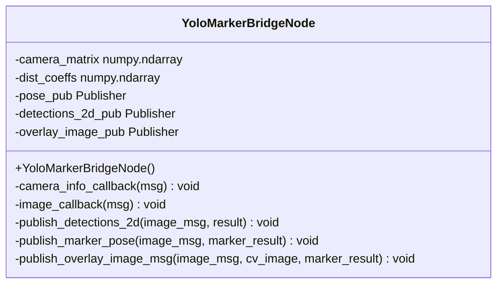

[← Back to index](./README.md)

# aruco_perception_yolo_bridge — class docs

Classes documented here: `YoloMarkerBridgeNode`. Plus the free function
`rotation_matrix_to_quaternion`, covered under its own section since it's
not a class. See [../aruco_perception_yolo_bridge.md](../aruco_perception_yolo_bridge.md)
for the plain-language explanation of why this package exists, the
classical/hybrid detector switch, and the HTTP contract with
`inference_server.py`.

---

## rotation_matrix_to_quaternion

Free function. Standard rotation-matrix → quaternion `(x, y, z, w)`
conversion (Shepperd's method, the same "largest diagonal element" branch
`tf2`'s own `Matrix3x3::getRotation` uses), reimplemented in plain numpy
rather than adding a new `scipy`/`tf_transformations` dependency for one
well-known ~15-line formula.

Parameters: `rotation_matrix`

---

## YoloMarkerBridgeNode

Subscribes to the camera's image/`camera_info` topics, calls the YOLO
inference server over HTTP, and republishes results onto the ROS graph — a
drop-in alternative to `aruco_perception`'s classical `ArucoDetectorNode`
for the marker-pose case, plus new `cup_holder`/`hole` 2D detections the
classical detector has no equivalent of. See
[../aruco_perception_yolo_bridge.md](../aruco_perception_yolo_bridge.md)
for the full per-frame behavior and why this process never imports
`ultralytics`.

### YoloMarkerBridgeNode

Constructs the node with `automatically_declare_parameters_from_overrides=True`
(no explicit `declare_parameter` calls — every parameter comes from the
`--params-file` yaml; adding an explicit `declare_parameter` for an
already-yaml-declared name throws `ParameterAlreadyDeclaredException`, a
live-crash lesson this file follows the same convention
`ArucoDetectorNode` already used to avoid). Creates the image/`camera_info`
subscriptions on one dedicated `MutuallyExclusiveCallbackGroup`, separate
from the node's default group the `set_parameters` service runs in — see
`main`'s doc comment for why.

### camera_info_callback

Always refreshes `camera_matrix`/`dist_coeffs` from the latest message
(unlike the classical detector, which latches on first receipt) — mirrors
`inference_server.py`'s own "always current, never cached" intrinsics
contract.

Parameters: `msg`

### image_callback

Per-frame pipeline: converts the image via `cv_bridge`, JPEG-encodes it,
POSTs to the inference server with the latest known intrinsics, and — if
`aruco_marker` is present in the response — publishes the marker pose (only
if `active` is true) and the debug overlay (only if
`publish_overlay_image` is true), then always publishes
`cup_holder`/`hole`/`aruco_marker` detections onto `detections_2d_topic`
regardless of `active`. A failed `cv_bridge` conversion, a failed/timed-out
HTTP request, or a non-200/non-JSON response each log and skip the frame
without crashing the node.

Parameters: `msg`

### publish_detections_2d

Builds and publishes one `visual_calibration_msgs/Detection2DArray`
containing whichever of `aruco_marker`/`cup_holder`/`hole` were present in
the inference response — always publishes, every frame, even with an empty
`detections[]`, so consumers see a continuous stream rather than needing to
distinguish "nothing detected" from "node down."

Parameters: `image_msg`, `result`

### publish_marker_pose

Converts the response's Rodrigues rotation vector to a quaternion (via
`rotation_matrix_to_quaternion`) and publishes `PoseStamped` on
`pose_topic`, reusing the source image message's own header (stamp +
`frame_id`) — same convention as the classical detector, not
`self.get_clock().now()`.

Parameters: `image_msg`, `marker_result`

### publish_overlay_image_msg

Draws the marker's border and XYZ axes onto a **copy** of the frame (never
mutates the frame already sent to the inference server) and publishes it —
same `drawDetectedMarkers`/`drawFrameAxes` calls, overlay color default,
and encoding as the classical detector's own overlay, so a viewer sees
identical visuals regardless of which detector produced them.

Parameters: `image_msg`, `cv_image`, `marker_result`

### main

Runs a `MultiThreadedExecutor`, not plain `rclpy.spin()` — `image_callback`
blocks on a synchronous HTTP request for up to `request_timeout_sec`, which
under single-threaded spin would also block the standard `set_parameters`
service callback `calibration_orchestrator_node` uses to flip `active`
(confirmed live: that call timed out even though the node was genuinely
healthy). A multi-threaded executor lets the parameter-service callback run
concurrently on a different thread instead of queueing behind an in-flight
HTTP request.
