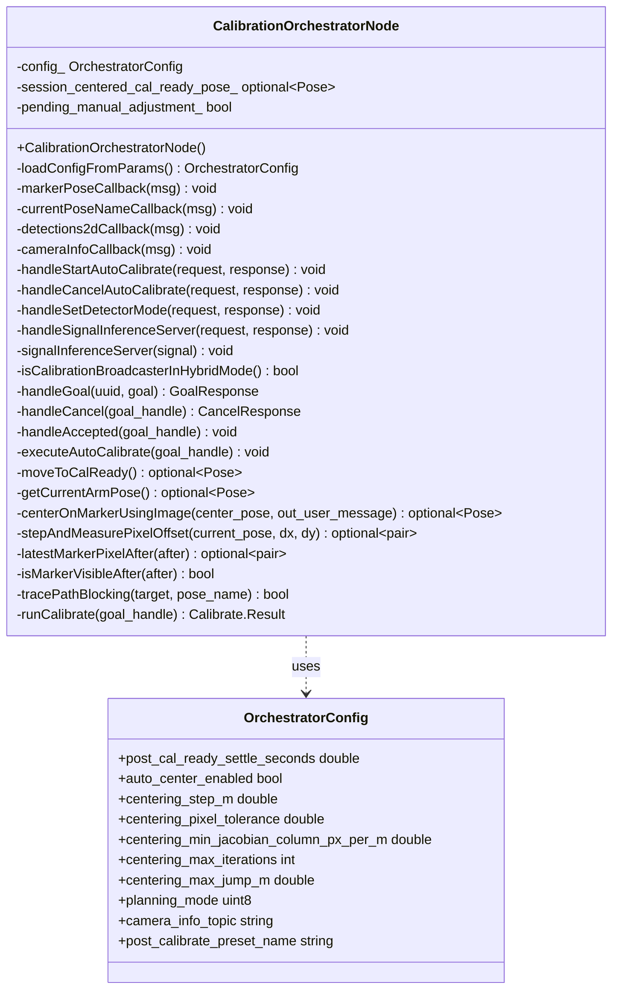

[← Back to index](./README.md)

# orchestrator — class docs

Classes documented here: `CalibrationOrchestratorNode`. See
[../orchestrator.md](../orchestrator.md) for the plain-language sequence
walkthrough (auto-calibrate stages, image-based centering algorithm, the
web/rosbridge facade) — this page covers the class's members/methods.

---

## CalibrationOrchestratorNode

Orchestrates the full `~/auto_calibrate` sequence (move to cal_ready →
settle → optional auto-center → calibrate) behind one action. Neither
`TrajectoryPlanner` nor `CalibrationBroadcasterNode` are told this
orchestration exists — this node only ever calls their already-existing
public services/action, the same ones a human or the web app could call by
hand. Also exposes the classical/hybrid detector switch
(`~/set_detector_mode`) and a rosbridge-reachable facade
(`~/start_auto_calibrate` + `~/auto_calibrate_status`) in front of the
action, for clients that can't speak rosbridge's native ROS2 action
protocol. See [../orchestrator.md](../orchestrator.md) for the full stage
and algorithm walkthrough.

`OrchestratorConfig` also still declares `auto_center_probe_step_m`,
`auto_center_max_probe_m`, and `auto_center_visibility_timeout_sec` — tuning
for the superseded per-axis probe search (`runAutoCenterProbe`,
`probeDirectionVisible`), kept unreferenced rather than deleted in case
that approach is needed as a fallback later. Not listed in the diagram
above since the active centering path (`centerOnMarkerUsingImage`) doesn't
use them.

### CalibrationOrchestratorNode

Constructs the node: subscribes to `marker_pose`, `current_pose_name`, and
`detections_2d`; creates the `~/auto_calibrate` action server and a client
of `calibration_broadcaster_node`'s `~/calibrate` action; creates the
`~/trace_path`/`~/get_standoff_pose`/`~/move_to_preset`/`~/get_polygon_waypoints`
service clients; sets up the `~/start_auto_calibrate`/`~/cancel_auto_calibrate`
rosbridge facade (including a self-referential action client of its own
`~/auto_calibrate` server); and creates `~/set_detector_mode` on its own
dedicated callback group (see that service's own entry below for why).

### loadConfigFromParams

Reads an `OrchestratorConfig` from this node's declared parameters.

### markerPoseCallback

Caches the latest `marker_pose` message's receipt time only (not the pose
itself) — used by `isMarkerVisibleAfter` for the superseded probe-based
centering path.

Parameters: `msg`

### currentPoseNameCallback

Clears `pending_manual_adjustment_` whenever `trajectory_planner` reports
the arm moved to any named preset pose — except moves whose name starts
with `nudge_` (the web app's fine-tune control drawer), which are excluded
since a nudge is the user performing the fine-tune this flag exists to
preserve, not abandoning it.

Parameters: `msg`

### detections2dCallback

Caches the most recent `aruco_marker` detection's pixel centroid and
receipt time. Ignores frames with no `aruco_marker` entry — leaves the
cached value in place rather than clearing it, so one momentary gap doesn't
look like "never seen."

Parameters: `msg`

### cameraInfoCallback

Captures the image's pixel width/height once, on first receipt — the only
thing this node needs from `CameraInfo` (to compute the image's own pixel
center for image-based centering).

Parameters: `msg`

### handleStartAutoCalibrate

Rosbridge-reachable facade handler: submits an `~/auto_calibrate` goal via
this node's own action client and returns `success=true` immediately once
the goal is accepted — fire-and-forget from the caller's perspective, not
fire-and-wait. Feedback/result are relayed onto `~/auto_calibrate_status`
separately. Returns `success=false` only if goal submission itself failed
(e.g. the action server unreachable), never if the sequence later fails.

Parameters: `request`, `response`

### handleCancelAutoCalibrate

Cancels the in-flight goal tracked from `handleStartAutoCalibrate`'s
acceptance callback. Returns `success=false` if there's no in-flight goal —
a legitimate "nothing to do" outcome, not an error.

Parameters: `request`, `response`

### handleSetDetectorMode

Validates `request.mode` is `"classical"` or `"hybrid"`, then sets the
target node's `active` parameter true first and the other node's `active`
false second — briefly both active is preferred over briefly neither
active. Returns `success=false` with a descriptive message if either
`set_parameters` call fails or times out; logs loudly (rather than silently
swallowing) if the first succeeds but the second fails, since that leaves
both detectors active simultaneously.

Parameters: `request`, `response`

**Why this needs its own callback group:** this handler blocks polling for
`AsyncParametersClient` responses. Under the node's shared default callback
group (used everywhere else in this class), that blocked the same group's
ability to ever process the incoming response it was waiting for — a
deadlock, confirmed live (`ros2 param set` directly against the target node
succeeded instantly, proving the target node was healthy the whole time;
only this node's own callback-group starvation was the problem). Fixed by
giving `~/set_detector_mode` its own dedicated `MutuallyExclusive` callback
group.

### handleSignalInferenceServer

Thin service wrapper exposing `signalInferenceServer()` as
`~/signal_inference_server`, so `calibration_broadcaster_node` (a
different package, cannot call this class's private member directly) can
reuse the same SIGSTOP/SIGCONT mechanism at a per-waypoint grain for its
`hybrid_per_waypoint_enabled` mode. No dedicated callback group needed
(unlike `~/set_detector_mode`) — `signalInferenceServer()` is fully
synchronous, nothing to deadlock against.

Parameters: `request`, `response`

### signalInferenceServer

Sends SIGSTOP or SIGCONT to every running `python3 inference_server.py`
process, found via a direct `/proc` scan (not `std::system()`/`popen()` —
see [../orchestrator.md](../orchestrator.md)'s "Pausing YOLO inference
during a run" section for why). No-ops harmlessly if no matching process
is found.

Parameters: `signal`

### isCalibrationBroadcasterInHybridMode

Live-reads `calibration_broadcaster_node`'s `hybrid_per_waypoint_enabled`
parameter via `getCalibrationBroadcasterParamClient()`. Defaults to
`false` (today's classical/continuous behavior) if the target node is
unreachable or the read times out — a conservative fallback that keeps
this node's own whole-run SIGSTOP running rather than risking the model
process never getting paused.

### handleGoal / handleCancel / handleAccepted

Standard `rclcpp_action` server callbacks: always accepts new goals and
cancellation requests; `handleAccepted` spawns a detached thread running
`executeAutoCalibrate` (action servers require this callback to return
quickly, not block).

Parameters: `uuid`, `goal` / `goal_handle` / `goal_handle`

### executeAutoCalibrate

The actual 4-stage sequence, run on its own thread — see
[../orchestrator.md](../orchestrator.md)'s stage diagram. Aborts with
`failed_stage` set on the first stage that fails; checks
`goal_handle->is_canceling()` between stages. SIGSTOPs `inference_server.py`
at the start (skipped if `calibration_broadcaster_node` is already in
`hybrid_per_waypoint_enabled` mode — see
[../orchestrator.md](../orchestrator.md)'s "Pausing YOLO inference during a
run"), and on success auto-moves to `post_calibrate_preset_name` after
`goal_handle->succeed()` (fire-and-forget, logged not surfaced through the
result on failure).

Parameters: `goal_handle`

### moveToCalReady

Stage 1's implementation. Reuses `session_centered_cal_ready_pose_` if a
previous run in this session already found a better center. Otherwise
tries `~/move_to_preset("cal_ready")` first (pins the exact IK branch if a
joint-value preset is configured), falling back to
`~/get_standoff_pose` + `~/trace_path` only if no such preset exists for
this environment — "no preset configured" is treated as a fall-through, not
a failure; any other `~/move_to_preset` failure is a real failure.

### getCurrentArmPose

Read-only "what is the arm's current Cartesian pose right now" query, used
when `pending_manual_adjustment_` is set — reuses `~/get_polygon_waypoints`'s
`center_pose` response field (a proven-safe TF-based current-pose read)
rather than adding a new dedicated service/TF buffer to this node.

### centerOnMarkerUsingImage

Stage 3's implementation — see [../orchestrator.md](../orchestrator.md)'s
"Image-based auto-centering" section for the full uncalibrated IBVS
algorithm (bootstrap probes, Jacobian solve, Broyden refinement,
convergence check). Sets/clears `aruco_detector_node`'s
`show_centering_crosshair` parameter for the duration of the search
(best-effort — a failure to set it doesn't abort centering, since it's only
a visual aid). On failure, sets `out_user_message` to a short, user-facing
suggestion suitable for direct display in the web app, distinct from the
detailed developer-facing `RCLCPP_ERROR` logs.

Parameters: `center_pose`, `out_user_message`

### stepAndMeasurePixelOffset

One step-and-remeasure move used by the bootstrap/correction loop: offsets
`current_pose` by `(dx, dy)` in world-frame X/Y, waits for a fresh
`Detection2D`, and returns the full 2D pixel offset from image center —
both axes, regardless of which arm axis moved, since the Jacobian estimate
needs to see cross-axis coupling.

Parameters: `current_pose`, `dx_m`, `dy_m`

### latestMarkerPixelAfter / isMarkerVisibleAfter

Poll (not block-and-wait) for a fresh detection/pose after a given
timestamp, timing out gracefully — a probe to a position where the marker
is genuinely invisible must time out, not hang.

Parameters: `after`

### tracePathBlocking

Sends a single-waypoint `~/trace_path` request and blocks for the
response. Shared by `moveToCalReady` and the centering methods.

Parameters: `target`, `pose_name`

### runCalibrate

Stage 4's implementation: sends an empty goal to
`calibration_broadcaster_node`'s `~/calibrate` action, relays its feedback
as `AutoCalibrate` feedback, and blocks until it completes. Returns the
result on success or failure alike — `nullptr` only if the action server
itself wasn't reachable.

Parameters: `goal_handle`
