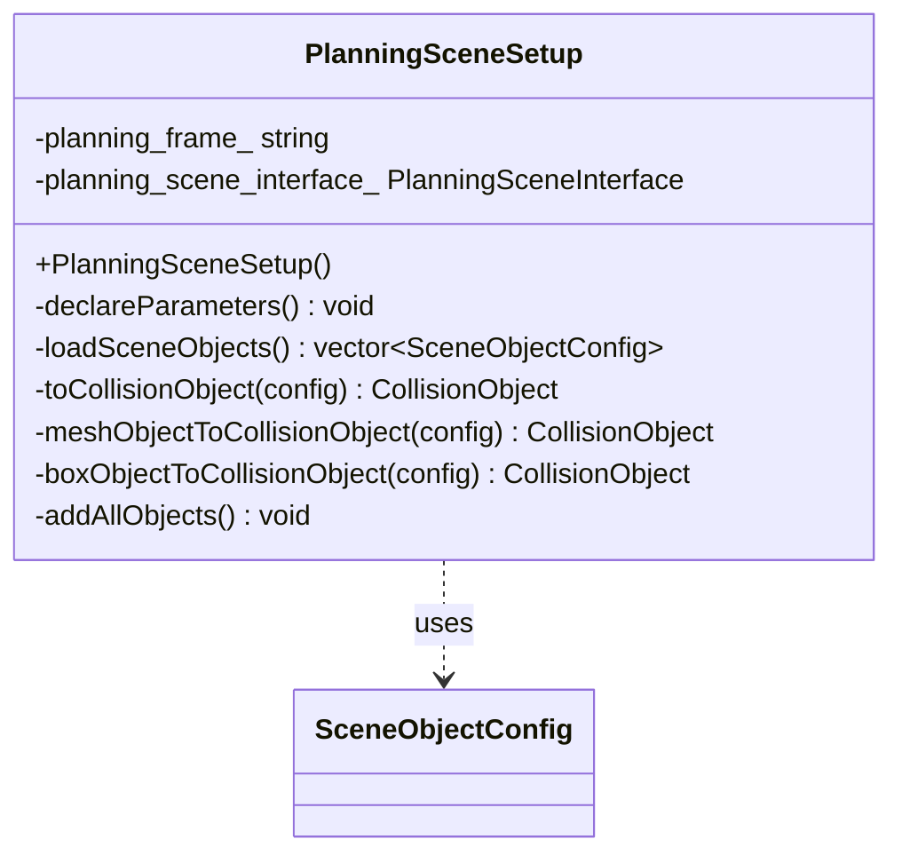
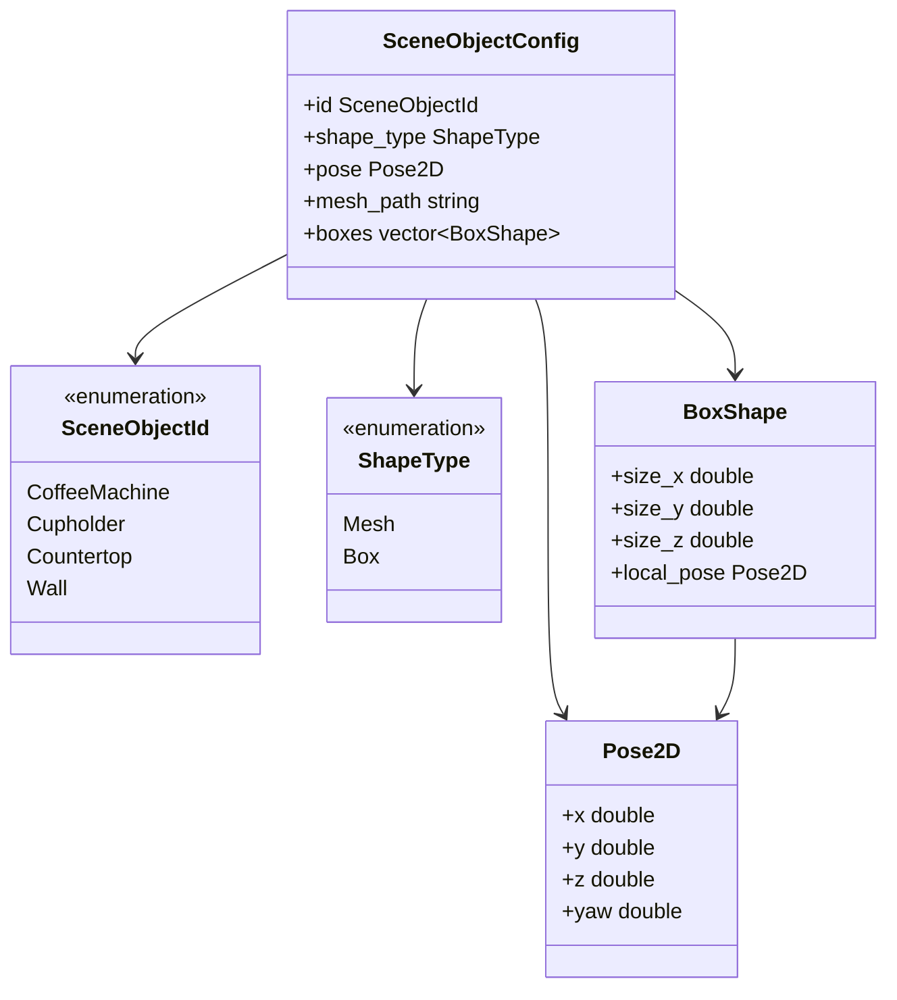
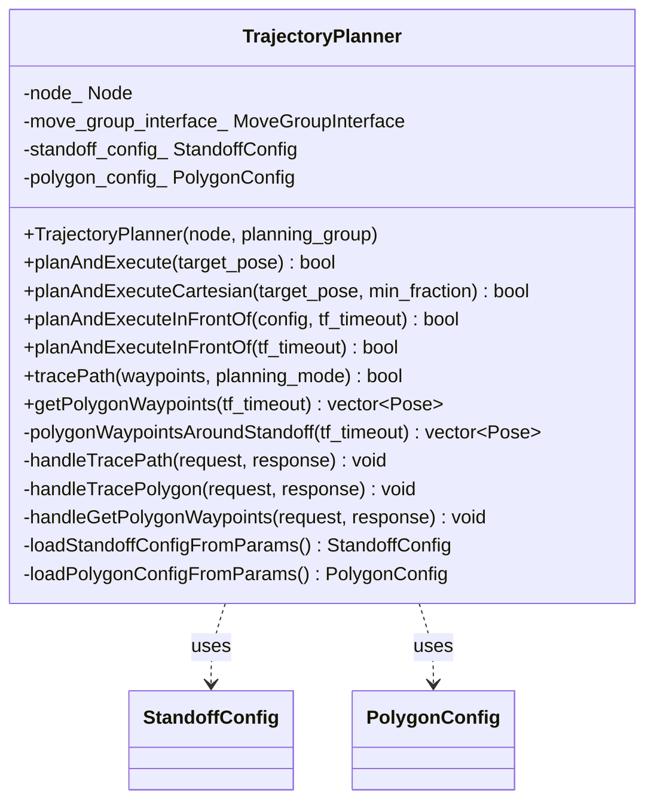
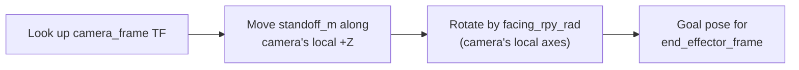
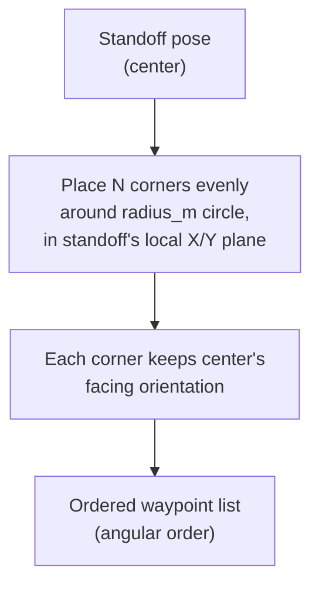

[← Back to index](../README.md)

# visual_calibration_moveit — class docs

Classes documented here: `PlanningSceneSetup`, `TrajectoryPlanner`. Plus the
supporting (non-class) types in `scene_object_types.hpp`, covered under
`PlanningSceneSetup` since that's the only class that uses them.

Not documented: `MtcTrajectory` — a disabled stub (MoveIt Task Constructor
build is unavailable upstream, see `README.md`'s known-limitation note), not
real working code.

Per-parameter YAML references:
[scene_objects.md](./scene_objects.md),
[trajectory_planner.md](./trajectory_planner.md).

---

## PlanningSceneSetup

Publishes the cafeteria's static obstacles (coffee machine, cupholder,
countertop, wall) into the MoveIt2 planning scene, so trajectory planning
knows to avoid them. Parameters: [scene_objects.md](./scene_objects.md).

### PlanningSceneSetup

Constructs the node, declares its parameters, and adds every known object
to the planning scene on startup. No parameters to list — it's a plain
default constructor; all per-object config comes from ROS parameters loaded
internally.

---

## Scene object types (`scene_object_types.hpp`)

Not a class — a set of small supporting types `PlanningSceneSetup` uses to
describe each obstacle in a uniform, data-driven way instead of one
hardcoded method per object.

- **`SceneObjectId`** — which known object this is (`CoffeeMachine`,
  `Cupholder`, `Countertop`, `Wall`).
- **`ShapeType`** — whether the object's collision geometry is a loaded mesh
  file or one-or-more axis-aligned boxes.
- **`Pose2D`** — a flat x/y/z/yaw pose (no full quaternion — every known
  object only needs yaw).
- **`BoxShape`** — one box's size plus its own pose offset from the parent
  object's base pose (used for objects modeled as multiple stacked boxes,
  e.g. the countertop's body + top slab).
- **`SceneObjectConfig`** — one object's full config: which object it is,
  which shape type, its base pose, and either a mesh path or a list of
  boxes depending on `shape_type`.

### toParamPrefix

Returns the ROS parameter namespace a given object's config is declared
under (e.g. `"coffee_machine"`).

Parameters: `id`

### toObjectName

Returns the `CollisionObject` id/name published into the planning scene for
a given object.

Parameters: `id`

---

## TrajectoryPlanner

Drives the arm via MoveIt2's `MoveGroupInterface`: plans and executes moves
to a target pose, either as single shots or as a sequence of waypoints. Has
no awareness of calibration — it's a plain mover other nodes call into.
Parameters: [trajectory_planner.md](./trajectory_planner.md).

### TrajectoryPlanner

Constructs the planner around an existing node and a MoveIt planning group.

Parameters: `node`, `planning_group`

### planAndExecute

Plans and executes a joint-space move to `target_pose` — no straight-line
guarantee on the path, but generally more likely to succeed near limits or
obstacles than the Cartesian variant.

Parameters: `target_pose`

### planAndExecuteCartesian

Plans and executes a straight-line Cartesian move to `target_pose`. Fails
outright (no partial execution) if the achieved path fraction is below
`min_fraction`.

Parameters: `target_pose`, `min_fraction`

**Why it's a hard failure, not a partial move:** a Cartesian path can run
into a collision, an IK failure, or a joint limit partway along the
straight line. If the planner executed however much of the path it *did*
manage, the arm would stop at some undefined point along that line — not a
pose anyone asked for, and not safe to treat as "the waypoint" for
calibration sampling. So below `min_fraction` (default 0.95), nothing is
executed at all; the caller gets a clean failure instead of an ambiguous
partial move.

### planAndExecuteInFrontOf

Looks up `config.camera_frame`'s live TF, computes a standoff pose in front
of it, and plans + executes so `config.end_effector_frame` reaches that
pose.

Parameters: `config`, `tf_timeout`

**The standoff/facing geometry:** the goal pose is computed by moving
`standoff_m` out along the camera frame's own local +Z axis (the
camera-forward convention), then rotating by `facing_rpy_rad` — a
configured roll/pitch/yaw applied in the camera's own local axes that
controls exactly how the target frame's axes line up with the camera's
(e.g. which axis faces back toward the camera, which axes swap). This
rotation is a parameter, not something computed from TF, because "how
should the marker face the camera" is a design choice, not a measurable
geometric fact.

### planAndExecuteInFrontOf

Same as above, but uses the `StandoffConfig` already loaded from ROS
parameters at construction time instead of one passed in.

Parameters: `tf_timeout`

### tracePath

Visits each pose in `waypoints` in order via `planAndExecute()` or
`planAndExecuteCartesian()` (chosen by `planning_mode`), stopping at the
first failure.

Parameters: `waypoints`, `planning_mode`

### getPolygonWaypoints

Computes and returns the polygon waypoints around the standoff pose,
**without moving the arm** — lets a caller (e.g.
`calibration_broadcaster_node`) drive them one at a time itself, without
duplicating this class's standoff/polygon geometry or config.

Parameters: `tf_timeout`

**The polygon waypoint math:** starting from the standoff pose (see
`planAndExecuteInFrontOf`), `polygon_num_corners` points are placed evenly
around a circle of radius `polygon_radius_m`, in the standoff pose's own
local X/Y plane. Every corner keeps the same facing orientation as the
center — only the position changes — so the target frame keeps facing the
camera at every corner, just from a slightly different angle. Corners are
returned in angular order, so consecutive waypoints are always physically
adjacent (no jumping across the polygon between moves).

