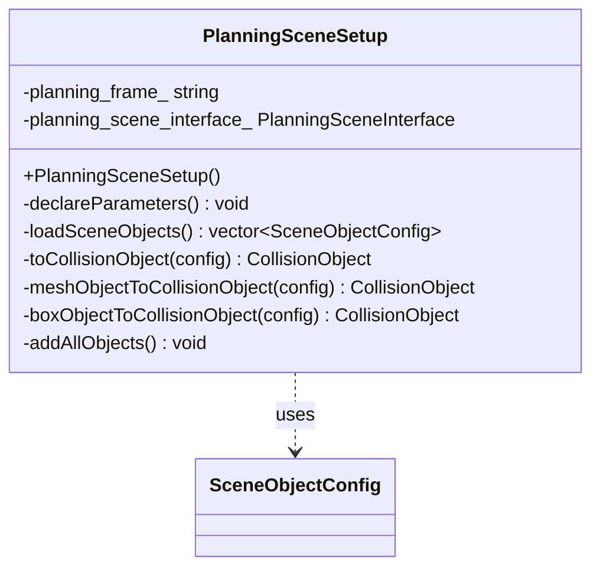
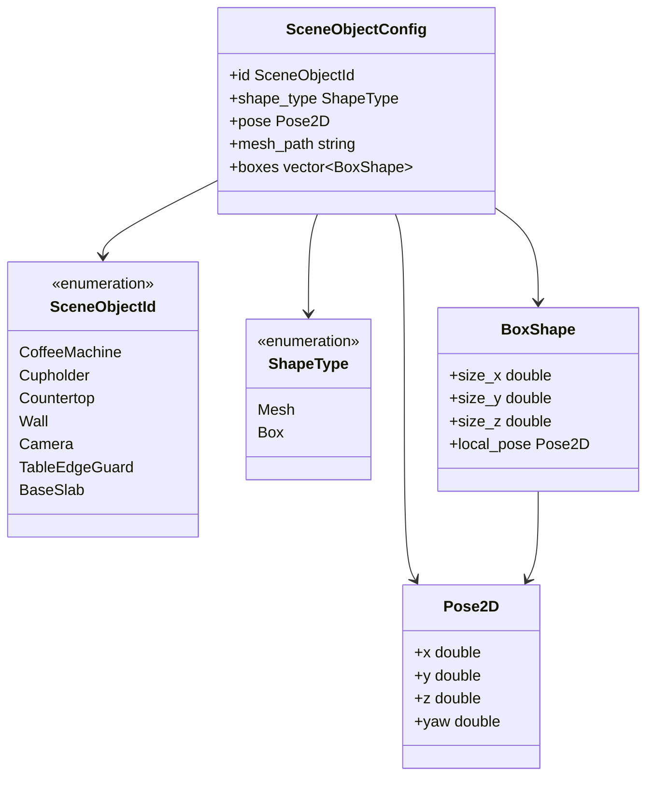
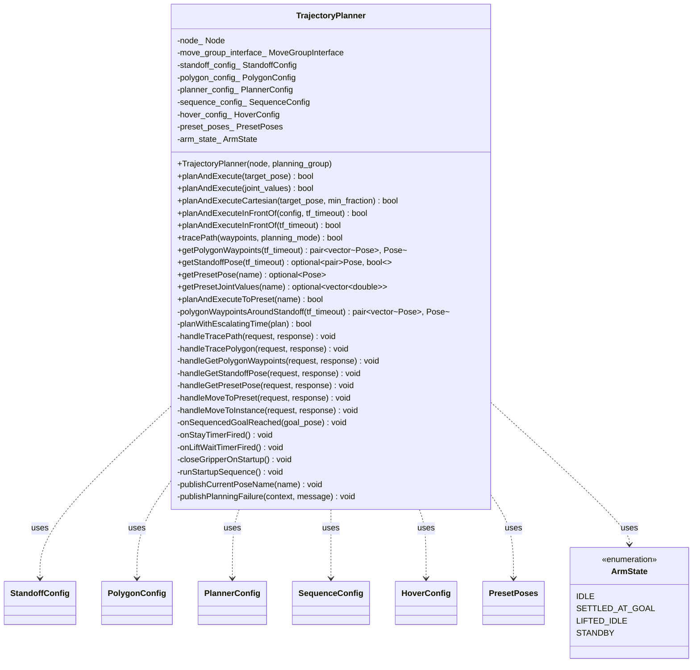
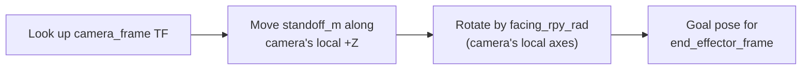
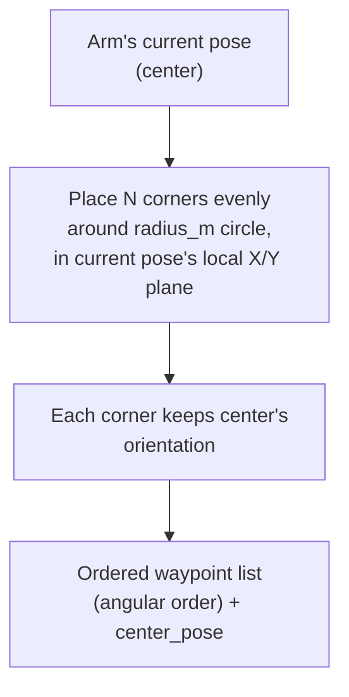
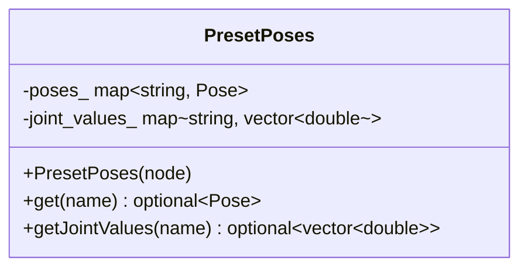

[← Back to index](../README.md)

# visual_calibration_moveit — class docs

Classes documented here: `PlanningSceneSetup`, `TrajectoryPlanner`,
`PresetPoses`. Plus the supporting (non-class) types in
`scene_object_types.hpp`, covered under `PlanningSceneSetup` since that's
the only class that uses them.

Not documented: `MtcTrajectory` — a disabled stub (MoveIt Task Constructor
build is unavailable upstream, see `README.md`'s known-limitation note), not
real working code.

Per-parameter YAML references:
[scene_objects.md](./scene_objects.md),
[trajectory_planner.md](./trajectory_planner.md),
[preset_poses.md](./preset_poses.md).

---

## PlanningSceneSetup

```mermaid
classDiagram
    class PlanningSceneSetup {
        +PlanningSceneSetup()
        -declareParameters() void
        -loadSceneObjects() vector~SceneObjectConfig~
        -toCollisionObject(config) CollisionObject
        -meshObjectToCollisionObject(config) CollisionObject
        -boxObjectToCollisionObject(config) CollisionObject
        -addAllObjects() void
        -planning_frame_ string
        -planning_scene_interface_ PlanningSceneInterface
    }
    PlanningSceneSetup ..> SceneObjectConfig : uses
```

Publishes the cafeteria's static obstacles (coffee machine, cupholder,
countertop, wall, and — a placeholder guarding the wall-mounted real
camera, also present in sim for style parity — camera) into the MoveIt2
planning scene, so trajectory planning knows to avoid them. Each object can
be individually disabled via its own `<object>.enabled` parameter without
deleting its config. Parameters: [scene_objects.md](./scene_objects.md).

### PlanningSceneSetup

Constructs the node, declares its parameters, and adds every known object
to the planning scene on startup. No parameters to list — it's a plain
default constructor; all per-object config comes from ROS parameters loaded
internally.

---

## Scene object types (`scene_object_types.hpp`)

Not a class — a set of small supporting types `PlanningSceneSetup` uses to
describe each obstacle in a uniform, data-driven way instead of one
hardcoded method per object.

```mermaid
classDiagram
    class SceneObjectId {
        <<enumeration>>
        CoffeeMachine
        Cupholder
        Countertop
        Wall
        Camera
        TableEdgeGuard
        BaseSlab
    }
    class ShapeType {
        <<enumeration>>
        Mesh
        Box
    }
    class Pose2D {
        +x double
        +y double
        +z double
        +yaw double
    }
    class BoxShape {
        +size_x double
        +size_y double
        +size_z double
        +local_pose Pose2D
    }
    class SceneObjectConfig {
        +id SceneObjectId
        +shape_type ShapeType
        +pose Pose2D
        +mesh_path string
        +boxes vector~BoxShape~
    }
    SceneObjectConfig --> SceneObjectId
    SceneObjectConfig --> ShapeType
    SceneObjectConfig --> Pose2D
    SceneObjectConfig --> BoxShape
    BoxShape --> Pose2D
```

- **`SceneObjectId`** — which known object this is (`CoffeeMachine`,
  `Cupholder`, `Countertop`, `Wall`, `Camera` — the last a placeholder box
  guarding the wall-mounted real camera, also present in sim for style
  parity even though sim's camera is wrist-mounted and not a real
  collision concern there — plus `TableEdgeGuard`/`BaseSlab`, two
  real-only boxes added from live-jogged positions to guard the table
  edge nearest the arm and the table surface directly under `base_link`'s
  own mount point — see [scene_objects.md](./scene_objects.md)).
- **`ShapeType`** — whether the object's collision geometry is a loaded mesh
  file or one-or-more axis-aligned boxes.
- **`Pose2D`** — a flat x/y/z/yaw pose (no full quaternion — every known
  object only needs yaw).
- **`BoxShape`** — one box's size plus its own pose offset from the parent
  object's base pose (used for objects modeled as multiple stacked boxes,
  e.g. the countertop's body + top slab).
- **`SceneObjectConfig`** — one object's full config: which object it is,
  which shape type, its base pose, and either a mesh path or a list of
  boxes depending on `shape_type`.

### toParamPrefix

Returns the ROS parameter namespace a given object's config is declared
under (e.g. `"coffee_machine"`).

Parameters: `id`

### toObjectName

Returns the `CollisionObject` id/name published into the planning scene for
a given object.

Parameters: `id`

---

## TrajectoryPlanner

```mermaid
classDiagram
    class TrajectoryPlanner {
        +TrajectoryPlanner(node, planning_group)
        +planAndExecute(target_pose) bool
        +planAndExecute(joint_values) bool
        +planAndExecuteCartesian(target_pose, min_fraction) bool
        +planAndExecuteInFrontOf(config, tf_timeout) bool
        +planAndExecuteInFrontOf(tf_timeout) bool
        +tracePath(waypoints, planning_mode) bool
        +getPolygonWaypoints(tf_timeout) pair~vector~Pose~, Pose~
        +getStandoffPose(tf_timeout) optional~pair~Pose, bool~~
        +getPresetPose(name) optional~Pose~
        +getPresetJointValues(name) optional~vector~double~~
        +planAndExecuteToPreset(name) bool
        -polygonWaypointsAroundStandoff(tf_timeout) pair~vector~Pose~, Pose~
        -planWithEscalatingTime(plan) bool
        -handleTracePath(request, response) void
        -handleTracePolygon(request, response) void
        -handleGetPolygonWaypoints(request, response) void
        -handleGetStandoffPose(request, response) void
        -handleGetPresetPose(request, response) void
        -handleMoveToPreset(request, response) void
        -handleMoveToInstance(request, response) void
        -onSequencedGoalReached(goal_pose) void
        -onStayTimerFired() void
        -onLiftWaitTimerFired() void
        -closeGripperOnStartup() void
        -runStartupSequence() void
        -publishCurrentPoseName(name) void
        -publishPlanningFailure(context, message) void
        -node_ Node
        -move_group_interface_ MoveGroupInterface
        -standoff_config_ StandoffConfig
        -polygon_config_ PolygonConfig
        -planner_config_ PlannerConfig
        -sequence_config_ SequenceConfig
        -hover_config_ HoverConfig
        -preset_poses_ PresetPoses
        -arm_state_ ArmState
    }
    TrajectoryPlanner ..> StandoffConfig : uses
    TrajectoryPlanner ..> PolygonConfig : uses
    TrajectoryPlanner ..> PlannerConfig : uses
    TrajectoryPlanner ..> SequenceConfig : uses
    TrajectoryPlanner ..> HoverConfig : uses
    TrajectoryPlanner ..> PresetPoses : uses
    TrajectoryPlanner ..> ArmState : uses
    class ArmState {
        <<enumeration>>
        IDLE
        SETTLED_AT_GOAL
        LIFTED_IDLE
        STANDBY
    }
```

Drives the arm via MoveIt2's `MoveGroupInterface`: plans and executes moves
to a target pose or named preset, either as single shots or as a sequence
of waypoints. Has no built-in understanding of what the robot's task is —
it doesn't know what "calibration" or "inspection" means, only "move to
this pose" — but does keep a small, bounded amount of memory about its own
recent activity (`arm_state_`, `ArmState`) to automatically run a
stay-then-lift-then-standby sequence after a "sequenced goal" (see
`TracePath.srv`'s `is_sequenced_goal` field), so callers don't have to
drive every step of that dance themselves. Parameters:
[trajectory_planner.md](./trajectory_planner.md).

**`ArmState`** — `IDLE` (no sequenced goal pending; also the state right
after startup/home/cal_ready moves, which never trigger this machinery) →
`SETTLED_AT_GOAL` (just reached a sequenced goal, waiting out
`stay_seconds_at_goal`) → `LIFTED_IDLE` (lifted straight up to
`lift_target_z_m`, waiting out `lift_wait_seconds` with no new sequenced
goal) → `STANDBY` (at the `"standby"` preset, stays until the next
sequenced goal). Every sequenced goal always resolves to the same two
destinations (a lift straight up from wherever it was reached, then
`"standby"`) — this does not track or return to any prior pose.

**Startup sequence** (`runStartupSequence`, called once from the
constructor): publishes an unconditional gripper-close command (see
`closeGripperOnStartup`) first, then — if `move_to_home_on_startup` is true
— moves to the `"home"` preset. Failures are logged and reported via
`~/planning_failure`, never thrown, and never block node startup either
way.

### TrajectoryPlanner

Constructs the planner around an existing node and a MoveIt planning group.

Parameters: `node`, `planning_group`

### planWithEscalatingTime

Shared by both `planAndExecute` overloads: plans (never executes) with
`planner_config_`'s pipeline/planner id and `num_planning_attempts`, at
`planning_time_s`. If that fails, retries once per entry in
`planning_time_retry_multipliers`, each attempt's time budget
`planning_time_s × multiplier` — e.g. `3.0s` base with `[3.0, 5.0]`
produces `3s → 9s → 15s` attempts. An empty multipliers list (the default)
means exactly one attempt. Each retry publishes a `~/planning_failure` with
context `"planning_retry"` (distinct from a genuine terminal failure) so the
web UI can show "still retrying" rather than going silent. Motivated by a
real OMPL log showing a genuine search timeout, not a hard
reachability/collision failure, for a target near the edge of what
`RRTstar` could solve quickly within the original fixed time budget.

### planAndExecute

Plans and executes a joint-space move to `target_pose` — no straight-line
guarantee on the path, but generally more likely to succeed near limits or
obstacles than the Cartesian variant.

Parameters: `target_pose`

### planAndExecute (joint values overload)

Plans and executes directly to a joint configuration (`setJointValueTarget`)
instead of a Cartesian pose (`setPoseTarget`) — no IK involved, so there's
no ambiguity about which of the arm's multiple valid IK solutions gets
used, since the exact joint values are given directly. Used via a
joint-value preset (see `planAndExecuteToPreset`) when a specific joint
configuration — not just a Cartesian pose — has been verified to work (the
UR3e can reach the same Cartesian target via multiple IK branches that
leave very different amounts of margin for downstream moves). Returns
`false` without planning if `joint_values.size()` doesn't match the
planning group's DOF count.

Parameters: `joint_values`

### planAndExecuteCartesian

Plans and executes a straight-line Cartesian move to `target_pose`. Fails
outright (no partial execution) if the achieved path fraction is below
`min_fraction`.

Parameters: `target_pose`, `min_fraction`

**Why it's a hard failure, not a partial move:** a Cartesian path can run
into a collision, an IK failure, or a joint limit partway along the
straight line. If the planner executed however much of the path it *did*
manage, the arm would stop at some undefined point along that line — not a
pose anyone asked for, and not safe to treat as "the waypoint" for
calibration sampling. So below `min_fraction` (default 0.95), nothing is
executed at all; the caller gets a clean failure instead of an ambiguous
partial move.

### planAndExecuteInFrontOf

Looks up `config.camera_frame`'s live TF, computes a standoff pose in front
of it, and plans + executes so `config.end_effector_frame` reaches that
pose.

Parameters: `config`, `tf_timeout`

**The standoff/facing geometry:** the goal pose is computed by moving
`standoff_m` out along the camera frame's own local +Z axis (the
camera-forward convention), then rotating by `facing_rpy_rad` — a
configured roll/pitch/yaw applied in the camera's own local axes that
controls exactly how the target frame's axes line up with the camera's
(e.g. which axis faces back toward the camera, which axes swap). This
rotation is a parameter, not something computed from TF, because "how
should the marker face the camera" is a design choice, not a measurable
geometric fact.

```mermaid
flowchart LR
    A["Look up camera_frame TF"] --> B["Move standoff_m along\ncamera's local +Z"]
    B --> C["Rotate by facing_rpy_rad\n(camera's local axes)"]
    C --> D["Goal pose for\nend_effector_frame"]
```

### planAndExecuteInFrontOf

Same as above, but uses the `StandoffConfig` already loaded from ROS
parameters at construction time instead of one passed in.

Parameters: `tf_timeout`

### tracePath

Visits each pose in `waypoints` in order via `planAndExecute()` or
`planAndExecuteCartesian()` (chosen by `planning_mode`), stopping at the
first failure.

Parameters: `waypoints`, `planning_mode`

### getPolygonWaypoints

Computes and returns the polygon waypoints AND their center pose,
**without moving the arm** — lets a caller (e.g.
`calibration_broadcaster_node`) drive them one at a time itself, and
generate its own additional offset poses from the same center (e.g. a
random-pose sampling phase), without duplicating this class's polygon
geometry/config or making a second "get current pose" round-trip. Returns
an empty waypoint list (with a default-constructed center pose) if the
current-pose TF lookup fails.

Parameters: `tf_timeout`

**The polygon waypoint math:** starting from the arm's own **current
pose** (not the camera's TF-derived standoff pose — redesigned so a
caller's random-offset phase samples around wherever the arm actually is,
not a value that may already be stale by the time sampling starts),
`polygon_num_corners` points are placed evenly around a circle of radius
`polygon_radius_m`, in that current pose's own local X/Y plane. Every
corner keeps the same orientation as the center — only the position
changes. Corners are returned in angular order, so consecutive waypoints
are always physically adjacent (no jumping across the polygon between
moves).

```mermaid
flowchart TD
    S["Arm's current pose\n(center)"] --> P["Place N corners evenly\naround radius_m circle,\nin current pose's local X/Y plane"]
    P --> O["Each corner keeps center's\norientation"]
    O --> W["Ordered waypoint list\n(angular order) + center_pose"]
```

### getStandoffPose

Computes the standoff pose from the configured `StandoffConfig`
**without moving the arm**. If the `camera_frame` TF lookup fails, falls
back to the `"standoff"` entry in `preset_poses_` — the returned pair's
second element (`used_fallback`) distinguishes which source was used.
Returns `std::nullopt` only if neither a live TF lookup nor a `"standoff"`
preset was available.

Parameters: `tf_timeout`

### getPresetPose

Returns the named preset's Cartesian pose **without moving the arm**.
Returns `std::nullopt` if no preset with that name was loaded (including
if that name only has a joint-value preset).

Parameters: `name`

### getPresetJointValues

Returns the named preset's joint values **without moving the arm**.
Returns `std::nullopt` if no joint-value preset with that name was loaded
(including if that name only has a Cartesian pose preset).

Parameters: `name`

### planAndExecuteToPreset

Moves to the named preset — prefers a joint-value preset (pins the exact
IK branch, via the `planAndExecute(joint_values)` overload) if one is
loaded for `name`; otherwise falls back to the Cartesian pose preset if one
is loaded instead. Returns `false` without planning if neither exists for
`name`. Never consults TF — callers needing TF-first-then-preset-fallback
behavior should use `getStandoffPose()`/`planAndExecuteInFrontOf()`
instead.

Parameters: `name`

### handleMoveToInstance

Handles a `~/move_to_instance` request — see
[../visual_calibration_moveit.md](../visual_calibration_moveit.md)'s own
`~/move_to_instance` section for the full 5-step hover-descend-stay-return-
lift sequence and the reach-safety clamp's geometry. Every call hovers above
`cup_holder`'s own TF first regardless of the requested instance, so
`hole_1..hole_4` are always approached from the same known-safe point.
Fails at the first failing step (a TF lookup or a planning call) with a
stage-labeled message.

Parameters: `request`, `response`

### onSequencedGoalReached

Called after a successful `is_sequenced_goal` move. Cancels any pending
stay/lift timer, transitions to `ArmState::SETTLED_AT_GOAL`, and
(re)starts the stay timer for `stay_seconds_at_goal`. The lift computed
once that timer fires is derived from `goal_pose` — the pose the arm just
reached — not from any pose the arm was at before the goal.

Parameters: `goal_pose`

### onStayTimerFired

Fires once the stay timer elapses. Plans and executes to `goal_pose_` with
Z set to `lift_target_z_m` (same X/Y/orientation, an absolute Z target, not
a relative offset). On success, transitions to `ArmState::LIFTED_IDLE` and
starts the lift-wait timer. On failure, reports via
`publishPlanningFailure` and returns to `ArmState::IDLE` — does not
proceed to standby from a failed lift, since the arm's actual position at
that point is uncertain.

### onLiftWaitTimerFired

Fires once the lift-wait timer elapses with no new sequenced goal having
arrived (a new sequenced goal cancels this timer instead, via
`onSequencedGoalReached`). Plans and executes to the `"standby"` preset; on
success transitions to `ArmState::STANDBY` and publishes `"standby"` via
`publishCurrentPoseName`. On failure, reports via `publishPlanningFailure`
and returns to `ArmState::IDLE`.

### closeGripperOnStartup

Publishes one close command on `/gripper/cmd` (`robotiq_85_msgs/GripperCmd`)
— called once, unconditionally, as the first step of `runStartupSequence`,
before the home move. Unconditional rather than an "if open, close" check,
because the real gripper's `/joint_states` entries were confirmed to report
the same static value regardless of actual open/closed state — there's no
reliable signal available to check first. Runs on both sim and real: on
sim, nothing subscribes to `/gripper/cmd` (RG2 is driven via MoveIt's
`gripper_controller` action instead), so the publish is a harmless no-op
there. Does not wait for or verify the close completed (no feedback signal
exists) — only pauses `gripper_close_settle_seconds` before
`runStartupSequence` proceeds to the home move.

### runStartupSequence

Called once from the constructor. Publishes the startup gripper-close
command first, then — if `move_to_home_on_startup` is true — moves to the
`"home"` preset. An explicit, opt-in reversal of this node's original
"never move on startup" design; the parameter makes auto-moving an
auditable config decision rather than silent behavior. On failure, logs
the error and reports it via `~/planning_failure` — never throws, never
blocks node startup either way.

### publishCurrentPoseName

Publishes `name` on `~/current_pose_name` (`transient_local`, so a late
subscriber — e.g. the web bridge reconnecting — immediately gets the last-
published value instead of nothing). Called after every successful move
that lands on a known named pose; not called for arbitrary/unnamed
waypoints (e.g. calibration polygon corners).

Parameters: `name`

### publishPlanningFailure

Publishes one `PlanningFailure` message on `~/planning_failure` — an
event, not a state, so plain reliable QoS (no `transient_local`). Also
logs via `RCLCPP_ERROR` at the call site; this method only handles the
web-facing side.

Parameters: `context`, `message`

---

## PresetPoses

```mermaid
classDiagram
    class PresetPoses {
        +PresetPoses(node)
        +get(name) optional~Pose~
        +getJointValues(name) optional~vector~double~~
        -poses_ map~string, Pose~
        -joint_values_ map~string, vector~double~~
    }
```

Named fallback poses for `end_effector_frame`, in the planning frame —
used when a deterministic pose can't be computed via TF (e.g. no
`camera_frame` TF yet on the real robot before first calibration), OR to
pin a move to one specific, already-verified joint configuration rather
than whatever IK solution the planner happens to land on for a given
Cartesian target. Loaded from `preset_poses_{sim,real}.yaml`; a node
started without such a file ends up with an empty preset set, not an error
— every named preset is optional by design. Parameters:
[preset_poses.md](./preset_poses.md).

**Why a preset can need joint values instead of just a pose:** the UR3e
has multiple valid IK solutions (elbow-up/elbow-down, wrist-flipped, ...)
for the same Cartesian target — which one a joint-space plan lands in
depends on the path taken to get there, not just the target itself. Two
different joint-space paths to the exact same Cartesian `cal_ready` pose
were confirmed to produce joint configurations differing by 90–250° on
several joints — only one of those configurations reliably let downstream
Cartesian polygon-corner moves succeed. A Cartesian preset alone can't
force a specific IK branch; a joint-value preset can, via
`setJointValueTarget()` instead of `setPoseTarget()`.

### PresetPoses

Reads `preset_names` and, per entry, either a `<name>.position`/
`<name>.orientation` pair or a `<name>.joint_values` array from `node`'s
declared parameters.

Parameters: `node`

### get

Returns the named preset's Cartesian pose, or `std::nullopt` if no
Cartesian preset with that name was loaded (including if that name only
has a joint-value preset).

Parameters: `name`

### getJointValues

Returns the named preset's joint values (in the planning group's own
joint order), or `std::nullopt` if no joint-value preset with that name
was loaded.

Parameters: `name`
