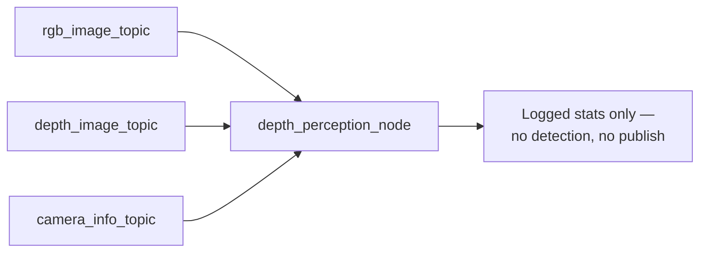

[← Back to index](./README.md)

# depth_perception

`depth_perception` is intended to compute the Barista cupholder task's 3D
geometry from the camera's depth data: the 4 mounting-hole poses and the 1
cupholder pose. **That detection/pose-estimation logic does not exist
yet.** What's currently implemented is a single plumbing-only checkpoint
node, `depth_perception_node`, matching the same "confirm the camera inputs
are readable before adding vision logic on top" pattern
`aruco_perception`'s own `ImageSubscriberNode` was built as before ArUco
detection was added to that package.

## What `depth_perception_node` actually does today

Subscribes to three topics — the color image, the depth image, and
`camera_info` — and logs basic stats (resolution, encoding) so a developer
can confirm all three are actually arriving before any hole/cupholder
detection logic is built on top:

- The RGB and depth callbacks each log the frame's dimensions/encoding,
  throttled to once per 5 seconds — depth images use a different encoding
  (typically 32FC1: one float, in meters, per pixel) than the RGB image, so
  each gets its own callback rather than sharing one.
- The `camera_info` callback logs once, on first receipt, since intrinsics
  don't change frame to frame.
- The node publishes nothing and computes no poses.

## Sim vs. real topics

Sim uses the wrist-mounted RGBD sensor's topics (`/wrist_rgbd_depth_sensor/...`),
matching every other perception node in this project. The real config
(`depth_perception_real.yaml`) is an unconfirmed placeholder — its
`rgb_image_topic`/`camera_info_topic` match the D415's color topics used
elsewhere, but its `depth_image_topic` has not yet been captured live from
the real robot; verify against `ros2 topic list` on the rosject before
trusting it.

## Intended consumer relationship (not yet built)

`aruco_perception_yolo_bridge`'s `yolo_marker_bridge_node` already publishes
`cup_holder`/`hole` 2D pixel detections (centroid + bounding box) on
`/aruco_perception/detections_2d` — see
[aruco_perception_yolo_bridge.md](./aruco_perception_yolo_bridge.md). The
design intent is for `depth_perception` to subscribe to that stream, look
up depth at each detection's centroid (using the bounding box to sample a
small neighborhood rather than one noisy pixel, especially important near a
cavity rim), back-project to 3D using the depth camera's own intrinsics,
and filter/vote across multiple frames before reporting a stable pose per
hole/cupholder. None of that consumption or 3D pipeline exists in this
package yet — this page will be updated once it does.
