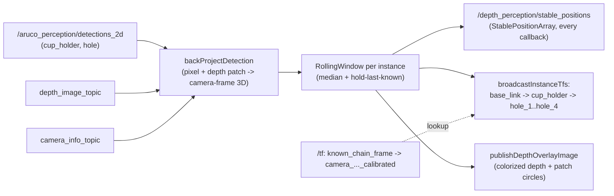

[← Back to index](./README.md)

# depth_perception

`depth_perception_node` turns the 2D pixel detections `aruco_perception_yolo_bridge`
(real) or `aruco_perception`'s `cup_holder_detector_node` (sim) publish on
`/aruco_perception/detections_2d` into stable 3D positions for the cupholder
task's 1 cupholder + up to 4 mounting holes, and broadcasts them as live TF
frames chained through the calibrated camera transform.

## Flow

`rgbImageCallback`/`depthImageCallback`/`cameraInfoCallback` are the
original plumbing-only checkpoint this node started as — they still just
log frame stats/cache the latest depth frame, confirming the camera inputs
are readable before the detection-consuming logic below runs.

## Back-projection: pixel + depth patch → 3D point

`backProjectDetection()` implements the standard pinhole back-projection
(`X = (u - cx)·depth/fx`, `Y = (v - cy)·depth/fy`, `Z = depth`) around each
detection's `(cx, cy)`, reading depth from a small square patch rather than
a single pixel — a lone depth pixel is often invalid/noisy, especially near
a hole's rim. The patch's half-size scales with the detection's own
bbox-derived radius (clamped to `[depth_patch_min_half_size_px,
depth_patch_half_size_px]`), instead of always using a fixed size, so a
patch sized for the cupholder never straddles a much smaller hole's rim.
Holes are reduced via the **max** valid depth in the patch (not the
median) — an oblique viewing ray can graze a hole's near wall before
reaching the true floor, and the wall's shorter depth would bias a median
toward it; the cupholder (a flat raised rim, no cavity to graze) stays on
the noise-robust median.

## Temporal filtering: `RollingWindow`

Because YOLO/the classical detector sometimes miss a real, physically
fixed object for a frame or several, a single continuous stream of
back-projected points would flicker (both from per-frame noise and from
outright gaps). `RollingWindow` (one per tracked `cup_holder`/`hole_1..4`
instance, `updateRollingWindow`) keeps the last `rolling_window_size`
valid samples and reduces them to a per-axis **median** — robust to a
minority of outlier frames, same idea as `backProjectDetection`'s own
patch median. On top of that, `RollingWindow::updateLastStable` **holds**
the previous "last known-good" position and only replaces it once a new
median differs by more than `stable_drift_threshold_m` — since the
tracked objects don't move, most frame-to-frame variation (including
frames with no detection at all) is noise, not signal, and holding across
a gap is what actually removes the flicker a bigger window alone could
not fix.

## TF broadcast: chaining through the calibrated camera

`broadcastInstanceTfs()` looks up `known_chain_frame → <camera_frame>_calibrated`
(the same static TF `calibration_broadcaster_node` broadcasts after a
`~/calibrate` run) and chains it with each instance's held camera-frame
position to publish `known_chain_frame → cup_holder` and
`cup_holder → hole_1..hole_4` (holes are parented to `cup_holder`, not
`known_chain_frame`, directly — physically the 4 holes move as one rigid
unit with the holder, so anchoring to the holder's own tracked centroid
avoids double-counting the holder's own position noise in each hole's
independent chain). This is a no-op (throttled log only) until at least
one `~/calibrate` run has completed in the current session.

Several live-tunable (never cached, read via `get_parameter_or` every
call) manual correction knobs are layered on top of the raw chained
position, each added for a specific, explicitly-requested reason rather
than as a general feature:

- `instance_tf_z_offset_m` — a flat Z lift/drop. On sim, corrects the
  raw TF landing slightly below the true physical surface. On real, was
  originally a reachability workaround (kept off by default there).
- `instance_tf_xy_offset_m` — a flat X/Y shift compensating a small
  centroid bias in the cupholder's fitted 2D pixel center (sim's
  `cv::fitEllipse`-based detector only).
- `instance_tf_max_horizontal_dist_m` — clamps the cupholder's horizontal
  (X/Y) distance from `known_chain_frame`'s origin to this radius by
  scaling X/Y back toward the origin along the same direction, if
  exceeded. A reachability accommodation, not a position fix — it does
  not change where the object actually is.
- `instance_tf_pitch_down_deg` — rotates the cupholder's camera-frame ray
  downward about the camera's local X axis by this angle, then rescales
  the resulting `known_chain_frame` point so its Z matches the
  *unrotated* reading's Z (i.e. the correction stays on the same
  real-world horizontal plane the object sits on, not sunk into it) —
  compensates a suspected camera pitch error. Must be applied in
  `known_chain_frame`, not camera frame: rescaling in camera frame alone
  does not preserve the same physical plane once the camera's own
  orientation error is folded in.

All four default to a no-op (0.0 / `[0, 0]`) and are independently
tunable per environment via `ros2 param set`.

## Published topics

- `/depth_perception/stable_positions` (`StablePositionArray`) — every
  tracked instance's held position, published every `detections_2d`
  callback regardless of whether that instance appeared in the triggering
  frame (a continuous, gap-free stream — see `StablePosition.msg`'s own
  header comment). Consumed by `yolo_marker_bridge_node`'s overlay
  (stabilized dot) and this node's own `broadcastInstanceTfs()`.
- `/depth_perception/overlay_image` (if `publish_depth_overlay_image`) —
  the colorized depth image (`cv::applyColorMap`, `COLORMAP_JET`) with
  each detection's centroid and actual sampled patch circle drawn on top
  — a diagnostic for visually cross-checking "where YOLO/classical says
  an object is" against what the depth camera itself sees there.

## Pausing during calibration

`pause_while_calibration` (default true) makes this node stop processing
`detections_2d`/depth entirely while `calibration_orchestrator_node`
reports an `~/auto_calibrate` run in progress (via `auto_calibrate_status_topic`),
freeing CPU for marker detection during exactly the window where its
speed/reliability matters most; it resumes automatically once the run
finishes. This node otherwise runs continuously from startup — it does
not wait for a calibration run to exist first, since sensing in the
camera's own frame has no such dependency (only `broadcastInstanceTfs`'s
TF chaining does).

## Sim vs. real inputs

| | Sim | Real |
|---|---|---|
| Detector feeding `detections_2d` | `aruco_perception`'s `cup_holder_detector_node` (classical CV) | `aruco_perception_yolo_bridge`'s `yolo_marker_bridge_node` (YOLO) |
| Depth topic | `/wrist_rgbd_depth_sensor/depth/image_raw` | `/D415/aligned_depth_to_color/image_raw` (pre-registered to the color image's pixel grid — required since `detection.cx/cy` come from YOLO running on the color image) |

## In-progress rebuild

`WIP_depth_perception_node.hpp/.cpp` (excluded from the CMake build — not
referenced in `CMakeLists.txt`) is a deliberately minimal, from-scratch
rewrite (branch `tf-construction-rebuild`) that starts from cupholder-only
back-projection with every intermediate value logged, to make a future
orientation-accuracy investigation easier to debug from logs alone rather
than needing a custom capture script. It is not the active node; the
`depth_perception_node` described above is what actually builds and runs.

## Class-level detail

Not yet covered by a `class_docs/` entry — `DepthPerceptionNode` and its
helper structs (`RollingWindow`, `TrackedInstanceKey`, `BackProjectedPoint`)
are documented inline above via their doc comments in
`depth_perception_node.hpp`/`.cpp`.
