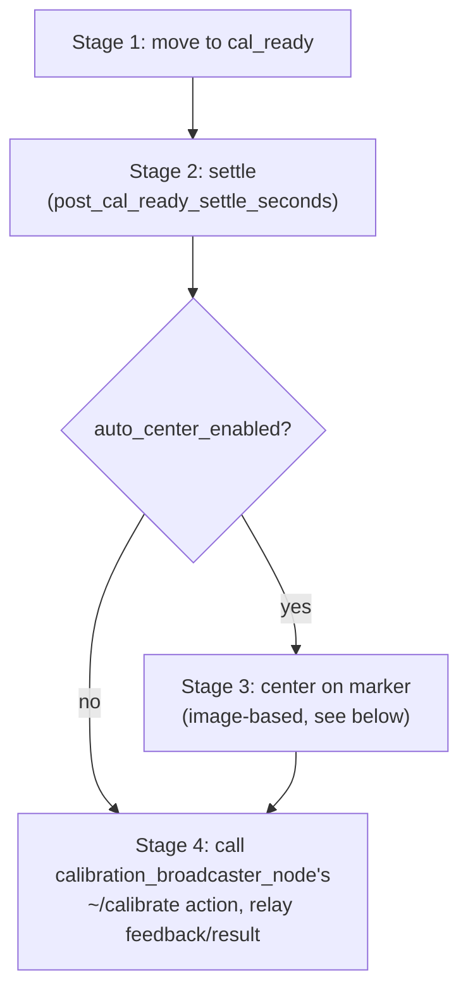
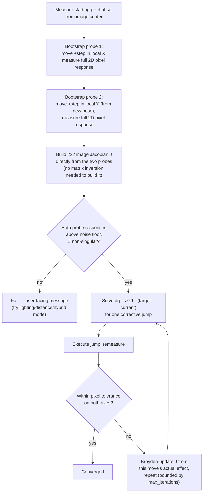

[← Back to index](./README.md)

# orchestrator

`orchestrator` contains one node, `calibration_orchestrator_node`, that
sequences the individual steps a human operator would otherwise have to
trigger by hand — move to `cal_ready`, optionally center the camera view on
the marker, then run calibration — behind a single action,
`~/auto_calibrate`. It also owns the classical/hybrid detector switch and a
small rosbridge-reachable facade so the web app can drive the whole sequence
despite this project's rosbridge version having no ROS2 action support.

Neither `trajectory_planner` nor `calibration_broadcaster_node` are aware
this orchestration exists — `calibration_orchestrator_node` only ever calls
their already-existing public services/actions, the same ones a human or
the web app could call directly. All new sequencing logic lives in this one
node.

## The `~/auto_calibrate` sequence

**Stage 1** tries `trajectory_planner`'s `~/move_to_preset("cal_ready")`
first — if a joint-value preset exists for `cal_ready`, this pins the exact
IK branch instead of leaving it to whichever solution a fresh
`~/get_standoff_pose` + `~/trace_path` call happens to land on (two
different joint-space paths to the same Cartesian `cal_ready` pose were
found to produce joint configurations differing by 90–250° on several
joints, only one of which left enough margin for the downstream Cartesian
polygon-corner moves to succeed). Falls back to the original
`~/get_standoff_pose` + `~/trace_path` behavior if no joint-value preset is
configured for that environment (true for real, as of this writing).

If a previous run's Stage 3 failed, the *next* `~/auto_calibrate` call
skips Stage 1 entirely and calibrates from the arm's current pose instead
— see "Resuming after a failed centering attempt" below.

## Image-based auto-centering (Stage 3)

Centers the marker in the camera's view using **uncalibrated Image-Based
Visual Servoing (IBVS)**: no camera intrinsics, no depth, and no TF lookup
to the camera frame at all — the entire mapping between arm motion and
on-screen marker movement is *learned empirically* by making two small
probe moves and observing how many pixels the marker moves in response.

This replaced two earlier per-axis designs (a repeated-halving search, then
a calibrate-then-jump search) that both assumed arm-local X only moves the
marker along image-X and arm-local Y only moves it along image-Y. Live
testing showed that assumption breaking down — a camera mounted at an
angle can make arm-local X move the marker mostly along image-Y instead,
which a per-axis search has no way to see or use.

The two bootstrap probes are axis-aligned in **arm space** (pure local +X,
then pure local +Y), so each probe's measured pixel delta divided by the
step size is directly one column of the Jacobian — no matrix inversion is
needed just to build it. Once built, closing the remaining offset is a
single closed-form 2×2 solve; if one jump isn't enough, the Jacobian is
refined via a **Broyden update** (the standard secant-method generalization
used throughout the uncalibrated visual servoing literature) from each
move's actual measured effect, rather than re-probing from scratch.

Both probe and correction moves are offset in the **pose's own world-frame**
X/Y (not the gripper's local frame) — probing in the gripper's local frame
ties the two probe directions to however the gripper happens to be tilted
at `cal_ready`, which has no fixed relationship to the camera's own view
(confirmed on real hardware: `cal_ready`'s recorded orientation made "local
X" project mostly onto world -Y/-Z). World-frame offsets are always the
same physical directions regardless of arm orientation.

A bootstrap probe is rejected as unreliable if its pixel response is too
weak relative to the configured noise floor (`centering_min_jacobian_column_px_per_m`)
or if the two probes' responses are too close to collinear to invert. Both
cases fail the whole centering attempt outright rather than retrying with a
bigger step — the step size is already chosen to be as large as is safe.

### Resuming after a failed centering attempt

If Stage 3 fails, the user is shown a message suggesting they fine-tune the
pose manually (via the web app's control drawer) and press the same
Calibrate button again. The node remembers this via one internal flag: the
*next* `~/auto_calibrate` call skips Stage 1 (moving to `cal_ready`) and
calibrates from wherever the arm currently is instead — a single button
that behaves automatically based on this internal state, not a second
button or goal field. The flag is cleared once a run reaches Stage 4
(success or failure) or whenever `trajectory_planner` reports the arm moved
to any named preset pose (choosing a different preset is treated as
abandoning the in-progress manual fine-tune). Small "nudge" moves from the
web app's control drawer are deliberately excluded from that clearing
check — a nudge *is* the fine-tune this flag exists to preserve, not an
abandonment of it.

## Classical/hybrid detector switch

`~/set_detector_mode` (request: `"classical"` or `"hybrid"`) flips exactly
one of `aruco_detector_node`'s or `yolo_marker_bridge_node`'s `active`
boolean parameter true and the other false, via the standard ROS
`set_parameters` service — no lifecycle nodes, no process start/stop; both
detector nodes keep running and subscribed the whole time. The node coming
*online* is always set first, then the one going *offline* — briefly having
both active (one harmless duplicate `marker_pose` sample) is preferred over
briefly having neither active (a real, if brief, gap in the pose stream).

## Pausing YOLO inference during a run

`executeAutoCalibrate` SIGSTOPs `inference_server.py` (YOLO-pipeline) for
the whole `~/auto_calibrate` sequence, cal_ready move included, and
SIGCONTs it in `publishStatusResult()` — real's CPU has nothing to spare
for continuous cupholder/hole inference while the arm is actively moving
through calibration waypoints. SIGSTOP freezes the process (confirmed
live: ~0% CPU, loaded model stays resident) rather than killing it, so the
resume is instant with no model reload. This is skipped for a run whose
`calibration_broadcaster_node` already has its own `hybrid_per_waypoint_enabled`
mode on (checked once via `isCalibrationBroadcasterInHybridMode()` and
remembered for the whole run, so the SIGSTOP-skip and its matching
SIGCONT-skip stay paired) — that mode already does its own per-waypoint
SIGCONT/SIGSTOP bracketing (see
[aruco_perception.md](./aruco_perception.md)'s "Per-waypoint hybrid
detection" bullet), and running both at once was confirmed live to fight
over the same process's pause/resume state. `~/signal_inference_server`
(`visual_calibration_msgs/SignalInferenceServer`) exposes the same
SIGSTOP/SIGCONT mechanism as a service specifically so
`calibration_broadcaster_node` (a different package) can reuse it at that
per-waypoint grain.

Both the SIGSTOP/SIGCONT itself and the running-process discovery use a
direct `/proc` scan + `kill()` — never `std::system()`/`popen()`:
fork()ing from this multithreaded `rclcpp` node risks the child inheriting
a locked mutex with no thread alive to release it (confirmed live: an
earlier `std::system("pkill ...")` call silently hung the whole
calibration thread before it ever reached `moveToCalReady()`).

## Post-calibration auto-move

On a successful `~/auto_calibrate` run, the arm auto-moves to
`post_calibrate_preset_name` (default `"home"`, empty string disables
this) via `~/move_to_preset` — fire-and-forget: a failed move here is
logged but does not retroactively turn the already-succeeded calibration
result into a failure.

## Web/rosbridge facade

This project's installed `rosbridge_suite` (1.3.1) has no ROS2 action
support at all. `~/start_auto_calibrate` (`std_srvs/Trigger`) and
`~/auto_calibrate_status` (`visual_calibration_msgs/AutoCalibrateStatus`,
a plain topic) work around that: the service submits an `~/auto_calibrate`
goal via the node acting as its own action client (a normal, supported
`rclcpp_action` pattern) and returns immediately once the goal is accepted;
feedback/result are separately relayed onto the status topic instead of
requiring the caller to listen for native action feedback/result. The
underlying `~/auto_calibrate` action is unchanged and still directly usable
by any ROS2-native client — the facade is additive, not a replacement.
`~/cancel_auto_calibrate` (`std_srvs/Trigger`) is the matching cancel-side
half.

See `resources/docs/info_stat.md`'s "Web/rosbridge gotchas" section for the
general pattern, and [visual_calibration_msgs.md](./class_docs/visual_calibration_msgs.md)
for `AutoCalibrate.action`/`AutoCalibrateStatus.msg`'s field-level detail.

## Class-level detail

See [class_docs/orchestrator.md](./class_docs/orchestrator.md) for
`CalibrationOrchestratorNode`'s full method-by-method breakdown.
