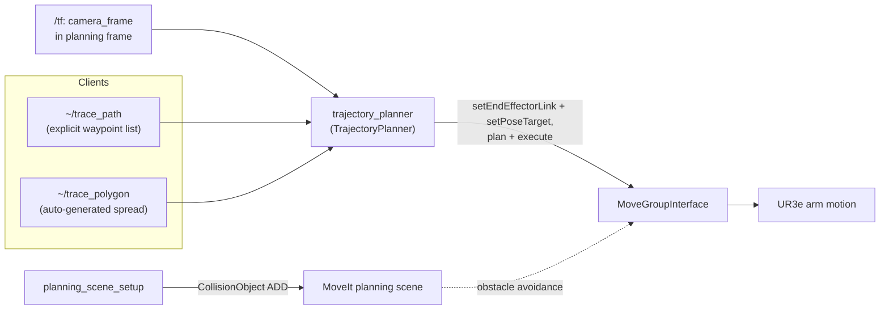

[← Back to index](./README.md)

# visual_calibration_moveit

`visual_calibration_moveit` is the package that moves the arm and keeps
MoveIt aware of its surroundings. It wraps `MoveGroupInterface` behind two
ROS services for driving the end effector to poses derived from TF (used
both for spreading out calibration samples and for validating a computed
camera transform), and separately publishes the static collision geometry
of the Starbots Cafeteria scene so planning avoids known obstacles.

## Flow

## `planning_scene_setup`

A node that publishes the cafeteria's static collision geometry into the
MoveIt planning scene on startup: the coffee machine and cupholder as mesh
collision objects (loaded from the Starbots Gazebo world's own `.dae`
meshes via `shapes::createMeshFromResource`), and the countertop and wall as
box primitives. The countertop is modeled as two stacked boxes (a body and a
thinner top slab) because that's how it's represented in the Gazebo world's
SDF, not because MoveIt requires it — matching the SDF's own primitive
decomposition keeps the collision geometry consistent with the simulated
world's actual shape.

Object poses and shape parameters are all declared as ROS parameters (with
defaults set in `declareParameters()`), and are loaded per scene object into
`SceneObjectConfig` structs, then converted into `moveit_msgs::CollisionObject`
messages and applied via `PlanningSceneInterface::applyCollisionObject`.
Separate `scene_objects_sim.yaml` / `scene_objects_real.yaml` files let the
same node run against different object poses in simulation versus on the
real cell.

## `trajectory_planner`

Wraps a single `MoveGroupInterface` behind two services:

- **`~/trace_path`** (`visual_calibration_msgs/TracePath`) — executes an
  explicit, ordered list of waypoint poses, planning and executing to each
  one in turn and stopping at the first failure.
- **`~/trace_polygon`** (`std_srvs/Trigger`) — computes a polygon of
  waypoints around a "standoff" pose positioned `standoff_m` in front of a
  configured `camera_frame` (looked up from `/tf` in the planning frame),
  facing back toward the camera per `facing_rpy_rad`, then traces them via
  the same waypoint-execution logic as `~/trace_path`.

Both services plan against a configurable `end_effector_frame` rather than
MoveIt's default end-effector link: every call to `planAndExecute` is
preceded by `move_group_interface_.setEndEffectorLink(config.end_effector_frame)`.
In this project's configuration, `end_effector_frame` is set to
`rg2_gripper_aruco_link` — see
[aruco_moveit_config.md](./aruco_moveit_config.md) for why targeting that
link directly (instead of `tool0`) is possible at all.

The standoff pose itself is computed by `offsetInFrontOf()`: starting from
the camera's TF, it moves `standoff_m` along the camera's local +Z (the
REP-103 optical-frame forward convention), then applies `facing_rpy_rad` as
a rotation in the camera's own local frame to get the desired orientation
for `end_effector_frame`. Before planning, the resulting goal's distance
from the planning-frame origin is checked against `max_reach_m` — a
straight-line reachability sanity check, not a substitute for the planner's
own IK/collision checking, but cheap enough to reject an obviously
unreachable standoff before invoking MoveIt.

`~/trace_polygon`'s waypoints are corners of a regular polygon
(`polygon_num_corners` corners, `polygon_radius_m` radius) computed in the
standoff pose's own local X/Y plane and visited in angular order, so
consecutive waypoints are adjacent and every corner keeps the same
`facing_rpy_rad`-derived orientation as the standoff center — only position
varies, so the end effector keeps facing the camera at each corner. This is
the service `calibration_broadcaster_node`'s calibration samples are
typically interleaved with, so that consecutive samples aren't taken from
the same, unmoving arm pose.

Each service call runs against the parameter set loaded at startup
(`camera_frame`, `end_effector_frame`, `standoff_m`, `max_reach_m`,
`facing_rpy_rad`, `polygon_num_corners`, `polygon_radius_m`), with separate
`trajectory_planner_sim.yaml` / `trajectory_planner_real.yaml` files.

## `mtc_trajectory`

A node built around MoveIt Task Constructor for expressing multi-stage
motions as a composed task rather than a sequence of independent
`planAndExecute` calls. Its source (`mtc_trajectory.cpp`) currently amounts
to a node that logs a startup message and does nothing further. The
`moveit_task_constructor_core` dependency and the executable's build block
are both commented out in `package.xml` and `CMakeLists.txt` respectively,
with an inline note attributing this to an upstream packaging naming
mismatch (`py_binding_tools` vs. `py_bindings_tools`) in
`moveit_task_constructor_core` itself. The files are left in place and the
build block documents exactly what to uncomment to reactivate the
executable once that upstream issue is resolved.