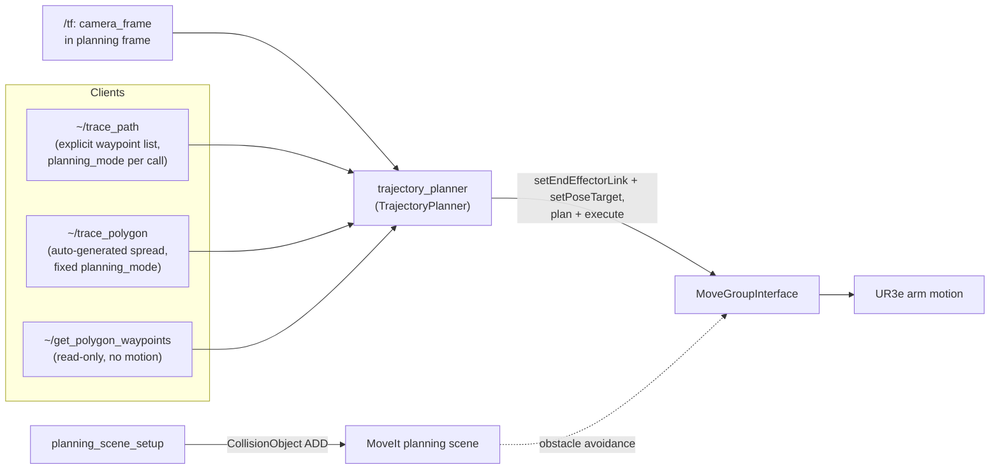
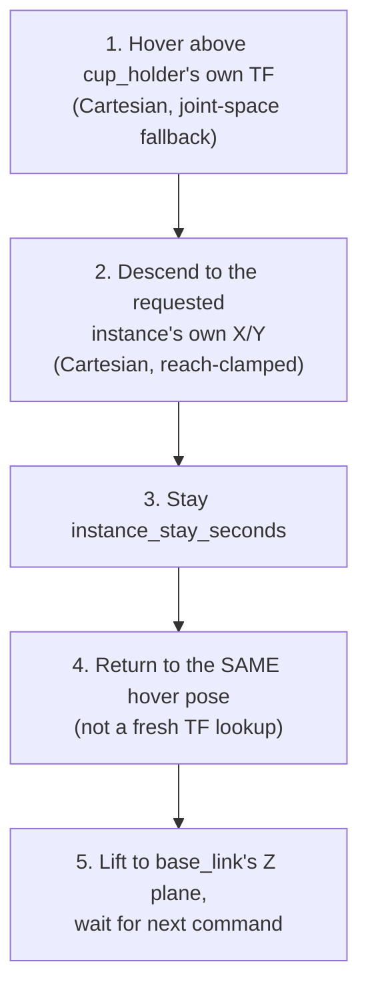

[← Back to index](./README.md)

# visual_calibration_moveit

`visual_calibration_moveit` is the package that moves the arm and keeps
MoveIt aware of its surroundings. It wraps `MoveGroupInterface` behind ROS
services for driving the end effector to poses derived from TF — used for
spreading out calibration samples, validating a computed camera transform,
and moving to a depth-perception-detected cupholder/hole instance — and
separately publishes the static collision geometry of the Starbots
Cafeteria scene so planning avoids known obstacles.

## Flow

```mermaid
flowchart LR
    subgraph Clients
        CALL_PATH["~/trace_path\n(explicit waypoint list,\nplanning_mode per call)"]
        CALL_POLY["~/trace_polygon\n(auto-generated spread,\nfixed planning_mode)"]
        CALL_GETPOLY["~/get_polygon_waypoints\n(read-only, no motion)"]
    end
    TF["/tf: camera_frame\nin planning frame"] --> TP["trajectory_planner\n(TrajectoryPlanner)"]
    CALL_PATH --> TP
    CALL_POLY --> TP
    CALL_GETPOLY --> TP
    TP -->|setEndEffectorLink + setPoseTarget,\nplan + execute| MGI["MoveGroupInterface"]
    MGI --> ARM["UR3e arm motion"]

    PSS["planning_scene_setup"] -->|CollisionObject ADD| SCENE["MoveIt planning scene"]
    SCENE -.->|obstacle avoidance| MGI
```

## `planning_scene_setup`

A node that publishes the cafeteria's static collision geometry into the
MoveIt planning scene on startup: the coffee machine and cupholder as mesh
collision objects (loaded from the Starbots Gazebo world's own `.dae`
meshes via `shapes::createMeshFromResource`), and the countertop and wall as
box primitives. The countertop is modeled as two stacked boxes (a body and a
thinner top slab) because that's how it's represented in the Gazebo world's
SDF, not because MoveIt requires it — matching the SDF's own primitive
decomposition keeps the collision geometry consistent with the simulated
world's actual shape.

Object poses and shape parameters are all declared as ROS parameters (with
defaults set in `declareParameters()`), and are loaded per scene object into
`SceneObjectConfig` structs, then converted into `moveit_msgs::CollisionObject`
messages and applied via `PlanningSceneInterface::applyCollisionObject`.
Separate `scene_objects_sim.yaml` / `scene_objects_real.yaml` files let the
same node run against different object poses in simulation versus on the
real cell.

## `trajectory_planner`

Wraps a single `MoveGroupInterface` behind two services:

- **`~/trace_path`** (`visual_calibration_msgs/TracePath`) — executes an
  explicit, ordered list of waypoint poses, planning and executing to each
  one in turn and stopping at the first failure. Each request also carries
  a `planning_mode` field — `PLANNING_MODE_CARTESIAN` (the default:
  straight-line, via `planAndExecuteCartesian()`, can fail partway near
  limits/obstacles) or `PLANNING_MODE_JOINT_SPACE` (free-space, via
  `planAndExecute()`, more robust but no straight-line guarantee).
- **`~/trace_polygon`** (`std_srvs/Trigger`) — computes a polygon of
  waypoints around a "standoff" pose positioned `standoff_m` in front of a
  configured `camera_frame` (looked up from `/tf` in the planning frame),
  facing back toward the camera per `facing_rpy_rad`, then traces them via
  the same waypoint-execution logic as `~/trace_path`. Since `Trigger` has
  no request fields, the planning mode for this call is fixed at startup by
  the `polygon_default_planning_mode` parameter instead of being chosen
  per-call.
- **`~/get_polygon_waypoints`** (`visual_calibration_msgs/GetPolygonWaypoints`)
  — computes and returns the same polygon of waypoints as `~/trace_polygon`,
  but read-only: the arm never moves. This is what
  `calibration_broadcaster_node` calls once per `~/calibrate` goal so it can
  drive the waypoints itself, one at a time, via `~/trace_path` — see
  [aruco_perception.md](./aruco_perception.md).

Both services plan against a configurable `end_effector_frame` rather than
MoveIt's default end-effector link: every call to `planAndExecute` is
preceded by `move_group_interface_.setEndEffectorLink(config.end_effector_frame)`.
In this project's configuration, `end_effector_frame` is set to
`rg2_gripper_aruco_link` (sim) / `robotiq_85_base_link` (real) — neither
matches the `ur_manipulator` group's own SRDF `tip_link` (`tool0` on both
`sim_ur3e_moveit_config` and `real_ur3e_moveit_config`, see
[ur3e_moveit_config_variants.md](./ur3e_moveit_config_variants.md)).
`setEndEffectorLink()` is what makes targeting a link past the SRDF chain's
own tip possible at all: as long as the requested link is rigidly (fixed-
joint) attached somewhere along the kinematic chain from `tip_link` onward,
MoveIt can still solve IK and plan for it directly, with no SRDF change
needed.

The standoff pose itself is computed by `offsetInFrontOf()`: starting from
the camera's TF, it moves `standoff_m` along the camera's local +Z (the
REP-103 optical-frame forward convention), then applies `facing_rpy_rad` as
a rotation in the camera's own local frame to get the desired orientation
for `end_effector_frame`. Before planning, the resulting goal's distance
from the planning-frame origin is checked against `max_reach_m` — a
straight-line reachability sanity check, not a substitute for the planner's
own IK/collision checking, but cheap enough to reject an obviously
unreachable standoff before invoking MoveIt.

`~/trace_polygon`'s waypoints are corners of a regular polygon
(`polygon_num_corners` corners, `polygon_radius_m` radius) computed in the
standoff pose's own local X/Y plane and visited in angular order, so
consecutive waypoints are adjacent and every corner keeps the same
`facing_rpy_rad`-derived orientation as the standoff center — only position
varies, so the end effector keeps facing the camera at each corner. This is
the service `calibration_broadcaster_node`'s calibration samples are
typically interleaved with, so that consecutive samples aren't taken from
the same, unmoving arm pose.

Each service call runs against the parameter set loaded at startup
(`camera_frame`, `end_effector_frame`, `standoff_m`, `max_reach_m`,
`facing_rpy_rad`, `polygon_num_corners`, `polygon_radius_m`), with separate
`trajectory_planner_sim.yaml` / `trajectory_planner_real.yaml` files.

### `~/move_to_instance` — moving to a detected cupholder/hole

- **`~/move_to_instance`** (`visual_calibration_msgs/MoveToInstance`) —
  moves the arm to a **live TF lookup** of a named `depth_perception_node`
  instance (`"cup_holder"` or `"hole_1".."hole_4"`, the exact
  `child_frame_id`s `broadcastInstanceTfs()` publishes — see
  [depth_perception.md](./depth_perception.md)), not a static preset: these
  positions are only known once calibration and depth-perception have
  actually run.

Every call — regardless of which instance was requested — always hovers
above `cup_holder` itself first, then descends to the actual target. This
keeps `hole_1..hole_4` approaches consistent and predictable: all four holes
are approached from the exact same known-safe point directly above the
holder, rather than each hole computing its own, potentially differently-
angled approach.

```mermaid
flowchart TD
    A["1. Hover above cup_holder's own TF\n(Cartesian, joint-space fallback)"] --> B["2. Descend to the requested\ninstance's own X/Y\n(Cartesian, reach-clamped)"]
    B --> C["3. Stay instance_stay_seconds"]
    C --> D["4. Return to the SAME hover pose\n(not a fresh TF lookup)"]
    D --> E["5. Lift to base_link's Z plane,\nwait for next command"]
```

1. **Hover** — looks up `cup_holder`'s TF (needed even when the requested
   instance *is* `cup_holder`, since the hover point is always derived from
   it) and builds a pose directly above it (`hover_offset_m` higher, same
   X/Y). Reached via a Cartesian attempt first, falling back to joint-space
   if the straight line isn't achievable from the arm's current pose.
2. **Descend** — looks up the actually-requested instance's own TF and
   descends `descend_offset_m` below the hover pose's Z, straight down onto
   that instance's X/Y, via a Cartesian move. If this pose would land
   farther from the planning frame's origin than `max_reach_m -
   reach_safety_margin_m`, it's pulled back along the hover→descend line to
   that radius instead of failing outright — the arm still visibly
   approaches the target and stops at the closest safely-reachable point.
3. **Stay** — pauses `instance_stay_seconds` at the descended pose.
4. **Return** — moves back to the *exact* hover pose computed in step 1 (not
   a fresh TF lookup), via the same Cartesian call.
5. **Lift** — moves straight up from the hover pose to `base_link`'s own Z
   plane (`lift_target_z_m`, the same absolute-Z convention `SequenceConfig`
   uses elsewhere, but applied here as a single direct call, independent of
   the `is_sequenced_goal`/`ArmState` machinery) and returns success — no
   timeout, no automatic follow-up move; the arm simply waits at the lifted
   pose for the next command.

Every hover/descend pose uses a fixed goal orientation (the end effector's
local +X axis pointed straight down) rather than the instance TF's own
rotation — `cup_holder`/`hole_N` TFs carry no meaningful orientation (they
come from position-only 2D-to-3D detection, see
[depth_perception.md](./depth_perception.md)), so an identity-quaternion
goal was found to correlate directly with otherwise-avoidable OMPL planning
failures. The chosen orientation is one arbitrary valid completion of
"palm facing down" (roll about the down axis is left unconstrained); a
proper tolerance-based orientation constraint was deferred as a further
refinement.

Fails at the first failing step with a stage-labeled message — including if
`cup_holder` itself has no TF yet (no `~/calibrate` run completed, or
`depth_perception_node` hasn't detected it).

## `mtc_trajectory`

A node built around MoveIt Task Constructor for expressing multi-stage
motions as a composed task rather than a sequence of independent
`planAndExecute` calls. Its source (`mtc_trajectory.cpp`) currently amounts
to a node that logs a startup message and does nothing further. The
`moveit_task_constructor_core` dependency and the executable's build block
are both commented out in `package.xml` and `CMakeLists.txt` respectively,
with an inline note attributing this to an upstream packaging naming
mismatch (`py_binding_tools` vs. `py_bindings_tools`) in
`moveit_task_constructor_core` itself. The files are left in place and the
build block documents exactly what to uncomment to reactivate the
executable once that upstream issue is resolved.